# Trekkey Mermaid 다이어그램 보드

- 기준일: 2026-07-21
- 상태: MVP 구현 및 팀 회의 기준
- 상세 컬럼 원장: [공모전·Credential 최종 ERD](./erd.md)
- 상세 규칙 원장: [Credential 및 Kaia 앵커링 설계](./blockchain-anchoring-architecture.md)

이 문서는 팀원이 한 화면에서 Trekkey의 업무 원장과 블록체인 앵커링을 순서대로 검토할 수 있도록 만든 시각 보드다. 관계를 읽을 때는 축약 ERD를 사용하고, 실제 컬럼과 제약은 최종 ERD를 기준으로 한다.

## 회의 순서

1. 시스템 전체 지도
2. 무엇을 신뢰하고 어디에 저장하는가
3. 대회 업무와 팀·제출·심사·수상 관계
4. Credential 생성과 Merkle 배치
5. Kaia 앵커링과 공개 검증
6. 폐기·대체·장애 복구
7. 구현 순서

## 1. 시스템 전체 지도

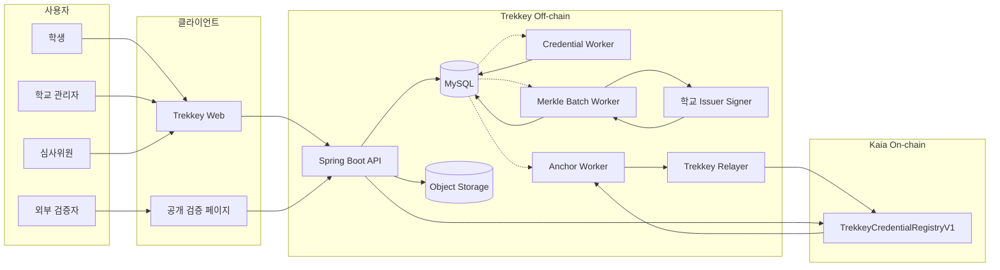
```mermaid
flowchart LR
    subgraph actors ["사용자"]
        student["학생"]
        admin["학교 관리자"]
        judge["심사위원"]
        verifier["외부 검증자"]
    end

    subgraph client ["클라이언트"]
        web["Trekkey Web"]
        verifyPage["공개 검증 페이지"]
    end

    subgraph backend ["Trekkey Off-chain"]
        api["Spring Boot API"]
        credentialWorker["Credential Worker"]
        batchWorker["Merkle Batch Worker"]
        anchorWorker["Anchor Worker"]
        mysql[("MySQL")]
        objectStore[("Object Storage")]
        signer["학교 Issuer Signer"]
        relayer["Trekkey Relayer"]
    end

    subgraph chain ["Kaia On-chain"]
        registry["TrekkeyCredentialRegistryV1"]
    end

    student --> web
    admin --> web
    judge --> web
    verifier --> verifyPage
    web --> api
    verifyPage --> api
    api --> mysql
    api --> objectStore
    mysql -.-> credentialWorker
    credentialWorker --> mysql
    mysql -.-> batchWorker
    batchWorker --> mysql
    batchWorker --> signer
    signer --> batchWorker
    mysql -.-> anchorWorker
    anchorWorker --> relayer
    relayer --> registry
    registry --> anchorWorker
    api --> registry
```

핵심 경계는 `업무 사실`, `검증 자료`, `온체인 증거` 세 층이다. 학생과 검증자는 지갑이나 KAIA를 직접 다루지 않는다.

## 2. 신뢰 경계와 저장 위치

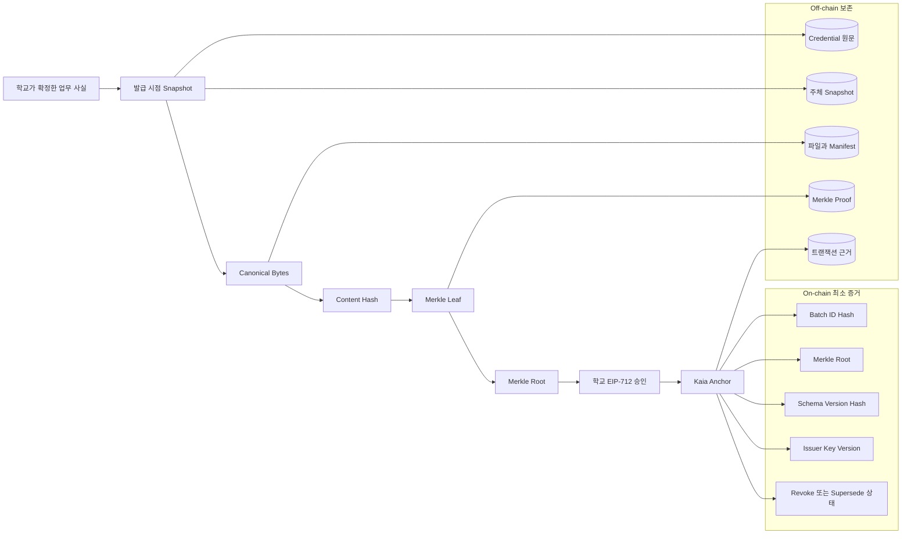
```mermaid
flowchart LR
    business["학교가 확정한 업무 사실"] --> snapshot["발급 시점 Snapshot"]
    snapshot --> canonical["Canonical Bytes"]
    canonical --> contentHash["Content Hash"]
    contentHash --> leaf["Merkle Leaf"]
    leaf --> root["Merkle Root"]
    root --> approval["학교 EIP-712 승인"]
    approval --> anchor["Kaia Anchor"]

    subgraph offchain ["Off-chain 보존"]
        payload[("Credential 원문")]
        subjects[("주체 Snapshot")]
        files[("파일과 Manifest")]
        proof[("Merkle Proof")]
        txEvidence[("트랜잭션 근거")]
    end

    subgraph onchain ["On-chain 최소 증거"]
        batchId["Batch ID Hash"]
        rootValue["Merkle Root"]
        schemaHash["Schema Version Hash"]
        issuerKey["Issuer Key Version"]
        status["Revoke 또는 Supersede 상태"]
    end

    snapshot --> payload
    snapshot --> subjects
    canonical --> files
    leaf --> proof
    anchor --> txEvidence
    anchor --> batchId
    anchor --> rootValue
    anchor --> schemaHash
    anchor --> issuerKey
    anchor --> status
```

블록체인은 앵커링 이전의 업무 사실이 참인지 판정하지 않는다. 앵커링 이후 원문과 증거가 바뀌지 않았는지를 독립적으로 검증하게 한다.

## 3. 학교부터 수상까지 업무 계층

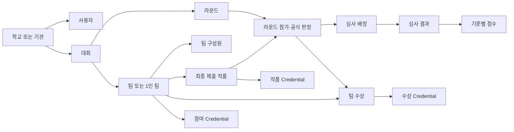
```mermaid
flowchart LR
    organization["학교 또는 기관"] --> user["사용자"]
    organization --> contest["대회"]
    contest --> stage["라운드"]
    contest --> team["팀 또는 1인 팀"]
    team --> member["팀 구성원"]
    team --> submission["최종 제출 작품"]
    submission --> stageEntry["라운드 참가·공식 판정"]
    stage --> stageEntry
    stageEntry --> assignment["심사 배정"]
    assignment --> review["심사 결과"]
    review --> score["기준별 점수"]
    stageEntry --> award["팀 수상"]
    team --> award
    team --> participationCredential["참여 Credential"]
    submission --> workCredential["작품 Credential"]
    award --> awardCredential["수상 Credential"]
```

개인전도 구성원 한 명을 가진 팀으로 처리한다. 따라서 팀전과 개인전이 같은 참가·수상·Credential 파이프라인을 사용한다.

## 4. 업무 SQL 축약 ERD

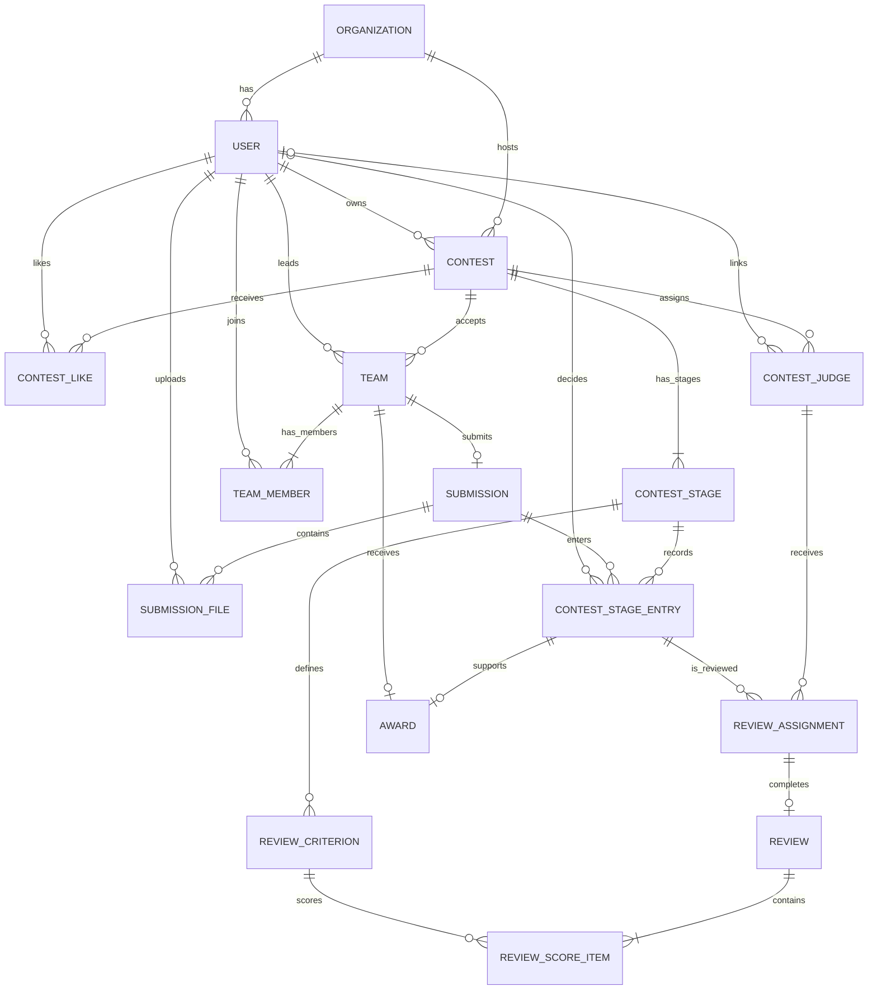
```mermaid
erDiagram
    ORGANIZATION ||--o{ USER : has
    ORGANIZATION ||--o{ CONTEST : hosts
    USER ||--o{ CONTEST : owns
    CONTEST ||--o{ CONTEST_LIKE : receives
    USER ||--o{ CONTEST_LIKE : likes
    CONTEST ||--|{ CONTEST_STAGE : has_stages
    CONTEST ||--o{ TEAM : accepts
    USER ||--o{ TEAM : leads
    TEAM ||--|{ TEAM_MEMBER : has_members
    USER ||--o{ TEAM_MEMBER : joins
    TEAM ||--o| SUBMISSION : submits
    SUBMISSION ||--o{ SUBMISSION_FILE : contains
    USER ||--o{ SUBMISSION_FILE : uploads
    CONTEST_STAGE ||--o{ CONTEST_STAGE_ENTRY : records
    SUBMISSION ||--o{ CONTEST_STAGE_ENTRY : enters
    USER o|--o{ CONTEST_STAGE_ENTRY : decides
    CONTEST_STAGE ||--o{ REVIEW_CRITERION : defines
    CONTEST ||--o{ CONTEST_JUDGE : assigns
    USER o|--o{ CONTEST_JUDGE : links
    CONTEST_JUDGE ||--o{ REVIEW_ASSIGNMENT : receives
    CONTEST_STAGE_ENTRY ||--o{ REVIEW_ASSIGNMENT : is_reviewed
    REVIEW_ASSIGNMENT ||--o| REVIEW : completes
    REVIEW ||--|{ REVIEW_SCORE_ITEM : contains
    REVIEW_CRITERION ||--o{ REVIEW_SCORE_ITEM : scores
    CONTEST_STAGE_ENTRY ||--o| AWARD : supports
    TEAM ||--o| AWARD : receives
```

상세 컬럼, `UNIQUE`, `CHECK`, 잠금 규칙은 [최종 ERD의 업무 SQL](./erd.md#2-업무-sql-erd)을 따른다.

## 5. Credential·앵커링 SQL 축약 ERD

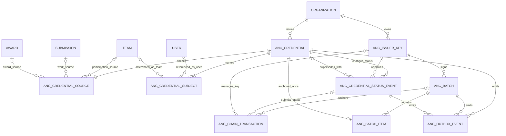
```mermaid
erDiagram
    ORGANIZATION ||--o{ ANC_ISSUER_KEY : owns
    ORGANIZATION ||--o{ ANC_CREDENTIAL : issues
    ANC_CREDENTIAL ||--|| ANC_CREDENTIAL_SOURCE : freezes
    ANC_CREDENTIAL ||--|{ ANC_CREDENTIAL_SUBJECT : names
    USER o|--o{ ANC_CREDENTIAL_SUBJECT : referenced_as_user
    TEAM o|--o{ ANC_CREDENTIAL_SUBJECT : referenced_as_team
    TEAM o|--o{ ANC_CREDENTIAL_SOURCE : participation_source
    SUBMISSION o|--o{ ANC_CREDENTIAL_SOURCE : work_source
    AWARD o|--o{ ANC_CREDENTIAL_SOURCE : award_source
    ANC_ISSUER_KEY ||--o{ ANC_BATCH : signs
    ANC_BATCH ||--|{ ANC_BATCH_ITEM : contains
    ANC_CREDENTIAL ||--o| ANC_BATCH_ITEM : anchored_once
    ANC_CREDENTIAL ||--o{ ANC_CREDENTIAL_STATUS_EVENT : changes_status
    ANC_ISSUER_KEY ||--o{ ANC_CREDENTIAL_STATUS_EVENT : approves
    ANC_CREDENTIAL o|--o{ ANC_CREDENTIAL_STATUS_EVENT : supersedes_with
    ANC_BATCH o|--o{ ANC_CHAIN_TRANSACTION : anchors
    ANC_CREDENTIAL_STATUS_EVENT o|--o{ ANC_CHAIN_TRANSACTION : submits_status
    ANC_ISSUER_KEY o|--o{ ANC_CHAIN_TRANSACTION : manages_key
    ANC_CREDENTIAL ||--o{ ANC_OUTBOX_EVENT : emits
    ANC_BATCH ||--o{ ANC_OUTBOX_EVENT : emits
    ANC_CREDENTIAL_STATUS_EVENT ||--o{ ANC_OUTBOX_EVENT : emits
```

`ANC_CREDENTIAL_SOURCE`와 `ANC_CHAIN_TRANSACTION`의 다형성 FK는 타입에 맞는 대상 하나만 non-null이어야 한다.

## 6. 대회 운영 전체 흐름

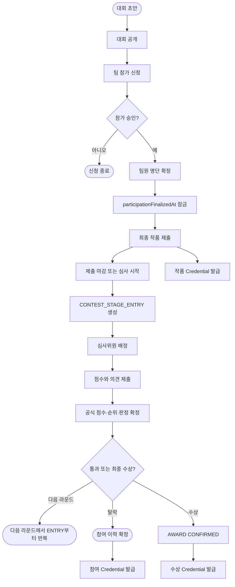
```mermaid
flowchart TD
    contestDraft(["대회 초안"]) --> contestOpen["대회 공개"]
    contestOpen --> application["팀 참가 신청"]
    application --> approval{"참가 승인?"}
    approval -->|"아니오"| rejected(["신청 종료"])
    approval -->|"예"| roster["팀원 명단 확정"]
    roster --> rosterLock["participationFinalizedAt 잠금"]
    rosterLock --> submit["최종 작품 제출"]
    submit --> submissionLock["제출 마감 또는 심사 시작"]
    submissionLock --> stageEntry["CONTEST_STAGE_ENTRY 생성"]
    stageEntry --> judgeAssign["심사위원 배정"]
    judgeAssign --> review["점수와 의견 제출"]
    review --> finalize["공식 점수·순위·판정 확정"]
    finalize --> passed{"통과 또는 최종 수상?"}
    passed -->|"다음 라운드"| nextStage(["다음 라운드에서 ENTRY부터 반복"])
    passed -->|"탈락"| finished(["참여 이력 확정"])
    passed -->|"수상"| award["AWARD CONFIRMED"]
    finished --> participationCredential["참여 Credential 발급"]
    submit --> workCredential["작품 Credential 발급"]
    award --> awardCredential["수상 Credential 발급"]
```

라운드가 확정되면 ENTRY, 평가 기준, 심사 배정, 제출된 심사 결과는 수정하지 않는다.

## 7. 팀 상장과 구성원 참조 모델

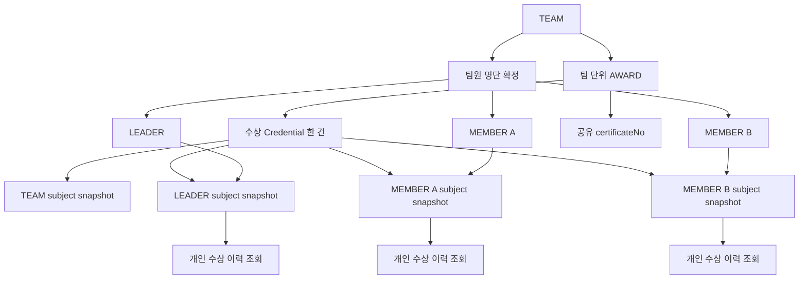
```mermaid
flowchart TD
    team["TEAM"] --> rosterLock["팀원 명단 확정"]
    rosterLock --> leader["LEADER"]
    rosterLock --> memberA["MEMBER A"]
    rosterLock --> memberB["MEMBER B"]
    team --> award["팀 단위 AWARD"]
    award --> certificateNo["공유 certificateNo"]
    award --> credential["수상 Credential 한 건"]
    credential --> teamSubject["TEAM subject snapshot"]
    credential --> leaderSubject["LEADER subject snapshot"]
    credential --> memberASubject["MEMBER A subject snapshot"]
    credential --> memberBSubject["MEMBER B subject snapshot"]
    leader --> leaderSubject
    memberA --> memberASubject
    memberB --> memberBSubject
    leaderSubject --> leaderHistory["개인 수상 이력 조회"]
    memberASubject --> memberAHistory["개인 수상 이력 조회"]
    memberBSubject --> memberBHistory["개인 수상 이력 조회"]
```

상장은 팀에 한 건만 발급되지만, 발급 당시 구성원을 subject snapshot으로 고정하므로 각 학생이 같은 수상을 자기 이력에서 참조할 수 있다.

## 8. 제출물 덮어쓰기와 잠금

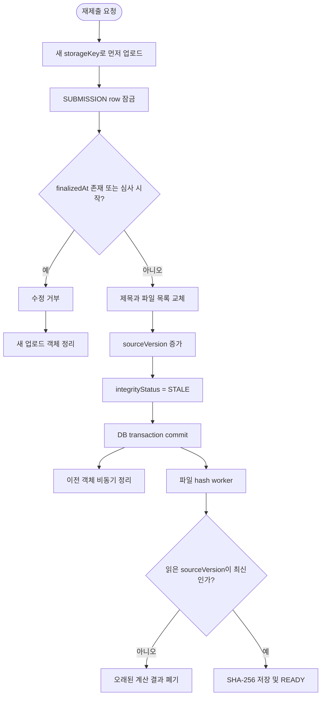
```mermaid
flowchart TD
    request(["재제출 요청"]) --> upload["새 storageKey로 먼저 업로드"]
    upload --> lock["SUBMISSION row 잠금"]
    lock --> immutable{"finalizedAt 존재 또는 심사 시작?"}
    immutable -->|"예"| reject["수정 거부"]
    reject --> cleanupNew["새 업로드 객체 정리"]
    immutable -->|"아니오"| replace["제목과 파일 목록 교체"]
    replace --> increment["sourceVersion 증가"]
    increment --> stale["integrityStatus = STALE"]
    stale --> commit["DB transaction commit"]
    commit --> cleanupOld["이전 객체 비동기 정리"]
    commit --> hashWorker["파일 hash worker"]
    hashWorker --> versionCheck{"읽은 sourceVersion이 최신인가?"}
    versionCheck -->|"아니오"| discard["오래된 계산 결과 폐기"]
    versionCheck -->|"예"| ready["SHA-256 저장 및 READY"]
```

별도 제출 버전 테이블은 만들지 않는다. 사용자에게는 최종 제출물 한 건만 보이고, 동시성은 `sourceVersion`으로 제어한다.

## 9. 라운드 심사와 공식 판정

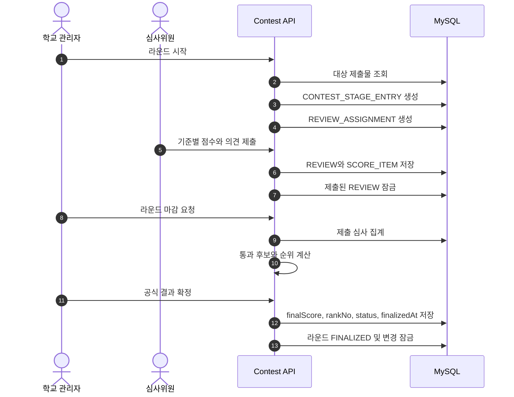
```mermaid
sequenceDiagram
    autonumber
    actor Admin as 학교 관리자
    actor Judge as 심사위원
    participant API as Contest API
    participant DB as MySQL

    Admin->>API: 라운드 시작
    API->>DB: 대상 제출물 조회
    API->>DB: CONTEST_STAGE_ENTRY 생성
    API->>DB: REVIEW_ASSIGNMENT 생성
    Judge->>API: 기준별 점수와 의견 제출
    API->>DB: REVIEW와 SCORE_ITEM 저장
    API->>DB: 제출된 REVIEW 잠금
    Admin->>API: 라운드 마감 요청
    API->>DB: 제출 심사 집계
    API->>API: 통과 후보와 순위 계산
    Admin->>API: 공식 결과 확정
    API->>DB: finalScore, rankNo, status, finalizedAt 저장
    API->>DB: 라운드 FINALIZED 및 변경 잠금
```

`REVIEW`는 심사위원별 원점수이고, `CONTEST_STAGE_ENTRY`는 학교가 확정한 공식 판정 원장이다.

## 10. Credential 발급 트랜잭션

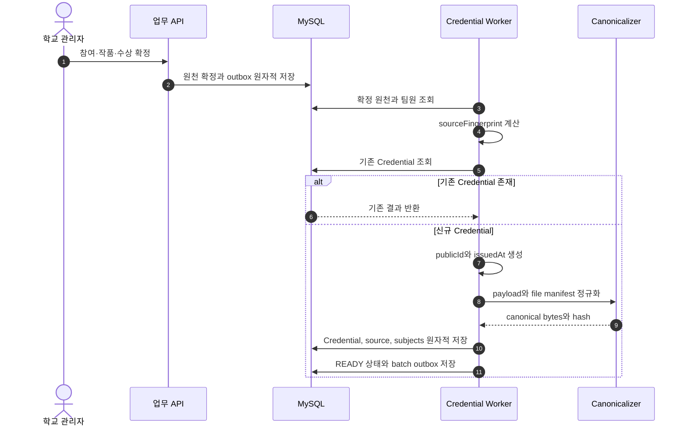
```mermaid
sequenceDiagram
    autonumber
    actor Admin as 학교 관리자
    participant Domain as 업무 API
    participant DB as MySQL
    participant Worker as Credential Worker
    participant Canon as Canonicalizer

    Admin->>Domain: 참여·작품·수상 확정
    Domain->>DB: 원천 확정과 outbox 원자적 저장
    Worker->>DB: 확정 원천과 팀원 조회
    Worker->>Worker: sourceFingerprint 계산
    Worker->>DB: 기존 Credential 조회
    alt 기존 Credential 존재
        DB-->>Worker: 기존 결과 반환
    else 신규 Credential
        Worker->>Worker: publicId와 issuedAt 생성
        Worker->>Canon: payload와 file manifest 정규화
        Canon-->>Worker: canonical bytes와 hash
        Worker->>DB: Credential, source, subjects 원자적 저장
        Worker->>DB: READY 상태와 batch outbox 저장
    end
```

Credential, source, subjects가 일부만 저장되는 상태는 허용하지 않는다. `sourceFingerprint`의 `UNIQUE`가 재시도와 동시 발급을 멱등하게 만든다.

## 11. Canonical JSON부터 Merkle Root까지

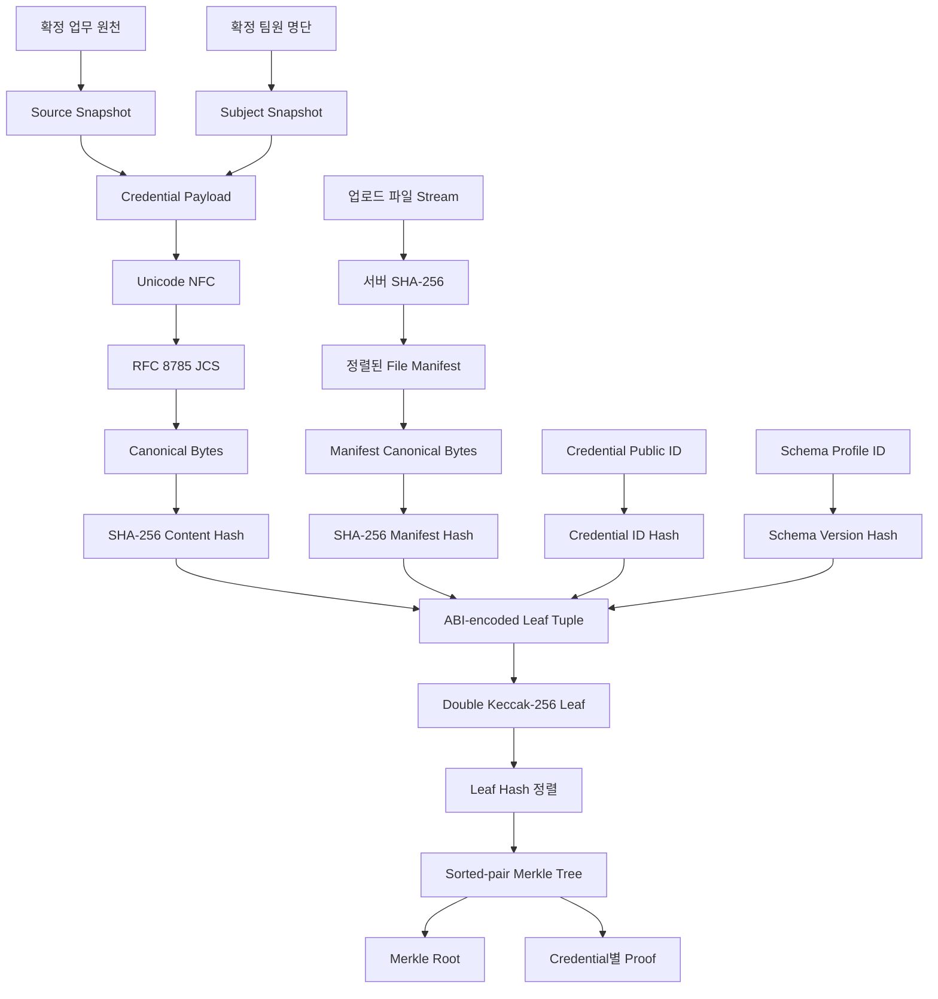
```mermaid
flowchart TD
    source["확정 업무 원천"] --> sourceSnapshot["Source Snapshot"]
    roster["확정 팀원 명단"] --> subjectSnapshot["Subject Snapshot"]
    sourceSnapshot --> payload["Credential Payload"]
    subjectSnapshot --> payload
    payload --> nfc["Unicode NFC"]
    nfc --> jcs["RFC 8785 JCS"]
    jcs --> canonicalBytes["Canonical Bytes"]
    canonicalBytes --> contentHash["SHA-256 Content Hash"]

    uploadedFiles["업로드 파일 Stream"] --> fileHash["서버 SHA-256"]
    fileHash --> manifest["정렬된 File Manifest"]
    manifest --> manifestCanonical["Manifest Canonical Bytes"]
    manifestCanonical --> fileManifestHash["SHA-256 Manifest Hash"]

    publicId["Credential Public ID"] --> credentialIdHash["Credential ID Hash"]
    schema["Schema Profile ID"] --> schemaVersionHash["Schema Version Hash"]

    contentHash --> leafTuple["ABI-encoded Leaf Tuple"]
    fileManifestHash --> leafTuple
    credentialIdHash --> leafTuple
    schemaVersionHash --> leafTuple
    leafTuple --> leafHash["Double Keccak-256 Leaf"]
    leafHash --> sort["Leaf Hash 정렬"]
    sort --> tree["Sorted-pair Merkle Tree"]
    tree --> root["Merkle Root"]
    tree --> proof["Credential별 Proof"]
```

같은 의미의 payload는 같은 canonical bytes를 만들어야 하고, payload 한 글자나 파일 한 바이트가 바뀌면 최종 root 검증이 실패해야 한다.

## 12. Merkle 배치와 Kaia 앵커링

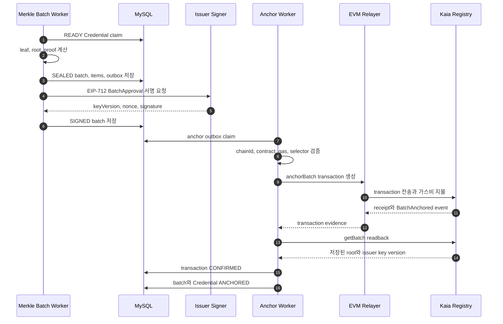
```mermaid
sequenceDiagram
    autonumber
    participant Batch as Merkle Batch Worker
    participant DB as MySQL
    participant Signer as Issuer Signer
    participant Anchor as Anchor Worker
    participant Relayer as EVM Relayer
    participant Kaia as Kaia Registry

    Batch->>DB: READY Credential claim
    Batch->>Batch: leaf, root, proof 계산
    Batch->>DB: SEALED batch, items, outbox 저장
    Batch->>Signer: EIP-712 BatchApproval 서명 요청
    Signer-->>Batch: keyVersion, nonce, signature
    Batch->>DB: SIGNED batch 저장
    Anchor->>DB: anchor outbox claim
    Anchor->>Anchor: chainId, contract, gas, selector 검증
    Anchor->>Relayer: anchorBatch transaction 생성
    Relayer->>Kaia: transaction 전송과 가스비 지불
    Kaia-->>Relayer: receipt와 BatchAnchored event
    Relayer-->>Anchor: transaction evidence
    Anchor->>Kaia: getBatch readback
    Kaia-->>Anchor: 저장된 root와 issuer key version
    Anchor->>DB: transaction CONFIRMED
    Anchor->>DB: batch와 Credential ANCHORED
```

한 batch에는 같은 issuer, `schemaVersionHash`, `treeVersion`의 Credential만 들어간다.

## 13. 공개 검증

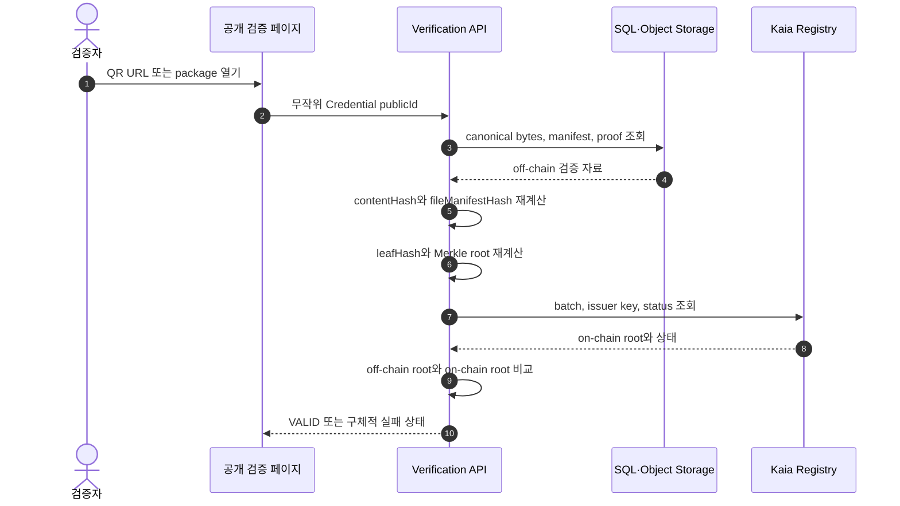
```mermaid
sequenceDiagram
    autonumber
    actor Verifier as 검증자
    participant Page as 공개 검증 페이지
    participant API as Verification API
    participant Store as SQL·Object Storage
    participant Kaia as Kaia Registry

    Verifier->>Page: QR URL 또는 package 열기
    Page->>API: 무작위 Credential publicId
    API->>Store: canonical bytes, manifest, proof 조회
    Store-->>API: off-chain 검증 자료
    API->>API: contentHash와 fileManifestHash 재계산
    API->>API: leafHash와 Merkle root 재계산
    API->>Kaia: batch, issuer key, status 조회
    Kaia-->>API: on-chain root와 상태
    API->>API: off-chain root와 on-chain root 비교
    API-->>Page: VALID 또는 구체적 실패 상태
```

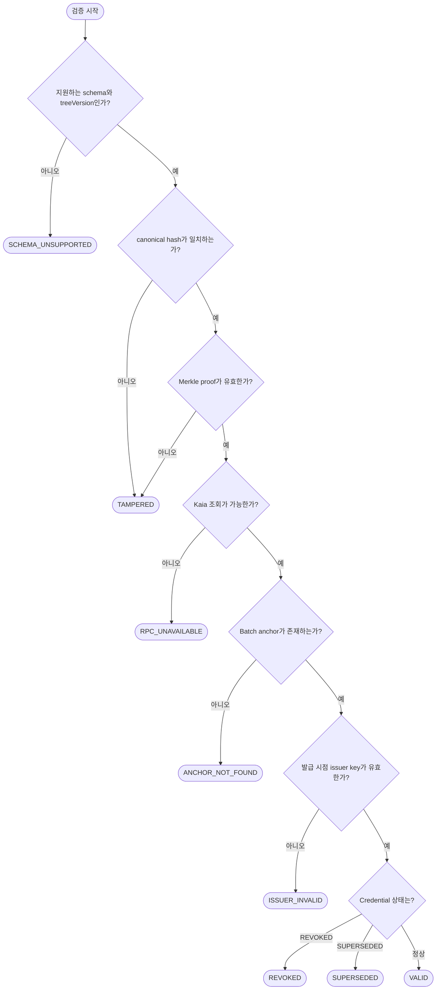
```mermaid
flowchart TD
    start(["검증 시작"]) --> schema{"지원하는 schema와 treeVersion인가?"}
    schema -->|"아니오"| unsupported(["SCHEMA_UNSUPPORTED"])
    schema -->|"예"| hashes{"canonical hash가 일치하는가?"}
    hashes -->|"아니오"| tampered(["TAMPERED"])
    hashes -->|"예"| proof{"Merkle proof가 유효한가?"}
    proof -->|"아니오"| tampered
    proof -->|"예"| rpc{"Kaia 조회가 가능한가?"}
    rpc -->|"아니오"| unavailable(["RPC_UNAVAILABLE"])
    rpc -->|"예"| anchor{"Batch anchor가 존재하는가?"}
    anchor -->|"아니오"| anchorMissing(["ANCHOR_NOT_FOUND"])
    anchor -->|"예"| issuer{"발급 시점 issuer key가 유효한가?"}
    issuer -->|"아니오"| issuerInvalid(["ISSUER_INVALID"])
    issuer -->|"예"| credentialStatus{"Credential 상태는?"}
    credentialStatus -->|"REVOKED"| revoked(["REVOKED"])
    credentialStatus -->|"SUPERSEDED"| superseded(["SUPERSEDED"])
    credentialStatus -->|"정상"| valid(["VALID"])
```

체인 RPC 장애는 위변조가 아니다. `RPC_UNAVAILABLE`로 별도 표시하고 복구 후 다시 조회한다.

## 14. Credential 상태 머신

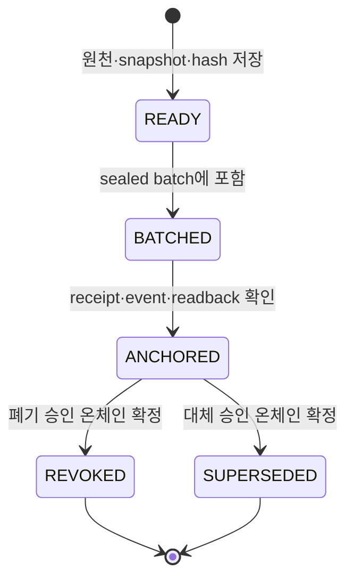
```mermaid
stateDiagram-v2
    [*] --> READY: 원천·snapshot·hash 저장
    READY --> BATCHED: sealed batch에 포함
    BATCHED --> ANCHORED: receipt·event·readback 확인
    ANCHORED --> REVOKED: 폐기 승인 온체인 확정
    ANCHORED --> SUPERSEDED: 대체 승인 온체인 확정
    REVOKED --> [*]
    SUPERSEDED --> [*]
```

`READY` 이후 payload, canonical bytes, source, subjects는 수정하지 않는다. 변경이 필요하면 새 Credential을 발급한다.

## 15. Batch와 Chain Transaction 상태 머신

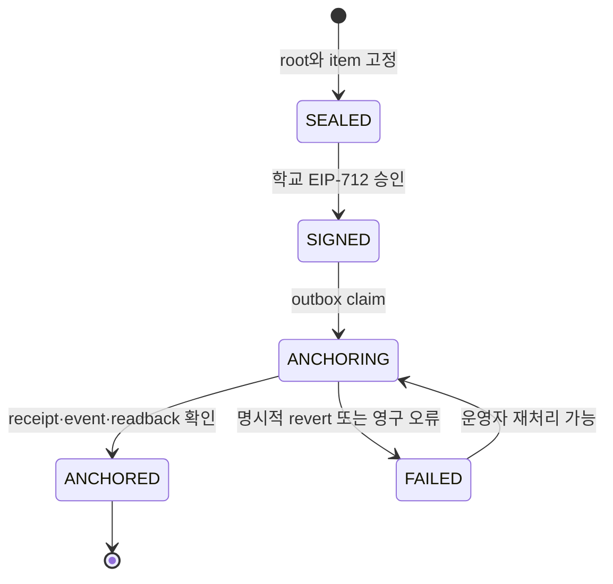
```mermaid
stateDiagram-v2
    [*] --> SEALED: root와 item 고정
    SEALED --> SIGNED: 학교 EIP-712 승인
    SIGNED --> ANCHORING: outbox claim
    ANCHORING --> ANCHORED: receipt·event·readback 확인
    ANCHORING --> FAILED: 명시적 revert 또는 영구 오류
    FAILED --> ANCHORING: 운영자 재처리 가능
    ANCHORED --> [*]
```

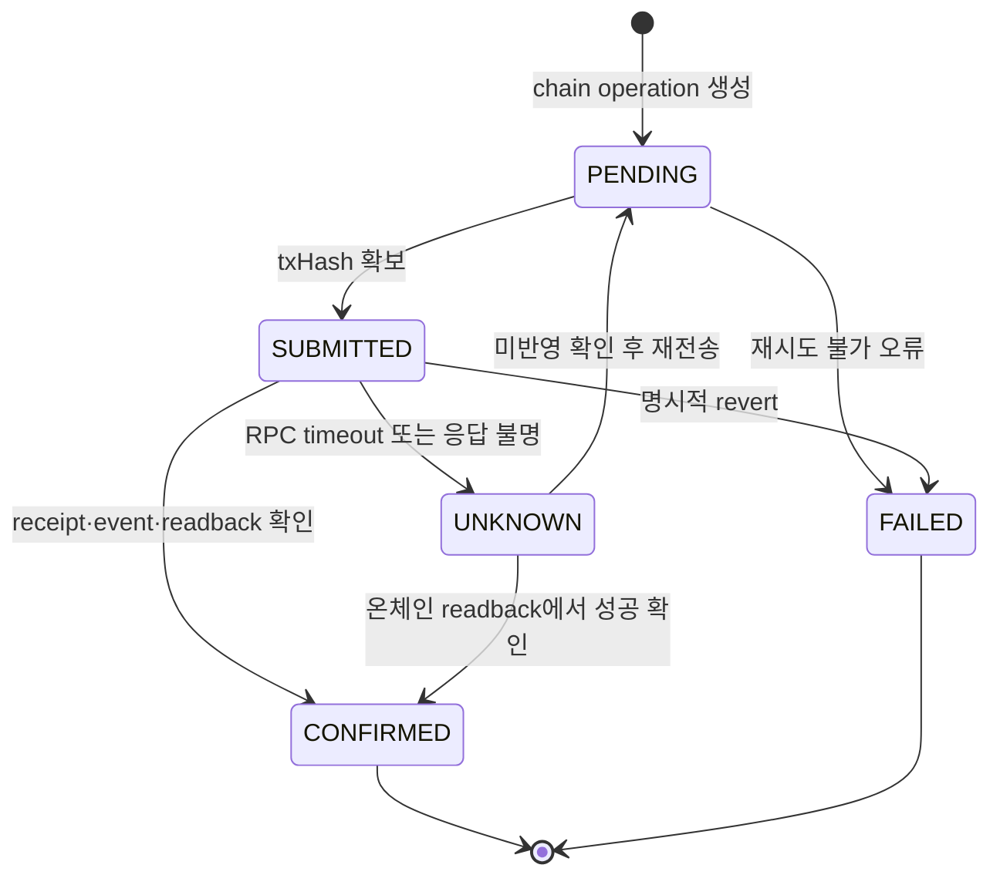
```mermaid
stateDiagram-v2
    [*] --> PENDING: chain operation 생성
    PENDING --> SUBMITTED: txHash 확보
    SUBMITTED --> CONFIRMED: receipt·event·readback 확인
    SUBMITTED --> UNKNOWN: RPC timeout 또는 응답 불명
    UNKNOWN --> CONFIRMED: 온체인 readback에서 성공 확인
    UNKNOWN --> PENDING: 미반영 확인 후 재전송
    PENDING --> FAILED: 재시도 불가 오류
    SUBMITTED --> FAILED: 명시적 revert
    CONFIRMED --> [*]
    FAILED --> [*]
```

`UNKNOWN`을 곧바로 재전송하면 같은 작업이 중복 제출될 수 있다. 먼저 batch ID hash 또는 Credential status를 온체인에서 조회한다.

## 16. 폐기와 대체 발급

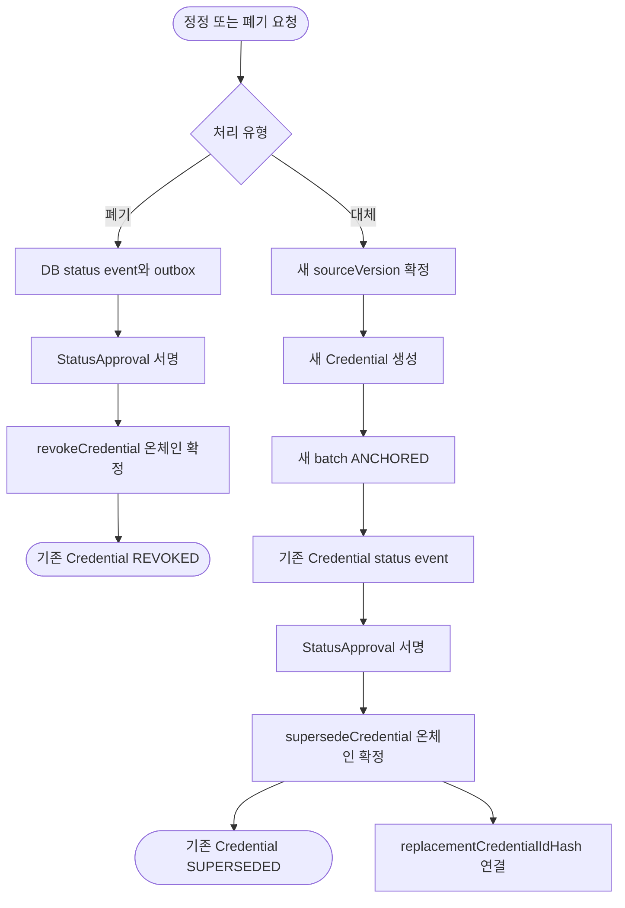
```mermaid
flowchart TD
    changeRequest(["정정 또는 폐기 요청"]) --> action{"처리 유형"}

    action -->|"폐기"| revokeEvent["DB status event와 outbox"]
    revokeEvent --> revokeSign["StatusApproval 서명"]
    revokeSign --> revokeChain["revokeCredential 온체인 확정"]
    revokeChain --> revokedState(["기존 Credential REVOKED"])

    action -->|"대체"| sourceVersion["새 sourceVersion 확정"]
    sourceVersion --> newCredential["새 Credential 생성"]
    newCredential --> newAnchor["새 batch ANCHORED"]
    newAnchor --> supersedeEvent["기존 Credential status event"]
    supersedeEvent --> supersedeSign["StatusApproval 서명"]
    supersedeSign --> supersedeChain["supersedeCredential 온체인 확정"]
    supersedeChain --> oldState(["기존 Credential SUPERSEDED"])
    supersedeChain --> replacement["replacementCredentialIdHash 연결"]
```

대체는 새 Credential이 먼저 검증 가능해진 뒤 기존 Credential을 `SUPERSEDED` 처리해 검증 공백을 만들지 않는다.

## 17. Outbox와 장애 복구

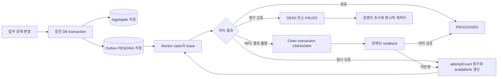
```mermaid
flowchart LR
    domainTx["업무 상태 변경"] --> sameTx["같은 DB transaction"]
    sameTx --> aggregate[("Aggregate 저장")]
    sameTx --> outbox[("Outbox PENDING 저장")]
    outbox --> claim["Worker claim과 lease"]
    claim --> process{"처리 결과"}
    process -->|"성공"| processed["PROCESSED"]
    process -->|"일시 오류"| retry["attemptCount 증가와 availableAt 갱신"]
    retry --> claim
    process -->|"RPC 결과 불명"| unknown["Chain transaction UNKNOWN"]
    unknown --> readback["온체인 readback"]
    readback -->|"이미 성공"| processed
    readback -->|"미반영"| retry
    process -->|"영구 오류"| dead["DEAD 또는 FAILED"]
    dead --> operator["운영자 조사와 명시적 재처리"]
```

outbox와 멱등 키는 DB transaction과 blockchain transaction을 하나의 분산 트랜잭션처럼 가장하지 않고도 안전하게 연결한다.

## 18. 중앙형 MVP와 학교별 서버 확장

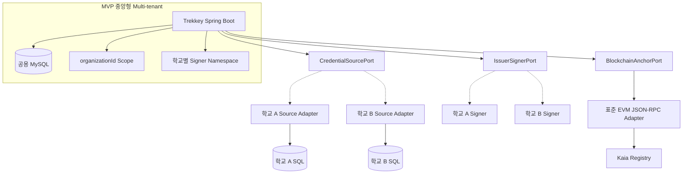
```mermaid
flowchart TD
    subgraph mvp ["MVP 중앙형 Multi-tenant"]
        centralApi["Trekkey Spring Boot"]
        centralDb[("공용 MySQL")]
        tenantScope["organizationId Scope"]
        signerNamespace["학교별 Signer Namespace"]
        centralApi --> centralDb
        centralApi --> tenantScope
        centralApi --> signerNamespace
    end

    sourcePort["CredentialSourcePort"]
    signerPort["IssuerSignerPort"]
    chainPort["BlockchainAnchorPort"]
    centralApi --> sourcePort
    centralApi --> signerPort
    centralApi --> chainPort

    schoolApiA["학교 A Source Adapter"] --> schoolDbA[("학교 A SQL")]
    schoolApiB["학교 B Source Adapter"] --> schoolDbB[("학교 B SQL")]
    schoolSignerA["학교 A Signer"]
    schoolSignerB["학교 B Signer"]
    sourcePort -.-> schoolApiA
    sourcePort -.-> schoolApiB
    signerPort -.-> schoolSignerA
    signerPort -.-> schoolSignerB

    evmAdapter["표준 EVM JSON-RPC Adapter"] --> registry["Kaia Registry"]
    chainPort --> evmAdapter
```

학교별 서버로 분리돼도 Credential schema, Merkle 규칙, 컨트랙트는 유지한다. 바뀌는 것은 source와 signer adapter다.

## 19. 구현 의존 순서

```mermaid
flowchart LR
    phase1["Phase 1 업무 원장"] --> phase2["Phase 2 체인 독립 Credential"]
    phase2 --> phase3["Phase 3 Merkle와 Solidity"]
    phase3 --> phase4["Phase 4 Spring Boot와 Kaia"]
    phase4 --> phase5["Phase 5 운영 확장"]

    phase1 --> p1a["팀·제출·라운드 잠금"]
    phase1 --> p1b["파일 SHA-256과 Domain Outbox"]
    phase2 --> p2a["Schema Profile과 Canonicalizer"]
    phase2 --> p2b["Source Fingerprint와 Subject Snapshot"]
    phase3 --> p3a["OpenZeppelin 호환 Fixture"]
    phase3 --> p3b["RegistryV1과 EIP-712"]
    phase4 --> p4a["Batch·Anchor Worker"]
    phase4 --> p4b["Kairos 배포와 공개 Verify API"]
    phase5 --> p5a["Mainnet Multisig·KMS·복수 RPC"]
    phase5 --> p5b["학교별 Adapter와 졸업 Credential"]
```

블록체인 구현은 업무 원장이 확정된 뒤 시작한다. 그렇지 않으면 블록체인이 보증하는 대상 자체가 계속 바뀐다.

## 최종 합의 한 장

```mermaid
flowchart LR
    finalized["학교가 업무 사실 확정"] --> immutable["원천·팀원·작품 Snapshot"]
    immutable --> credential["불변 Credential"]
    credential --> batch["Merkle Batch"]
    batch --> kaia["Kaia Root Anchor"]
    credential --> package["학생 소유 Portable Package"]
    kaia --> verify["외부 독립 검증"]
    package --> verify
    verify --> lifetime(["장기 증빙"])

    privacy["개인정보와 원문"] --> offchain[("Off-chain")]
    rootOnly["Root와 상태"] --> onchain[("On-chain")]
```

Trekkey의 목표는 블록체인에 상장을 저장하는 것이 아니라, 학교가 확정한 기록을 이후 누구도 조용히 바꾸지 못하게 하고 학생이 장기간 검증 자료를 소유하게 만드는 것이다.
