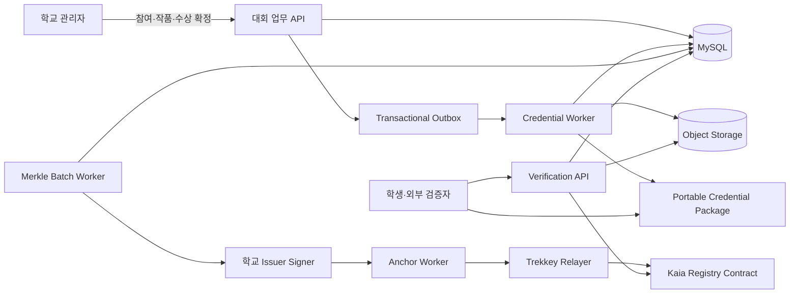
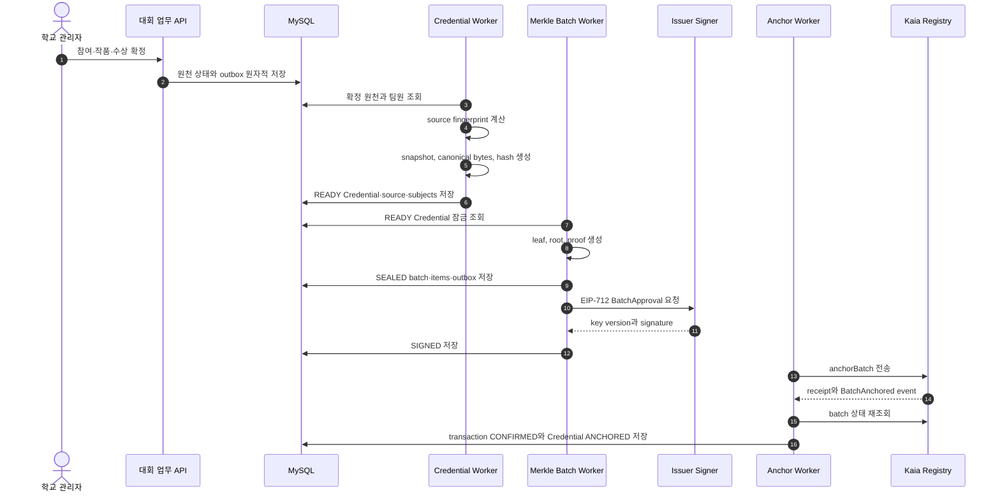
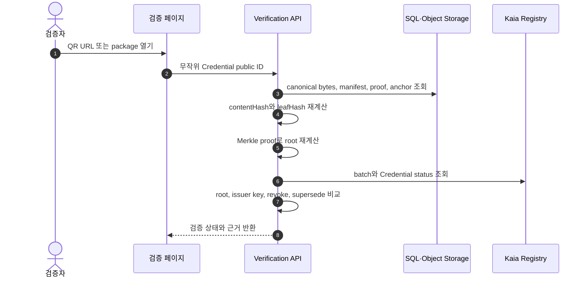

# Trekkey Credential 및 Kaia 앵커링 설계

- 기준일: 2026-07-20
- 상태: MVP 구현 기준
- 기준 ERD: [Trekkey 공모전·Credential 최종 ERD](./erd.md)
- 대상 네트워크: Kaia Kairos 우선, EVM 체인 교체 가능 구조

## 1. 한 줄 결론

Trekkey는 대회 원문과 개인정보를 SQL 및 객체 저장소에 보관하고, 확정된 참여·작품·수상 Credential을 Merkle Tree로 묶어 root만 Kaia에 기록한다.

블록체인은 다음을 증명한다.

> 특정 학교가 특정 시점에 승인한 Credential이 앵커링 이후 변경되지 않았고, 현재 폐기 또는 대체되지 않았는가.

블록체인은 다음을 증명하지 않는다.

> 학교가 앵커링 전에 입력한 대회 결과가 현실에서도 참이었는가.

앵커링 전 사실성은 학교의 심사·수상 확정 절차가 책임지고, 앵커링 후 무결성은 Credential hash, Merkle proof, 학교 서명, Kaia 상태가 책임진다.

## 2. MVP 범위

### 구현 대상

- `PARTICIPATION`: 확정된 팀 참가 이력
- `WORK`: 확정된 최종 제출 작품
- `AWARD`: 확정된 팀 수상 이력
- 학교별 issuer key 등록과 회전
- Credential canonicalization 및 content hash
- 파일 manifest hash
- Merkle batch 생성과 proof 보관
- EIP-712 학교 승인
- 표준 EVM relayer를 통한 Kaia 앵커링
- Credential revoke 및 supersede
- QR 검증과 Portable Credential Package

### 후속 대상

- 졸업요건 업무 원장과 `GRADUATION` Credential
- 학적·소속 이력
- 공모전 외 독립 작품
- 제출물 버전 이력
- 라운드별 앵커링
- batch 전체 revoke
- Kaia native fee delegation adapter
- 학교별 물리 서버 배포

## 3. 시스템 경계



역할은 세 층으로 나뉜다.

| 계층 | 책임 |
| --- | --- |
| 업무 SQL·객체 저장소 | 원문, 개인정보, 검색, 파일, 심사, 수상, proof, 트랜잭션 영수증 |
| Credential 계층 | 확정 데이터 스냅샷, canonical bytes, source fingerprint, 상태 이력 |
| Kaia | issuer 승인, Merkle root, Credential 폐기·대체 상태의 공개 증거 |

## 4. 왜 Merkle Tree인가

인증서별로 트랜잭션을 보내면 발급 수만큼 가스비와 nonce 관리가 늘어난다. 여러 Credential을 한 배치로 묶으면 한 번의 트랜잭션으로 여러 인증서를 앵커링할 수 있다.

```text
Credential 1 ─┐
Credential 2 ─┼─> Merkle root ─> Kaia transaction 1건
Credential 3 ─┘
```

개별 Credential은 다음 세 데이터로 검증한다.

```text
canonical credential
+ leaf tuple
+ Merkle proof
```

root 하나는 원문의 백업이 아니다. 원문과 proof를 잃으면 root만으로 인증서를 복구할 수 없다. 따라서 장기 증빙은 블록체인뿐 아니라 SQL 백업, 객체 저장소, Portable Package를 함께 운영해야 한다.

## 5. 저장 위치

### MySQL

- 기관, 사용자, 대회, 팀, 팀원, 제출물, 심사, 수상
- Credential payload 및 canonical bytes
- source와 subject 스냅샷
- content hash와 file manifest hash
- Merkle batch, leaf, proof
- issuer key 공개 주소와 key version
- EIP-712 typed data, digest, signature
- outbox, relayer 상태, receipt, event 위치
- revoke 및 supersede 이력

### 객체 저장소

- 최종 제출 파일
- 표시용 인증서 PDF
- immutable Portable Credential Package
- 선택적 장기 보존 원본

### Kaia

- issuer ID와 issuer key version
- batch ID hash
- Merkle root
- schema version hash
- tree version과 leaf count
- issuer 승인 nonce
- Credential ID hash별 revoke 또는 supersede 상태

### Kaia에 올리지 않는 값

- 이름, 학번, 이메일, 전화번호
- 학교 내부 PK
- 팀명, 작품명, 수상명
- 파일 URL, storage key, 원본 파일
- canonical Credential JSON

학번은 값의 범위가 작아 단순 SHA-256이나 Keccak-256만 공개해도 대입 공격이 가능하다. 학번은 온체인에 올리지 않으며, 학번 검색 API도 학교 tenant와 권한을 요구한다.

## 6. Credential 단위

| Credential type | source | 발급 조건 | 대표 내용 |
| --- | --- | --- | --- |
| `PARTICIPATION` | `TEAM` | 팀 명단 확정 | 대회, 팀, 구성원, 역할 |
| `WORK` | `SUBMISSION` | 제출 잠금 및 파일 hash 준비 | 작품명, 팀, file manifest |
| `AWARD` | `AWARD` | 수상 `CONFIRMED` | 대회, 상격, 수상 순위, 팀 |

상장은 팀 단위 Credential 한 건으로 발급한다. 개인별로 같은 Credential을 복제하지 않는다.

```text
AWARD Credential 1건
├─ subjectType TEAM 1행
├─ subjectType USER 대표자 1행
└─ subjectType USER 팀원 N행
```

학생별 이력은 `ANC_CREDENTIAL_SUBJECT.userId`로 조회한다. Credential payload의 subject 배열과 DB subject 행은 같은 안정적 순서를 사용한다.

## 7. 원천 확정과 스냅샷

Credential은 현재 업무 행을 실시간 참조하는 화면이 아니라 발급 시점 스냅샷이다.

발급 전제:

```text
PARTICIPATION -> TEAM.participationFinalizedAt 존재
WORK          -> SUBMISSION.finalizedAt 존재 + integrityStatus READY
AWARD         -> AWARD.status CONFIRMED + confirmedAt 존재
```

발급 트랜잭션은 다음을 함께 저장한다.

- `ANC_CREDENTIAL`
- `ANC_CREDENTIAL_SOURCE`
- 모든 `ANC_CREDENTIAL_SUBJECT`
- 발급 완료 outbox

한 부분이라도 실패하면 전체를 rollback한다. `READY`가 된 이후 payload, canonical bytes, source, subject를 UPDATE하지 않는다.

## 8. 식별자와 도메인 분리

외부 공개 ID는 내부 bigint PK를 사용하지 않는다.

- `ORGANIZATION.publicId`: 안정적인 issuer 공개 ID
- `CONTEST`, `TEAM`, `SUBMISSION`, `AWARD`: 충분히 예측하기 어려운 공개 ID
- `ANC_CREDENTIAL.publicId`: UUIDv4 기반 불변 ID
- `ANC_BATCH.publicId`: UUIDv4 기반 불변 ID

온체인 식별자는 고정 domain을 포함해 계산한다.

```text
issuerId = keccak256(
  abi.encode(ISSUER_ID_DOMAIN, keccak256(UTF8(organizationPublicId)))
)

credentialIdHash = keccak256(
  abi.encode(
    CREDENTIAL_ID_DOMAIN,
    issuerId,
    keccak256(UTF8(credentialPublicId))
  )
)

batchIdHash = keccak256(
  abi.encode(
    BATCH_ID_DOMAIN,
    issuerId,
    keccak256(UTF8(batchPublicId))
  )
)
```

domain 상수와 ABI 타입은 계약, Java fixture, schema profile에 고정한다.

## 9. Schema profile

단순 정수 `schemaVersion = 1`만으로는 payload, Unicode, canonicalization, leaf 규칙을 재현하기 부족하다.

V1은 불변 문자열 profile을 사용한다.

```text
trekkey:award:v1:jcs-rfc8785:unicode-nfc-1
trekkey:participation:v1:jcs-rfc8785:unicode-nfc-1
trekkey:work:v1:jcs-rfc8785:unicode-nfc-1
```

```text
schemaVersionHash = keccak256(UTF8(schemaProfileId))
```

profile 문서는 다음을 함께 고정한다.

- 허용 필드와 필수 필드
- 문자열 Unicode 정책
- 숫자와 시각 표현
- 배열 정렬
- null 포함 여부
- file manifest 규칙
- leaf ABI tuple과 tree version

## 10. Canonical JSON

V1 규칙:

- 모든 문자열을 Unicode NFC로 변환한 뒤 canonicalization한다.
- JSON은 RFC 8785 JCS를 사용한다.
- canonical 결과는 UTF-8 bytes로 저장한다.
- 날짜는 UTC RFC 3339 문자열로 고정한다.
- 점수는 binary floating point를 사용하지 않고 integer 또는 decimal 문자열을 사용한다.
- 배열은 profile이 정한 stable key로 먼저 정렬한다.
- URL, storage key처럼 바뀔 수 있는 운영 값은 해시 대상에서 제외한다.

RFC 8785 자체는 Unicode normalization을 수행하지 않으므로 NFC 변환은 Trekkey schema profile의 별도 전처리 규칙이다.

```text
contentHash = SHA-256(canonicalBytes)
```

DB에는 조회용 `payloadJson`과 실제 hash 입력인 `canonicalBytes`를 모두 저장한다. 검증은 payload를 새로 정규화한 결과와 저장된 canonical bytes 및 content hash를 모두 비교한다.

## 11. Source fingerprint와 중복 발급 방지

`contentHash`는 내용 무결성이고 `sourceFingerprint`는 같은 업무 원천의 중복 발급 방지 키다.

```json
{
  "fingerprintVersion": 1,
  "issuerPublicId": "org_public_id",
  "credentialType": "AWARD",
  "sourceType": "AWARD",
  "sourcePublicId": "award_public_id",
  "sourceVersion": 1,
  "subjectSetHash": "sha256_hex",
  "schemaProfileId": "trekkey:award:v1:jcs-rfc8785:unicode-nfc-1"
}
```

```text
subjectSetHash = SHA-256(
  JCS([{userId, roleCode}, ...] sorted by userId then roleCode)
)

sourceFingerprint = SHA-256(
  JCS(fingerprint input)
)
```

처리 순서:

```text
source fingerprint 계산
-> 기존 Credential 조회
-> 있으면 기존 결과 반환
-> 없으면 public ID와 issuedAt을 최초 한 번 생성
-> UNIQUE 충돌 시 기존 Credential 재조회 후 반환
```

사용자 더블 클릭, HTTP 재시도, worker 중복 실행은 같은 Credential을 반환한다. payload에 영향을 주는 업무 변경은 먼저 `sourceVersion`을 증가시켜야 한다.

## 12. 제출 파일과 manifest

파일 SHA-256은 브라우저가 보낸 값을 신뢰하지 않고 서버가 실제 업로드 stream으로 계산한다.

manifest input:

```json
{
  "manifestVersion": 1,
  "files": [
    {
      "sha256Hex": "...",
      "sizeBytes": 1234,
      "contentType": "application/pdf",
      "originalName": "result.pdf"
    }
  ]
}
```

규칙:

- 문자열은 NFC 처리한다.
- 파일은 `sha256Hex`, `sizeBytes`, `contentType`, `originalName` 순으로 lexicographic 정렬한다.
- `storageKey`, presigned URL, bucket 이름은 포함하지 않는다.
- 파일이 없는 Credential도 빈 `files` 배열의 canonical manifest를 사용한다.

```text
fileManifestHash = SHA-256(fileManifestCanonicalBytes)
```

객체 저장 위치가 바뀌어도 작품 증명은 변하지 않는다.

## 13. Merkle V1 규칙

한 batch는 같은 issuer와 같은 `schemaVersionHash`, `treeVersion`의 Credential만 포함한다.

leaf tuple:

```text
leafValue = abi.encode(
  bytes32 LEAF_DOMAIN,
  bytes32 issuerId,
  bytes32 credentialIdHash,
  bytes32 schemaVersionHash,
  bytes32 contentHash,
  bytes32 fileManifestHash
)
```

OpenZeppelin `StandardMerkleTree` 호환 규칙을 사용한다.

```text
leafHash = keccak256(bytes.concat(keccak256(leafValue)))
nodeHash = keccak256(sorted(left, right))
```

- 최종 leaf hash를 lexicographic 정렬한다.
- 정렬된 위치를 `leafIndex`로 저장한다.
- proof는 `bytes32[]` 순서 그대로 JSON hex 배열로 저장한다.
- 홀수 leaf 처리와 internal node 규칙은 `treeVersion = 1` fixture로 고정한다.
- `credentialIdHash`가 고유하므로 동일 content라도 leaf는 다르다.
- Java 구현은 OpenZeppelin reference fixture와 byte-for-byte 일치해야 한다.

필수 fixture:

- leaf 1, 2, 3개와 홀수 개수
- 동일 content와 서로 다른 Credential ID
- payload 한 글자 변경
- 잘못된 proof와 순서 변경
- Java와 JavaScript의 root/proof 교차 검증

## 14. 학교 승인 서명

학교 issuer와 가스비를 내는 relayer를 분리한다.

```text
학교 issuer key -> EIP-712 approval 서명
Trekkey relayer -> Kaia transaction 전송 및 가스비 지불
컨트랙트 -> 학교 서명과 nonce 검증
```

`BatchApproval` 필수 필드:

- issuer ID
- batch ID hash
- Merkle root
- schema version hash
- leaf count와 tree version
- issuer key version
- approval nonce
- deadline

`StatusApproval` 필수 필드:

- issuer ID
- Credential ID hash
- action: `REVOKE` 또는 `SUPERSEDE`
- replacement Credential ID hash
- effective time
- issuer key version
- approval nonce
- deadline

EIP-712 domain에는 다음을 포함한다.

- `name = TrekkeyCredentialRegistry`
- contract version
- chain ID
- verifying contract address

DB에는 typed data JSON, digest, signature, key ID, nonce, deadline을 보존한다. V1 컨트랙트는 이미 사용된 `approvalDigest`를 기록해 같은 승인의 replay를 거부한다.

## 15. 온체인 모델

V1 컨트랙트는 관계형 업무 데이터를 저장하지 않는다.

```solidity
struct BatchAnchor {
    bytes32 issuerId;
    bytes32 merkleRoot;
    bytes32 schemaVersionHash;
    uint32 leafCount;
    uint16 treeVersion;
    uint64 issuerKeyVersion;
    uint64 anchoredAt;
}

struct IssuerKey {
    address signer;
    uint64 validFrom;
    uint64 validUntil;
    uint64 compromisedAt;
}

enum CredentialState {
    NONE,
    REVOKED,
    SUPERSEDED
}

struct StatusRecord {
    CredentialState state;
    uint64 effectiveAt;
    uint64 issuerKeyVersion;
    bytes32 replacementCredentialIdHash;
}
```

권장 함수:

```solidity
registerIssuerKey(bytes32 issuerId, uint64 keyVersion, address signer)
retireIssuerKey(bytes32 issuerId, uint64 keyVersion, uint64 validUntil)
markIssuerKeyCompromised(bytes32 issuerId, uint64 keyVersion, uint64 compromisedAt)

anchorBatch(BatchApproval approval, bytes issuerSignature)
revokeCredential(StatusApproval approval, bytes issuerSignature)
supersedeCredential(StatusApproval approval, bytes issuerSignature)

getBatch(bytes32 batchIdHash)
getIssuerKey(bytes32 issuerId, uint64 keyVersion)
getCredentialStatus(bytes32 issuerId, bytes32 credentialIdHash)
verifyProof(bytes32 batchIdHash, bytes32 leafHash, bytes32[] proof)
```

V1은 batch 전체 revoke를 지원하지 않는다. 잘못된 Credential은 개별 폐기·대체한다. batch revoke가 실제 운영 요구가 되면 서명된 별도 batch status 원장을 추가한다.

## 16. 컨트랙트 운영 원칙

- Solidity와 OpenZeppelin `AccessControl`, `Pausable`, `EIP712`, `ECDSA`, `MerkleProof`를 사용한다.
- issuer key 등록 권한과 relayer 제출 권한을 분리한다.
- 신규 anchor를 pause하더라도 revoke와 supersede는 계속 허용한다.
- issuer key는 `validFrom`, `validUntil`, `compromisedAt`을 검증한다.
- 키 회전은 과거 정상 batch를 자동 무효화하지 않는다.
- V1은 upgradeable proxy를 사용하지 않는다.
- 로직 변경은 새 contract address와 `contractVersion`으로 배포한다.
- 운영 admin은 개인 EOA 한 개가 아니라 multisig와 timelock을 사용한다.

## 17. Kaia 선택과 전송 방식

Kaia를 선택하는 이유:

- EVM 호환으로 Solidity, Foundry, OpenZeppelin 등 기존 도구를 사용할 수 있다.
- 빠른 block 생성과 BFT 기반 immediate finality를 제공한다.
- Kairos testnet과 mainnet의 구분이 명확하다.
- native fee delegation과 관리형 fee delegation 선택지가 있다.

네트워크:

| 환경 | chain ID | 용도 |
| --- | ---: | --- |
| Kairos | `1001` | 개발, 통합 테스트, 데모 |
| Mainnet | `8217` | 운영 |

V1은 Kaia native fee-delegated transaction을 사용하지 않고 표준 EVM relayer를 사용한다. 학생과 검증자는 트랜잭션을 보내지 않으므로 지갑과 KAIA가 필요 없다. 학교는 EIP-712 approval만 서명하고 Trekkey relayer가 가스비를 낸다.

native fee delegation은 학교 담당자나 학생이 자기 지갑으로 직접 컨트랙트를 호출하면서 Trekkey가 수수료만 대신 내야 할 때 별도 adapter로 도입한다.

백엔드 core에는 Kaia SDK 타입을 직접 노출하지 않는다.

```java
public interface BlockchainAnchorPort {
    AnchorSubmission submit(AnchorBatchPayload payload);
    AnchorReceipt getReceipt(String txHash);
    OnChainBatch getBatch(String batchIdHash);
    CredentialChainStatus getCredentialStatus(String issuerId, String credentialIdHash);
}
```

표준 JSON-RPC adapter로 시작하고 Kaia 고유 기능이 필요할 때 `kaia-sdk` 호환성 검증 후 adapter를 추가한다.

## 18. 발급과 앵커링 순서



배치 생성은 `SELECT ... FOR UPDATE SKIP LOCKED` 또는 동등한 claim 전략으로 worker 간 중복 선점을 막는다.

## 19. 공개 검증 순서



검증 결과:

| 상태 | 의미 |
| --- | --- |
| `VALID` | hash, proof, issuer, 온체인 상태 모두 정상 |
| `PENDING` | 아직 batch가 온체인 확정되지 않음 |
| `REVOKED` | 발급자가 폐기함 |
| `SUPERSEDED` | 더 최신 Credential로 대체됨 |
| `TAMPERED` | canonical hash 또는 proof 불일치 |
| `ANCHOR_NOT_FOUND` | 온체인 batch가 없음 |
| `ISSUER_INVALID` | 발급 당시 issuer key 검증 실패 |
| `RPC_UNAVAILABLE` | 체인 조회 장애이며 위조로 단정하지 않음 |
| `SCHEMA_UNSUPPORTED` | verifier가 schema 또는 tree version을 모름 |

QR에는 학번이나 전체 proof를 넣지 않는다. 기본 QR은 HTTPS URL과 무작위 Credential public ID만 포함한다.

## 20. 폐기와 대체 발급

### 폐기

```text
관리자 폐기 요청
-> DB status event와 outbox 저장
-> issuer StatusApproval 서명
-> revokeCredential 온체인 확정
-> Credential REVOKED
```

### 대체

대체 Credential이 검증 불가능한 공백을 만들지 않도록 순서를 고정한다.

```text
새 sourceVersion 확정
-> 새 Credential 생성
-> 새 batch 앵커 CONFIRMED
-> 기존 Credential supersede 온체인 확정
-> 기존 Credential SUPERSEDED
```

replacement Credential ID hash는 0일 수 없고, 이미 `REVOKED` 또는 `SUPERSEDED`인 Credential에 상태를 덮어쓰지 않는다.

## 21. Portable Credential Package

장기 검증을 위해 학생이 소유할 수 있는 package를 제공한다.

```text
credential.json
file-manifest.json
merkle-proof.json
anchor.json
issuer-approval.json
status.json
rendered-certificate.pdf
```

필수 검증 입력:

- canonical Credential bytes
- canonical file manifest bytes
- leaf tuple과 tree version
- Merkle proof와 batch ID hash
- chain ID, contract address, contract version
- EIP-712 typed data와 issuer signature
- schema profile ID와 hash

PDF는 사람이 보는 표시물이며 cryptographic source of truth가 아니다. 원본 파일은 크기와 공개 정책에 따라 package에 포함하거나 SHA-256 manifest만 포함한다.

## 22. 학교별 서버와 중앙 서버

### MVP

하나의 Spring Boot와 MySQL을 multi-tenant로 운영한다.

- 모든 업무 요청은 `organizationId` scope를 강제한다.
- 학번 조회는 `organizationId + studentId`로 수행한다.
- issuer key와 nonce는 학교별로 분리한다.
- 학교별 key는 KMS/HSM namespace와 접근 정책을 분리한다.

### 확장

각 학교가 자기 SQL과 signer를 운영할 수 있도록 port를 유지한다.

```java
public interface CredentialSourcePort {
    FinalizedCredentialSource load(CredentialSourceId sourceId);
}

public interface IssuerSignerPort {
    IssuerApproval sign(ApprovalPayload payload);
}
```

학교 서버 분산 배포로 바뀌어도 Credential schema, Merkle 규칙, 컨트랙트는 바뀌지 않는다.

## 23. API 경계

공개 검증과 관리자 검색을 분리한다.

```text
GET /api/v1/credentials/{publicId}
GET /api/v1/credentials/{publicId}/verify
GET /api/v1/credentials/{publicId}/package

GET /api/v1/organizations/{organizationId}/students/{studentId}/credentials
GET /api/v1/contests/{contestPublicId}/credentials
GET /api/v1/teams/{teamPublicId}/credentials

POST /internal/v1/credentials/issue
POST /internal/v1/batches/{batchPublicId}/seal
POST /internal/v1/batches/{batchPublicId}/submit
POST /internal/v1/credentials/{publicId}/revoke
POST /internal/v1/credentials/{publicId}/supersede
```

학번 기반 전체 이력 API는 본인 인증 또는 학교 관리자 권한이 필요하다.

## 24. 장애 및 보안 기준

- 업무 확정과 outbox 저장은 한 트랜잭션이다.
- Credential 생성과 source·subject 저장은 한 트랜잭션이다.
- batch seal과 anchor outbox 저장은 한 트랜잭션이다.
- relayer nonce는 단일 sequencer 또는 DB lease로 관리한다.
- 전송 전 `eth_call`, chain ID, contract allowlist, function selector, value zero, gas cap을 확인한다.
- RPC timeout은 `UNKNOWN`으로 기록한다.
- 재전송 전 batch ID hash 또는 Credential status를 온체인 조회한다.
- issuer와 relayer private key는 소스, DB, 일반 환경변수에 두지 않는다.
- 운영 RPC는 두 provider 이상을 사용하고 receipt, event, block hash를 교차 확인할 수 있게 한다.
- relayer 잔액, 일별 가스 예산, outbox backlog, 실패율을 모니터링한다.
- MySQL 복구 훈련, 객체 저장소 versioning, package 복원 테스트를 수행한다.

Kaia는 BFT 기반 immediate finality를 제공하므로 임의의 Ethereum confirmation 수를 하드코딩하지 않는다. 성공 receipt, 예상 event, block hash, on-chain readback을 확인한다.

## 25. 테스트 완료 기준

### 데이터와 canonicalization

- 같은 의미의 payload가 같은 canonical bytes와 content hash를 만든다.
- 필드 순서가 달라도 같은 hash를 만든다.
- NFC 이전 표현이 다른 문자열은 정책에 따라 같은 bytes가 된다.
- 한 글자 변경은 다른 hash를 만든다.
- decimal과 timestamp 표현이 profile 규칙을 벗어나면 발급을 거부한다.

### 업무 무결성

- 같은 팀원, 제출물, ENTRY, 심사 배정, 수상 중복 생성이 DB 제약으로 실패한다.
- 동시 재제출에서 오래된 hash worker 결과가 최신 sourceVersion을 덮어쓰지 못한다.
- 라운드 확정 후 심사와 결과 수정이 실패한다.
- AWARD의 team이 ENTRY의 team과 다르면 확정이 실패한다.

### Merkle와 계약

- Java와 OpenZeppelin fixture의 leaf, root, proof가 일치한다.
- 다른 issuer, schema, Credential ID를 사용한 proof가 실패한다.
- 만료된 approval과 재사용 nonce가 실패한다.
- 다른 chain ID 또는 contract address의 EIP-712 signature가 실패한다.
- 같은 batch ID hash를 두 번 앵커링할 수 없다.
- revoke와 supersede 상태가 검증 결과에 반영된다.

### 장애 복구

- 동일 outbox와 source fingerprint 재처리가 중복 Credential을 만들지 않는다.
- RPC timeout 후 readback으로 이미 성공한 트랜잭션을 확인한다.
- SQL 백업과 Portable Package만으로 proof를 재검증할 수 있다.

## 26. 구현 순서

### Phase 1. 업무 원장

- ERD의 업무 테이블과 제약 migration
- 팀 명단 및 제출물 잠금
- 서버 측 파일 SHA-256
- 라운드 확정과 수상 원천 연결
- domain outbox

### Phase 2. 체인 독립 Credential

- schema profile과 JSON Schema
- RFC 8785 canonicalizer
- source fingerprint와 idempotent issuance
- subject snapshot
- file manifest
- Portable Package 초안

### Phase 3. Merkle와 Solidity

- OpenZeppelin-compatible fixture
- `TrekkeyCredentialRegistryV1`
- EIP-712 BatchApproval과 StatusApproval
- issuer key rotation
- revoke와 supersede
- Foundry 단위·fuzz 테스트

### Phase 4. Spring Boot 및 Kaia

- batch worker와 anchor worker
- signer, relayer, JSON-RPC adapter
- Kairos 배포 및 explorer 검증
- 공개 verify API와 QR
- 모니터링 및 재시도

### Phase 5. 운영 확장

- mainnet multisig와 timelock
- KMS/HSM signer
- 복수 RPC
- 학교별 signer 또는 source adapter
- 졸업 Credential 업무 원장

## 27. 포트폴리오 설명

Trekkey는 개인정보와 인증서 원문을 퍼블릭 체인에 저장하지 않고, 확정된 Credential을 RFC 8785 canonical JSON으로 고정한 뒤 Merkle root만 Kaia에 앵커링한다.

여러 인증서를 하나의 root로 묶어 트랜잭션 수를 줄였고, 개별 인증서는 OpenZeppelin 호환 proof로 검증한다. 학교 issuer가 EIP-712 approval에 서명하고 Trekkey relayer가 가스비를 부담하므로 학생은 지갑이나 코인을 사용할 필요가 없다.

업무 DB와 체인 처리는 transactional outbox로 분리했으며, source fingerprint, batch ID, chain operation별 멱등 키로 중복 발급과 중복 전송을 방지한다. 폐기와 정정은 기존 원문 수정이 아니라 revoke와 supersede로 처리한다.

블록체인 root만으로 원문을 복구할 수 없다는 한계도 설계에 반영했다. SQL 백업, 객체 저장소, 학생 소유 Portable Credential Package를 함께 제공해 장기 증빙 가능성을 확보한다.

## 28. 최종 결정 요약

- 업무 SQL과 앵커링 SQL, 온체인 상태를 분리한다.
- 개인정보와 원문은 온체인에 저장하지 않는다.
- 팀 상장은 Credential 한 건이며 구성원은 subject snapshot으로 연결한다.
- 제출물은 팀당 한 건이고 마감 전 덮어쓰기, 확정 후 잠금이다.
- 라운드 심사 원점수와 공식 판정 ENTRY를 분리한다.
- AWARD는 공식 `CONTEST_STAGE_ENTRY`를 원천으로 가진다.
- `sourceFingerprint`로 의미 기반 중복 발급을 막는다.
- JCS + NFC, SHA-256 content hash, OpenZeppelin-compatible Merkle 규칙을 고정한다.
- 학교는 EIP-712 approval을 서명하고 표준 EVM relayer가 Kaia 트랜잭션을 보낸다.
- V1은 개별 revoke와 supersede만 지원한다.
- Credential Package는 장기 검증의 필수 산출물이다.
- 졸업, 학적 이력, 제출 버전, batch revoke는 실제 요구가 생길 때 확장한다.

## 29. 참고

- [Kaia Foundation Setup](https://docs.kaia.io/build/get-started/foundation-setup/)
- [Kaia execution model and finality](https://docs.kaia.io/learn/computation/execution-model/)
- [Kaia and Ethereum comparison](https://docs.kaia.io/learn/kaia-vs-ethereum/)
- [Kaia fee delegation](https://docs.kaia.io/build/transactions/fee-delegation/)
- [Kaia SDK](https://github.com/kaiachain/kaia-sdk)
- [Kaia fee delegation server](https://github.com/kaiachain/fee-delegation-server)
- [RFC 8785 JSON Canonicalization Scheme](https://www.rfc-editor.org/rfc/rfc8785.html)
- [EIP-712 typed structured data](https://eips.ethereum.org/EIPS/eip-712)
- [OpenZeppelin Contracts cryptography](https://docs.openzeppelin.com/contracts/5.x/api/utils/cryptography)
- [OpenZeppelin Standard Merkle Tree](https://github.com/OpenZeppelin/merkle-tree)

배포 직전에는 Kaia network, EVM target, SDK 호환 버전, OpenZeppelin release를 다시 확인한다.
