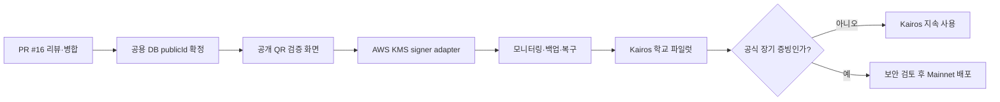

# Trekkey Kairos 지속 사용 및 후속 개발 인계

- 기준일: 2026-07-29
- 현재 단계: Kairos Credential E2E 완료, 학교 운영 환경과 Mainnet 전
- 대상: 블록체인 후속 개발자, 백엔드 담당자, 프론트 검증 화면 담당자, 배포 담당자
- 기준 PR: [Backend Draft PR #16](https://github.com/Tok-Baro/Trekkey_BackEnd/pull/16)
- 상세 실행 절차: [블록체인 구현 및 Kairos 실행 가이드](./blockchain-implementation-runbook.md)
- 실제 체인 증적: [Kairos Registry 배포 및 E2E 검증 기록](./blockchain-kairos-deployment.md)

## 1. 결정

Trekkey는 당분간 Kaia Kairos Testnet을 계속 사용한다.

- 졸업작품, 포트폴리오 시연, 팀 통합 개발, 학교 내부 베타는 Kairos에서 수행한다.
- 현재 Registry를 재배포하지 않고 같은 주소에 후속 batch와 상태 변경을 기록한다.
- Kaiascan source verification은 기능 사용의 선행 조건이 아니다.
- 실제 학생에게 장기 공식 증빙을 제공하기 전까지 Mainnet 배포를 서두르지 않는다.
- Mainnet 전환은 이 문서의 운영 준비와 전환 조건을 모두 만족한 뒤 별도 배포로 진행한다.

Kaia 공식 문서는 Kairos를 개발·테스트용, Mainnet을 production 용도로 구분한다.
공개 RPC는 개발에 사용할 수 있지만 uptime, 안정성, rate limit을 보장하지 않는다.

- [Kaia Foundation Setup](https://docs.kaia.io/build/get-started/foundation-setup/)
- [Kaia Public JSON-RPC Endpoints](https://docs.kaia.io/references/public-en/)
- [Kairos Faucet](https://docs.kaia.io/build/get-started/getting-kaia/)

## 2. 현재 고정 좌표

| 항목 | 현재 값 |
| --- | --- |
| Network | Kaia Kairos Testnet |
| Chain ID | `1001` |
| Registry | `0x4ca738CC22Af5aE40EA8A23E001FA93e1e044117` |
| Runtime code hash | `0x6bdcd078a99c833e1e6126d71954b570fb7bfb4afe4720fc4a438009039571a2` |
| Test organization public ID | `725050e0-2a2f-48a8-a8b8-2e51e12524b7` |
| Test issuer key | version `2`, `0x235a99Eb7Acb6f181740B246acfc9885692BD79d` |
| Backend relayer | `0xB87670C4171e913368F688B660e143366E0ca6ea` |
| Contract version | `1` |
| Merkle tree version | `1` |

이 값은 `contracts/deployments/kairos-1001.json`을 프로그램 기준 원본으로 사용한다.
주소, runtime hash, issuer와 relayer가 manifest와 다르면 트랜잭션을 보내지 않는다.

## 3. 바로 이어서 개발하는 순서



### P0. PR과 공용 DB 기준 확정

1. Draft PR #16을 팀원이 검토한다.
2. Java 21과 Solidity CI 성공을 확인한다.
3. `develop`에 병합한다.
4. 공용 MySQL에서 실제 학교 `ORGANIZATION` 행과 현재 `public_id`를 확인한다.

`public_id` 처리 규칙:

| 공용 DB 상태 | 처리 |
| --- | --- |
| null 또는 blank이고 기존 Credential 없음 | UUIDv4를 부여한 뒤 `NOT NULL + UNIQUE` migration |
| 현재 Kairos test UUID와 같음 | issuer v2를 그대로 사용 |
| 다른 UUID가 이미 고정됨 | 값을 덮어쓰지 않고 실제 UUID용 issuer를 Kairos에 새로 등록 |
| 기존 Credential이 이미 발급됨 | public ID 변경 금지, 새 issuer 또는 supersede migration 설계 |

온체인 `issuerId`는 `ORGANIZATION.publicId`에서 파생된다. 이미 사용한 public ID를 임의로
바꾸면 과거 Credential과 발급자의 연결이 깨진다.

완료 기준:

- 모든 학교 행의 `public_id`가 유효한 UUIDv4다.
- null, blank, 중복 값이 없다.
- DB 제약이 `NOT NULL + UNIQUE`다.
- 선택한 학교 UUID로 계산한 issuer ID와 Kairos 등록값이 일치한다.

### P1. QR 공개 검증 화면

구현 대상:

- `/verify/{credentialPublicId}` 공개 라우트
- `GET /api/public/credentials/{credentialPublicId}` 호출
- `VALID`, `PENDING`, `TAMPERED`, `REVOKED`, `SUPERSEDED`, `RPC_UNAVAILABLE` 표시
- `SUPERSEDED`이면 replacement Credential 이동
- chain ID, Registry, tx hash와 Kaiascan 링크 표시
- 서버 오류와 위변조 판정을 같은 화면으로 표시하지 않음
- QR에는 개인정보나 canonical JSON이 아니라 공개 검증 URL만 포함

브라우저 E2E:

1. 정상 Credential QR에서 `VALID`
2. 폐기 후 같은 QR에서 `REVOKED`
3. 대체 후 같은 QR에서 `SUPERSEDED`와 replacement 이동
4. 존재하지 않는 ID
5. RPC 장애에서 `RPC_UNAVAILABLE`
6. 모바일 viewport에서 상태와 링크가 겹치지 않음

완료 기준:

- 실제 Kairos E2E Credential 세 건으로 브라우저 테스트가 통과한다.
- 화면은 DB의 표시 상태만 신뢰하지 않고 공개 검증 API 결과와 근거를 표시한다.

### P1. AWS KMS signer

현재 `LOCAL_RELAYER`는 Kairos 개발용 private key adapter다. 운영에서는 다음 두 권한을
서로 다른 AWS KMS 키와 IAM 정책으로 분리한다.

| KMS 키 | 책임 |
| --- | --- |
| School issuer signer | EIP-712 batch, revoke, supersede 승인 |
| Trekkey relayer signer | 승인된 EVM raw transaction 서명과 가스 납부 |

KMS 기준:

- Key spec: `ECC_SECG_P256K1`
- Key usage: `SIGN_VERIFY`
- Signing algorithm: `ECDSA_SHA_256`
- EIP-712와 EVM digest 전달: `MessageType=DIGEST`
- DER signature의 `r`, `s` 파싱
- secp256k1 low-s 정규화와 recovery ID 검증
- private key export 금지
- issuer IAM과 relayer IAM 상호 분리

백엔드 변경 방향:

1. Web3j adapter에서 로컬 `Credentials` 생성을 transaction signer port 뒤로 분리한다.
2. Kairos 개발용 local signer와 AWS KMS signer를 각각 adapter로 둔다.
3. KMS 장애는 새 nonce를 만들지 않고 기존 Outbox와 chain transaction을 재처리한다.
4. KMS key ARN 또는 alias만 설정에 저장하고 secret key material은 저장하지 않는다.
5. Mainnet write mode는 KMS adapter와 운영 권한 검증이 없으면 기동을 거부한다.

완료 기준:

- private key 환경변수 없이 Kairos anchor, revoke, supersede가 성공한다.
- 잘못된 KMS key, IAM 거부, timeout, 중복 재시도 테스트가 있다.
- 서명 복구 주소가 온체인 issuer 또는 relayer 주소와 정확히 일치한다.

### P1. 모니터링과 복구

필수 지표:

- Outbox `PENDING`, `PROCESSING`, `DEAD` 개수와 최고 체류 시간
- Chain transaction `UNKNOWN`, `FAILED` 개수와 체류 시간
- relayer KAIA 잔액과 일별 가스 사용량
- RPC 오류율, latency, chain ID와 runtime hash 불일치
- Credential 발급, batch seal, anchor, revoke, supersede 처리량

필수 복구 훈련:

- MySQL point-in-time 복원
- Object Storage versioning과 file hash 재검증
- Portable Credential Package만으로 hash와 Merkle proof 재검증
- primary RPC 장애 시 read-only secondary RPC 조회
- 성공 receipt 이후 readback 지연에서 `UNKNOWN -> CONFIRMED` 수렴

완료 기준:

- 테스트 경보가 실제 알림 채널에 도착한다.
- 백업본에서 임의 Credential 한 건을 복원하고 동일 hash와 proof를 재현한다.
- 복구 절차와 담당자, 목표 복구 시간이 문서에 기록된다.

### P2. Kaiascan source verification과 legacy 권한

Kaiascan 검증은 선택적 후속 작업이다. 실행하지 않아도 현재 Registry는 계속 동작한다.

검증 시 공개되는 것:

- Solidity source와 관련 의존 source
- compiler, optimizer, EVM target
- ABI와 constructor argument

공개되지 않는 것:

- Java 백엔드 전체
- DB와 Credential 개인정보
- `.env`, private key, seed phrase, 지갑 비밀번호

소스와 build metadata의 외부 공개 승인을 받은 뒤에만 아래 명령을 실행한다.

```bash
cd contracts
npm run verify:kairos -- \
  0x4ca738CC22Af5aE40EA8A23E001FA93e1e044117 \
  0x5cc66C91d390336bD58Db75C261a994A78C14486
```

legacy 정리 후보:

- issuer key version `1` retirement
- browser relayer `0xFf3BFF4FfF5d0699E82Fd5b045F034AB01FF8Ed6` 역할 회수

둘 다 실제 온체인 권한 변경이므로 기존 증적 영향과 관리자 지갑을 확인한 뒤 별도
change transaction으로 처리한다.

## 4. 일상 개발 명령

### 공개 상태 사전 점검

```bash
cd contracts
npm run read:kairos --silent
```

아래 항목이 모두 `true`여야 한다.

- Registry와 deployer가 manifest와 일치
- runtime code 존재와 hash 일치
- `LEAF_DOMAIN` 일치
- admin과 relayer role 일치
- issuer signer와 key version 일치
- issuer key가 현재 활성 상태

### 백엔드 READ_ONLY 점검

```bash
./contracts/scripts/run-kairos-read-only.sh
```

이 시험은 relayer private key 없이 Spring/JPA, issuer ID 계산, Registry readback을 검증한다.

### 로컬 회귀 테스트

```bash
./gradlew test

cd contracts
npm test
npx tsc --noEmit
```

### 실제 Kairos write E2E

아래 명령은 실제 Kairos transaction 세 건 이상을 만들고 test KAIA를 사용한다. 기능 변경이
anchor 또는 상태 전이에 영향을 줄 때만 실행한다.

```bash
KAIROS_LIVE_E2E_CONFIRM=I_UNDERSTAND_KAIROS_WRITES \
  ./contracts/scripts/run-kairos-live-e2e.sh
```

## 5. Kairos 지속 사용 규칙

1. 같은 Registry를 사용하고 배포 주소를 환경별로 하드코딩해 섞지 않는다.
2. `chainId`, Registry, runtime hash를 연결 시마다 검증한다.
3. test issuer와 relayer 키를 운영 또는 Mainnet에서 재사용하지 않는다.
4. relayer 잔액은 write 전에 확인하고 Faucet은 테스트 계정에만 사용한다.
5. public RPC 장애를 위조로 판정하지 않고 `RPC_UNAVAILABLE`로 구분한다.
6. public RPC의 uptime과 rate limit을 운영 SLA로 간주하지 않는다.
7. testnet root만을 평생 보존 수단으로 약속하지 않는다.
8. 원문, file manifest, proof, receipt와 Portable Package를 함께 백업한다.
9. canonical profile과 `treeVersion=1`을 기존 Credential에 대해 변경하지 않는다.
10. 테스트 데이터를 삭제하려고 기존 Credential을 UPDATE하지 않는다. 새 발급과
    revoke 또는 supersede를 사용한다.

## 6. Mainnet 전환 조건

다음 조건 중 하나가 발생하면 Mainnet 전환 검토를 시작한다.

- 실제 학교가 학생에게 공식 Credential을 발급하기로 확정
- 졸업 이후에도 장기 독립 검증을 서비스 요구사항으로 약속
- 테스트 계정이 아닌 운영 조직과 발급 책임자가 확정

검토를 시작해도 아래 조건을 모두 만족하기 전에는 배포하지 않는다.

- 공용 DB migration 완료
- QR 브라우저 E2E 완료
- AWS KMS signer와 IAM 분리 완료
- multisig 또는 timelock 관리자 구성
- RPC provider SLA와 장애 전환
- 모니터링, 가스 예산, relayer 충전 절차
- MySQL, Object Storage, Portable Package 복구 훈련
- 컨트랙트 source verification과 보안 리뷰
- 테스트 issuer, relayer, 관리자 키를 Mainnet에서 재사용하지 않음

Mainnet은 Kairos 컨트랙트를 이동시키는 것이 아니다.

```text
새 Mainnet Registry 배포
-> 새 운영 admin, issuer, relayer 등록
-> chainId=8217과 새 contractAddress를 DB에 저장
-> 기존 Kairos Credential은 기존 chain locator로 계속 검증
-> 신규 운영 Credential부터 Mainnet batch에 포함
```

## 7. 단계별 완료 정의

### 현재 완료: 포트폴리오·Kairos 기술 E2E

- [x] Registry 배포와 runtime hash 검증
- [x] issuer v2와 backend relayer 분리
- [x] Credential 3건 Merkle anchor
- [x] revoke, supersede와 replacement 검증
- [x] Spring/JPA READ_ONLY
- [x] Java, Solidity, Wallet console CI
- [x] 배포, E2E, 장애 원인과 복구 문서

### 다음 목표: 학교 내부 Kairos 파일럿

- [ ] Draft PR #16 병합
- [ ] 공용 DB 실제 학교 public ID 확정
- [ ] QR 공개 검증 화면과 모바일 E2E
- [ ] KMS signer 또는 파일럿용 격리 signer 운영 결정
- [ ] 잔액, Outbox, RPC 모니터링
- [ ] 백업과 Portable Package 복구 시험
- [ ] 팀 운영 담당자와 장애 처리 절차 확정

### 후속 목표: Mainnet 운영

- [ ] 운영 학교와 발급 정책 승인
- [ ] Mainnet 전환 조건 전체 충족
- [ ] 새 Registry 배포와 source verification
- [ ] 운영 키, 권한, 가스 예산 검증
- [ ] 제한된 첫 batch 발급과 독립 검증
- [ ] 운영 승인 후 일반 발급 개시

## 8. 다음 개발자가 처음 확인할 것

1. PR #16 병합 여부를 확인한다.
2. 미병합이면 `fix/blockchain-credential-readiness`, 병합됐으면 `develop`을 checkout하고 pull한다.
3. `contracts/deployments/kairos-1001.json`을 확인한다.
4. `npm --prefix contracts run read:kairos --silent`를 실행한다.
5. `./contracts/scripts/run-kairos-read-only.sh`를 실행한다.
6. `./gradlew test`와 `npm --prefix contracts test`를 실행한다.
7. 이 문서의 P0에서 아직 완료되지 않은 첫 항목부터 작업한다.

private key, seed phrase, 실제 `.env` 내용은 GitHub, Notion, 이슈, 로그에 기록하지 않는다.
