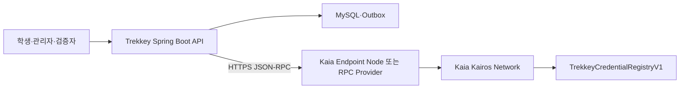

# Trekkey Kaia RPC와 EC2 배포 기준

- 기준일: 2026-08-03
- 대상: 백엔드 개발자, 블록체인 담당자, AWS 배포 담당자
- 현재 네트워크: Kaia Kairos Testnet `chainId=1001`
- 현재 결정: Trekkey는 Kaia 노드를 직접 운영하지 않고 외부 JSON-RPC endpoint를 사용한다.

## 1. 한 줄 정의

`blockchain.anchoring.rpc-url`은 **Trekkey 백엔드가 Kaia 네트워크에 조회와 트랜잭션을 요청할 때 접속하는 Kaia 노드의 HTTP 주소**다.

현재 설정은 다음과 같다.

```properties
blockchain.anchoring.rpc-url=${BLOCKCHAIN_RPC_URL:https://public-en-kairos.node.kaia.io}
```

각 항목의 의미는 다음과 같다.

| 항목 | 의미 |
| --- | --- |
| `blockchain.anchoring.rpc-url` | Spring Boot 내부 설정 이름 |
| `BLOCKCHAIN_RPC_URL` | EC2 등 실행 환경에서 주입하는 환경변수 |
| `https://public-en-kairos.node.kaia.io` | 환경변수가 없을 때 사용하는 Kaia Foundation의 Kairos public RPC |
| `blockchain.anchoring.chain-id` | RPC가 연결된 네트워크 식별자. Kairos는 `1001` |
| `blockchain.anchoring.contract-address` | 해당 네트워크에 배포된 Trekkey Registry 주소 |

RPC URL은 Registry 컨트랙트 주소, Kaiascan 주소, 지갑 주소 또는 private key가 아니다. Public RPC URL 자체는 공개값이다. 유료 RPC URL에 API key가 포함되면 그 전체 URL은 비밀값으로 취급한다.

### Kairos와 Mainnet 구분

현재 기본 URL의 `kairos`는 이 주소가 테스트넷 endpoint라는 뜻이다.

| 구분 | Kairos Testnet | Kaia Mainnet |
| --- | --- | --- |
| 용도 | 개발, E2E, 시연, 학교 내부 베타 | 실제 장기 증빙 운영 |
| Chain ID | `1001` (`0x3e9`) | `8217` (`0x2019`) |
| Kaia Foundation RPC | `https://public-en-kairos.node.kaia.io` | `https://public-en.node.kaia.io` |
| Explorer | `https://kairos.kaiascan.io` | `https://kaiascan.io` |
| 가스 | Faucet에서 받은 테스트 KAIA | 실제 KAIA |

현재 Registry `0x4ca738CC22Af5aE40EA8A23E001FA93e1e044117`은 Kairos에만 배포된 테스트 컨트랙트다. 같은 20-byte 주소가 다른 네트워크에서 같은 컨트랙트를 의미하지 않는다.

Mainnet 전환은 RPC URL 교체가 아니라 별도 배포 작업이다. Mainnet Registry를 새로 배포하고 `BLOCKCHAIN_CHAIN_ID`, contract address, runtime code hash, issuer key, relayer 권한과 실제 KAIA 잔액을 모두 Mainnet 좌표로 설정해야 한다. Kairos Credential은 자동으로 Mainnet으로 이동하지 않는다.

## 2. 현재 연결 구조



EC2에는 Spring Boot, MySQL, Nginx와 파일 저장소를 배치한다. Kaia 블록 전체를 내려받거나 검증하는 `kend` Endpoint Node 프로세스는 설치하지 않는다.

백엔드의 web3j adapter는 RPC를 통해 주로 다음 요청을 보낸다.

| JSON-RPC 동작 | Trekkey에서 사용하는 목적 |
| --- | --- |
| `eth_chainId` | 연결한 RPC가 설정된 `chainId`와 같은지 확인 |
| `eth_getCode` | Registry 주소에 실제 코드가 있고 runtime code hash가 맞는지 확인 |
| `eth_call` | issuer key, Merkle batch, Credential 상태 조회 |
| `eth_sendRawTransaction` | 로컬에서 서명 완료한 앵커·상태 변경 트랜잭션 전송 |
| `eth_getTransactionReceipt` | 트랜잭션 포함·성공 여부와 블록 번호 확인 |

Relayer private key는 RPC로 보내지 않는다. Trekkey가 로컬에서 서명한 raw transaction만 전송한다. Credential 원문과 개인정보도 온체인에 전송하지 않으며, 컨트랙트에는 Merkle root와 검증에 필요한 식별 hash·상태만 기록한다.

## 3. `16GB 권장`이 의미하는 것

Kaia 문서의 `4 core, RAM 16GB, HDD 50GB`는 ServiceChain quick start에서 **시험용 Kairos Endpoint Node를 직접 실행할 때의 최소 하드웨어**다. Trekkey Spring Boot 애플리케이션이 public RPC를 호출하는 사양이 아니다.

현재 Kaia 공식 Endpoint Node 권장 사양은 `8 vCPU`, `64GiB RAM`, `4,000GiB 초과 스토리지`다. 노드는 체인 데이터를 동기화하고 새 블록을 검증하므로 일반 API 서버보다 훨씬 많은 자원이 필요하다.

Trekkey는 자체 Endpoint Node 운영을 현재 범위에 포함하지 않는다. 향후 자체 노드가 필요해져도 애플리케이션 EC2와 같은 서버에 넣지 않고 별도 인스턴스로 분리한다.

- [Kaia Public JSON-RPC Endpoints](https://docs.kaia.io/references/public-en/)
- [Kaia Endpoint Node 권장 사양](https://docs.kaia.io/nodes/endpoint-node/system-requirements/)
- [16GB 시험 사양이 등장하는 ServiceChain quick start](https://docs.kaia.io/nodes/service-chain/quick-start/en-scn-connection/)

## 4. Trekkey EC2 권장 사양

현재 코드처럼 Spring Boot, MySQL, Nginx, 로컬 파일 저장소와 Kaia Outbox worker를 한 EC2에서 실행하는 초기 학교 베타를 기준으로 한다.

| 배포 형태 | EC2 기준 | 스토리지 | 판단 |
| --- | --- | --- | --- |
| 임시 시연 | `t4g.small`, 2 vCPU, 2GiB | gp3 30GiB | 기동 시험만 가능, 운영 비권장 |
| DB·파일 포함 단일 서버 | `t4g.large`, 2 vCPU, 8GiB | root gp3 30GiB + upload gp3 80~100GiB | 현재 권장 시작점 |
| 메모리 여유 우선 | `t4g.xlarge`, 4 vCPU, 16GiB | 위와 동일 | 동시 업로드·PDF 생성 여유, 필수는 아님 |
| RDS·객체 저장소 분리 | `t4g.medium`, 2 vCPU, 4GiB | root gp3 30GiB | 애플리케이션 전용 시작점 |
| Kaia Endpoint Node 직접 운영 | 앱 서버와 별도 구성 | Kaia 공식 EN 기준 적용 | 현재 범위 아님 |

`16GiB`를 선택할 수는 있지만 블록체인 SDK의 필수 메모리가 아니라 MySQL, PDF 생성, 최대 350MB 업로드와 운영 여유를 위한 선택이다. 현재 구조에서 Kaia worker 자체의 자원 사용량은 작고 GPU는 필요하지 않다.

ARM 기반 T4g를 사용할 때 현재 Java 애플리케이션은 JAR로 실행할 수 있다. Docker를 도입한다면 이미지를 `linux/arm64`로 빌드해야 한다. x86 환경을 유지하려면 같은 메모리 크기의 T3 계열을 선택한다.

애플리케이션과 DB를 한 서버에 둘 때의 초기 실행 기준은 다음과 같다.

```text
JVM: -Xms512m -Xmx2g
Swap: 2GiB
FILE_UPLOAD_DIR: /data/trekkey/uploads
Nginx client_max_body_size: 350M 이상
```

업로드 파일은 현재 로컬 파일 시스템에 저장되므로 root volume에만 두지 않는다. 별도 gp3 EBS에 저장하고 snapshot을 구성한다. 제출물 최대 크기 300MB를 기준으로 100건이면 파일만 약 30GB를 차지할 수 있다.

- [AWS T4g 사양](https://aws.amazon.com/blogs/aws/new-t4g-instances-burstable-performance-powered-by-aws-graviton2/)
- [AWS gp3 사양](https://docs.aws.amazon.com/ebs/latest/userguide/general-purpose.html)

## 5. 환경별 RPC 선택

| 환경 | `BLOCKCHAIN_RPC_URL` | 운영 원칙 |
| --- | --- | --- |
| 일반 로컬 개발·CI | 설정하지 않아도 됨 | `BLOCKCHAIN_ANCHORING_MODE=DISABLED` |
| Kairos 개발·시연·학교 내부 베타 | `https://public-en-kairos.node.kaia.io` | public RPC의 rate limit과 일시 장애를 허용 |
| Mainnet 운영 | SLA가 명확한 Mainnet 관리형 RPC URL | Foundation public RPC를 상용 단일 연결점으로 사용하지 않고 API key는 Secrets Manager 또는 SSM으로 주입 |
| 자체 Endpoint Node | 내부 EN URL | 별도 노드 운영·모니터링 체계가 있을 때만 선택 |

Kaia Foundation은 public RPC가 제품 개발을 돕지만 uptime과 안정성을 보장하지 않고 rate limit이 적용될 수 있다고 안내한다. Kairos E2E와 내부 베타에는 사용할 수 있지만 장기 상용 Mainnet의 단일 연결점으로 간주하지 않는다.

현재 adapter는 하나의 RPC URL만 사용한다. 자동 provider failover는 아직 구현되어 있지 않으므로 Mainnet 전에는 관리형 provider, 보조 provider와 전환 절차를 별도로 결정한다.

## 6. 설정과 장애 판단

RPC URL만 바꾸면 네트워크 전환이 끝나는 것이 아니다. 다음 값은 반드시 같은 배포 좌표를 가리켜야 한다.

```text
BLOCKCHAIN_CHAIN_ID
BLOCKCHAIN_RPC_URL
BLOCKCHAIN_CONTRACT_ADDRESS
BLOCKCHAIN_RUNTIME_CODE_HASH
BLOCKCHAIN_CONTRACT_VERSION
```

백엔드는 최초 연결 때 RPC의 chain ID, Registry runtime code와 code hash를 검증한다. 하나라도 다르면 트랜잭션을 보내지 않고 설정 오류로 실패한다.

Kairos RPC를 직접 확인하는 명령은 다음과 같다.

```bash
curl -sS https://public-en-kairos.node.kaia.io \
  -H 'Content-Type: application/json' \
  --data '{"jsonrpc":"2.0","method":"eth_chainId","params":[],"id":1}'
```

Kairos의 정상 결과에는 1001의 16진수인 `0x3e9`가 포함된다.

RPC 장애는 Credential 원문이나 Merkle proof를 훼손하지 않는다. 조회는 일시적으로 `RPC_UNAVAILABLE`이 될 수 있고, 전송 worker는 Outbox와 저장된 transaction 상태를 이용해 재시도·수렴한다. RPC 장애와 Credential 위변조 판정을 같은 오류로 처리하지 않는다.

## 7. 배포 체크리스트

- [ ] 애플리케이션 서버에 Kaia Endpoint Node를 설치하지 않았는지 확인
- [ ] `BLOCKCHAIN_CHAIN_ID=1001`과 Kairos RPC의 `eth_chainId=0x3e9` 일치 확인
- [ ] Registry address와 runtime code hash가 배포 manifest와 일치하는지 확인
- [ ] 첫 기동은 `READ_ONLY`, worker 비활성화 상태에서 readback 검증
- [ ] Relayer key 보관과 잔액 확인 후 쓰기 worker 활성화
- [ ] public RPC 장애와 rate limit을 애플리케이션 장애·위변조로 오판하지 않도록 알림 분리
- [ ] Mainnet 전환 전에 SLA가 있는 RPC provider와 장애 전환 절차 결정
- [ ] 로컬 업로드 EBS와 MySQL 백업·복구 절차 확인
