<aside>

**최종 구현 기준 · 2026-07-21**

이 페이지를 Trekkey 업무 DB와 Kaia 앵커링의 팀 공통 기준으로 사용한다. 기존 v1·v2 문서는 의사결정 이력이며, 구현이 충돌하면 이 페이지와 최종 ERD를 먼저 갱신한다.

</aside>

## 1. 한 줄 결론

Trekkey는 학교가 확정한 **참여·작품·수상 Credential 원문과 개인정보를 SQL 및 객체 저장소에 보존**하고, 여러 Credential을 Merkle Tree로 묶어 **root만 Kaia에 앵커링**한다.

> 블록체인은 학교가 처음 입력한 사실의 현실적 진실성을 판정하지 않는다. 학교가 승인한 특정 시점의 Credential이 앵커링 이후 변경되지 않았고, 현재 폐기 또는 대체되지 않았는지를 검증한다.
> 

### 해결하려는 문제

- 졸업 이후 학교 시스템에서 대회 참여·작품·수상 기록이 사라지는 문제
- 팀 상장과 구성원 관계가 끊겨 개인 이력으로 조회되지 않는 문제
- 발급자가 나중에 원문을 조용히 바꾸더라도 외부에서 알기 어려운 문제
- 인증서마다 트랜잭션을 보내면 발급량에 비례해 비용이 증가하는 문제

## 2. 범위와 제외 범위

| 구분 | 현재 MVP | 후속 확장 |
| --- | --- | --- |
| Credential | 참여, 최종 작품, 수상 | 졸업요건, 학적 이력, 독립 작품 |
| 제출물 | 팀당 최종 제출물 한 건, 마감 전 덮어쓰기 | 제출 버전 원장이 실제로 필요할 때 추가 |
| 폐기 | Credential별 REVOKED·SUPERSEDED | 서명된 batch 전체 폐기 |
| 배포 | 중앙 Spring Boot·MySQL multi-tenant | 학교별 Source·Signer Adapter |

## 3. 시스템 전체 구조

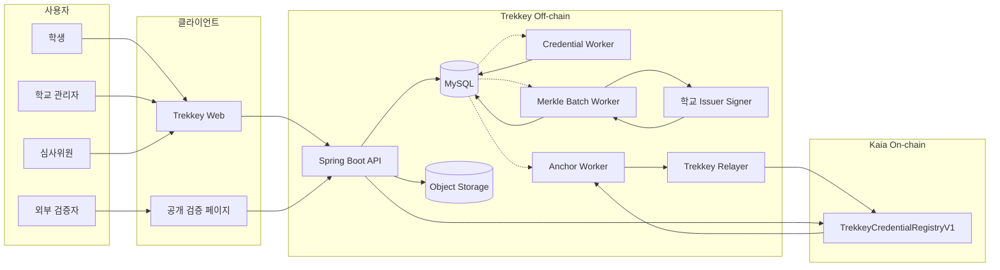

### 책임 경계

| 영역 | 책임 |
| --- | --- |
| 업무 SQL | 학교, 사용자, 대회, 팀원, 제출, 심사, 공식 판정, 수상 |
| 앵커링 SQL | Credential snapshot, canonical bytes, hash, proof, 승인 서명, 트랜잭션 영수증, Outbox |
| Object Storage | 제출 원본, 인증서 PDF, Portable Credential Package |
| Kaia | Issuer key, batch root, schema·tree version, Credential 폐기·대체 상태 |

## 4. 전체 통합 ERD

전체 ERD는 **업무 SQL 16개 + 인증·관리자 3개(USER 확장, ADMIN_INVITATION, ADMIN_AUDIT_LOG, REFRESH_TOKEN) + Credential·앵커링 SQL 9개**, 총 28개 테이블로 구성한다. 컬럼까지 포함한 전체 원본은 repo의 [`docs/trekkey-unified-erd.mmd`](./trekkey-unified-erd.mmd)가 정본이다.

### 엔터티 묶음

| 도메인 | 테이블 | 역할 |
| --- | --- | --- |
| 기관·사용자 | ORGANIZATION, USER | 학교 tenant와 사용자 식별 |
| 대회·참가 | CONTEST, REVIEW_ROUND, TEAM, TEAM_MEMBER | 대회 구조와 확정 참가자 명단 |
| 작품·심사 | SUBMISSION, SUBMISSION_FILE, REVIEW_ROUND_ENTRY, REVIEW 계열 | 최종 작품, 원점수, 공식 라운드 판정 |
| 수상 | AWARD | 공식 ENTRY를 근거로 한 팀 단위 상장 |
| Credential | ANC_CREDENTIAL, SOURCE, SUBJECT, STATUS_EVENT | 발급 시점 불변 원문과 주체·상태 snapshot |
| Merkle·Chain | ANC_BATCH, BATCH_ITEM, CHAIN_TRANSACTION, OUTBOX_EVENT | 배치, proof, Kaia 전송, 장애 복구 |

### 반드시 DB 제약으로 막을 것

- USER: 학교 안에서 학번 유일
- TEAM_MEMBER: 팀과 사용자 조합 유일
- SUBMISSION: 팀당 한 건
- REVIEW_ROUND_ENTRY: 라운드와 제출물 조합 유일
- REVIEW_ASSIGNMENT: 심사위원과 ENTRY 조합 유일
- REVIEW: 배정당 한 건
- REVIEW_SCORE_ITEM: 심사와 기준 조합 유일
- AWARD: 공식 ENTRY당 한 건
- ANC_CREDENTIAL_SOURCE: sourceFingerprint 유일
- ANC_BATCH_ITEM: Credential은 sealed batch 하나에만 포함
- 다형성 FK는 타입에 맞는 대상 하나만 non-null

## 5. 업무 원장 결정

### 팀과 상장

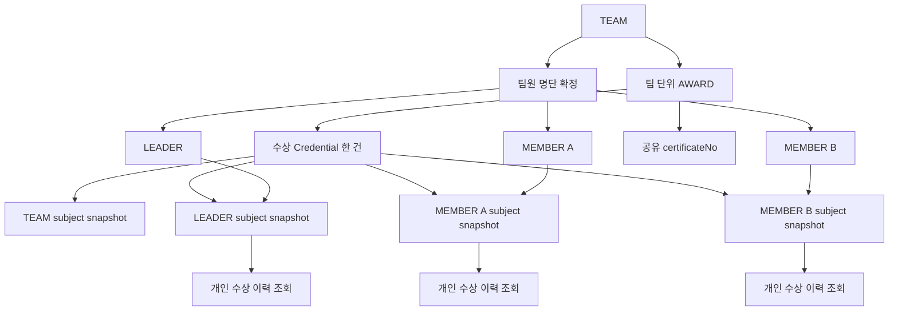

- **TEAM_MEMBER가 현재 구성원 원장**이다.
- participationFinalizedAt 이후 팀원 추가·삭제·역할 변경을 거부한다.
- 상장은 팀 단위 AWARD와 Credential 한 건으로 발급한다.
- 발급 당시 구성원 전원을 ANC_CREDENTIAL_SUBJECT에 snapshot으로 고정한다.
- 학생별 이력 조회는 현재 팀이 아니라 Credential subject snapshot을 사용한다.

### 제출물 덮어쓰기

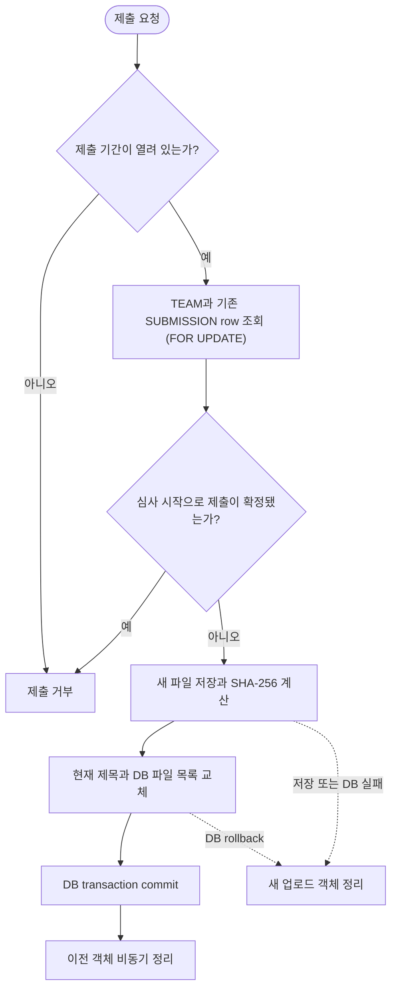

- 재제출 이력 테이블은 현재 만들지 않는다.
- 같은 `SUBMISSION` 행의 제목과 파일 목록을 덮어쓴다.
- TEAM row lock은 최초 제출과 덮어쓰기를 팀 단위로 직렬화하며, 기존 SUBMISSION도 같은 순서로 잠근다.
- SHA-256은 업로드 스트림에서 계산하며 별도 hash worker나 `STALE/READY` 상태를 두지 않는다.
- DB 커밋 뒤 기존 객체를 삭제하고, 롤백되면 새 객체를 삭제한다.
- 제출 마감 또는 첫 심사 시작으로 확정된 뒤에는 수정할 수 없다.

### 라운드 심사와 공식 판정

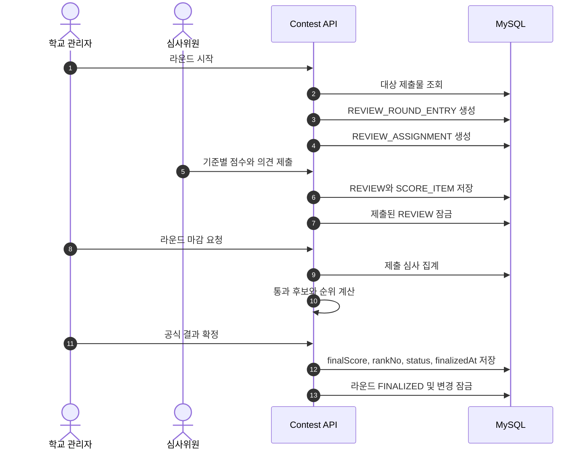

- REVIEW와 REVIEW_SCORE_ITEM은 심사위원별 원점수다.
- REVIEW_ROUND_ENTRY는 학교가 확정한 공식 점수·순위·통과·탈락 원장이다.
- FINALIZED 라운드의 ENTRY, 평가 기준, 배정, 제출된 REVIEW는 수정·삭제할 수 없다.
- AWARD.teamId는 조회용 비정규화 FK이며 ENTRY에서 도달한 TEAM과 같아야 한다.

## 6. Credential 발급 단위

| 유형 | 업무 원천 | 주체 |
| --- | --- | --- |
| PARTICIPATION | 확정 TEAM | 팀과 확정 팀원 |
| WORK | 확정 SUBMISSION | 팀과 작품 기여 구성원 |
| AWARD | CONFIRMED AWARD | 수상 팀과 발급 당시 구성원 |

Credential 발급은 source, subjects, canonical bytes를 한 DB transaction으로 저장한다. 일부만 저장된 DRAFT 상태를 만들지 않고 완성된 READY Credential로 생성한다.

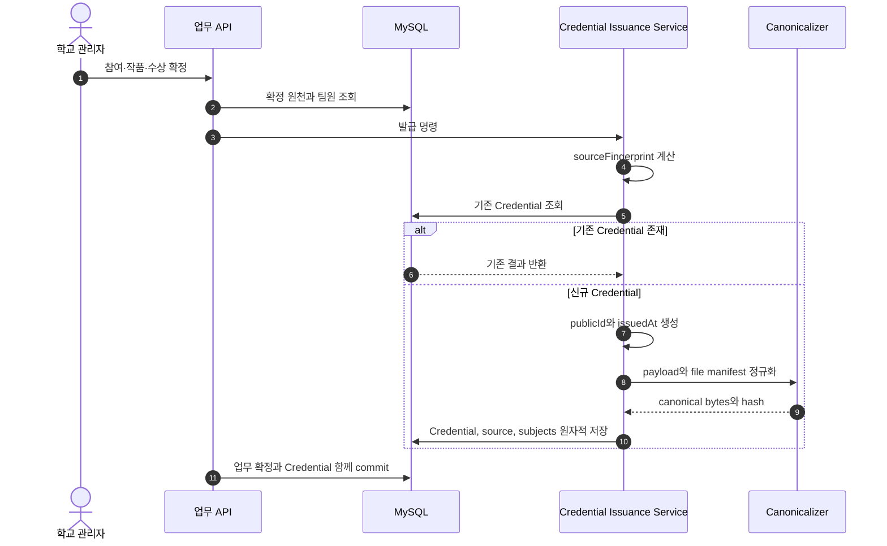

### 중복 발급 방지

```
subjectSetHash = SHA-256(
  JCS([{subjectPublicId, roleCode, snapshot}, ...]
      sorted by subjectPublicId then roleCode)
)

sourceSnapshotHash = SHA-256(JCS(sourceSnapshot))

sourceFingerprint = SHA-256(
  JCS({
    fingerprintProfileId,
    issuerPublicId,
    credentialType,
    sourceType,
    sourcePublicId,
    sourceSnapshotHash,
    subjectSetHash,
    schemaProfileId
  })
)
```

같은 확정 원천 snapshot과 subject snapshot으로 재시도하면 기존 Credential을 반환한다. 사실을 정정해야 하면 기존 Credential을 수정하지 않고, 정정된 snapshot으로 새 Credential을 발급한 뒤 기존 Credential을 `SUPERSEDED` 처리한다.

## 7. Canonical JSON과 Merkle V1

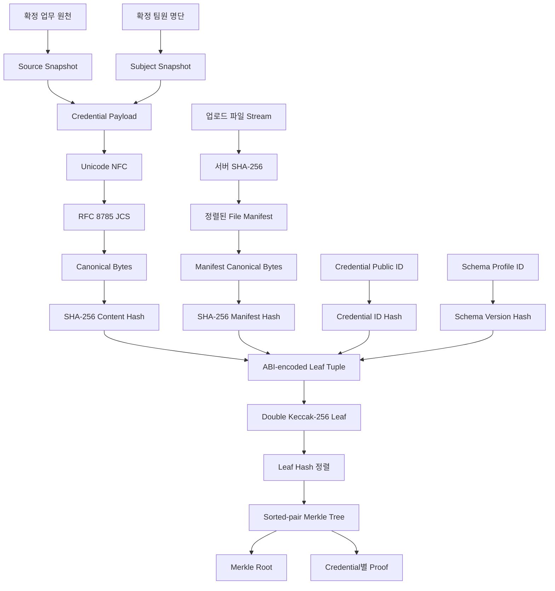

### 고정 규칙

- 문자열은 Unicode NFC 후 RFC 8785 JCS로 canonicalize한다.
- contentHash와 fileManifestHash는 SHA-256을 사용한다.
- 파일 manifest에는 storageKey, bucket, presigned URL을 넣지 않는다.
- leaf는 issuer, Credential ID, schema, content, manifest hash를 ABI encode한다.
- OpenZeppelin StandardMerkleTree 호환 double Keccak-256 leaf와 sorted-pair node를 사용한다.
- 같은 issuer, schemaVersionHash, treeVersion만 한 batch로 묶는다.

```
leafValue = abi.encode(
  LEAF_DOMAIN,
  issuerId,
  credentialIdHash,
  schemaVersionHash,
  contentHash,
  fileManifestHash
)

leafHash = keccak256(bytes.concat(keccak256(leafValue)))
nodeHash = keccak256(sorted(left, right))
```

## 8. 학교 승인과 Kaia 앵커링

학교 issuer와 가스비를 내는 relayer를 분리한다.

1. 학교 Issuer Signer가 EIP-712 BatchApproval 또는 StatusApproval에 서명한다.
2. Trekkey relayer가 자기 nonce와 KAIA로 표준 EVM transaction을 보낸다.
3. 컨트랙트가 학교 signer, key version, nonce, deadline을 검증한다.
4. 학생과 검증자는 지갑이나 KAIA를 보유하지 않는다.

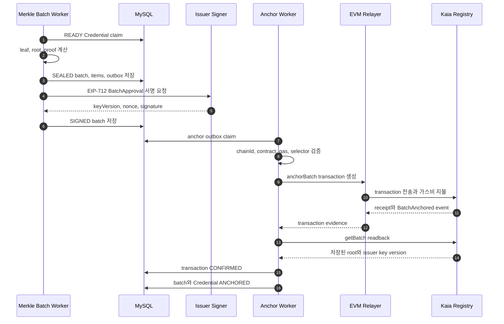

### Kaia 적용

- Kairos testnet chain ID: 1001
- Mainnet chain ID: 8217
- V1은 Kaia native fee delegation이 아니라 표준 EVM relayer를 사용한다.
- 백엔드 core에는 Kaia SDK 타입을 노출하지 않고 BlockchainAnchorPort로 격리한다.
- 다른 EVM 체인으로 이동할 때 chainId, contractAddress, contractVersion으로 구분한다.

## 9. 공개 검증

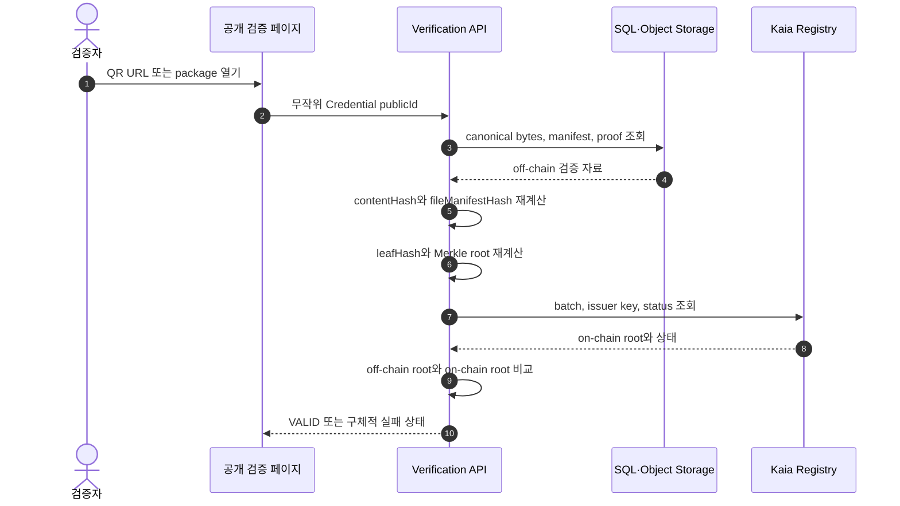

### 검증 결과

| 상태 | 의미 |
| --- | --- |
| VALID | hash, proof, issuer, 온체인 상태가 모두 정상 |
| PENDING | 아직 batch anchor가 확정되지 않음 |
| REVOKED | 학교가 Credential을 폐기함 |
| SUPERSEDED | 새 Credential로 대체됨 |
| TAMPERED | canonical hash 또는 Merkle proof 불일치 |
| ANCHOR_NOT_FOUND | 온체인 batch를 찾을 수 없음 |
| ISSUER_INVALID | 발급 시점 issuer key 검증 실패 |
| RPC_UNAVAILABLE | 체인 조회 장애이며 위조로 단정하지 않음 |
| SCHEMA_UNSUPPORTED | 검증기가 schema 또는 tree version을 모름 |

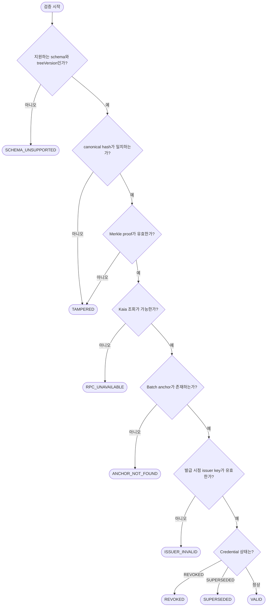

QR에는 학번, 개인정보, 전체 proof를 넣지 않는다. HTTPS 검증 URL과 무작위 Credential publicId만 넣는다.

## 10. 상태 변경

### Credential 상태

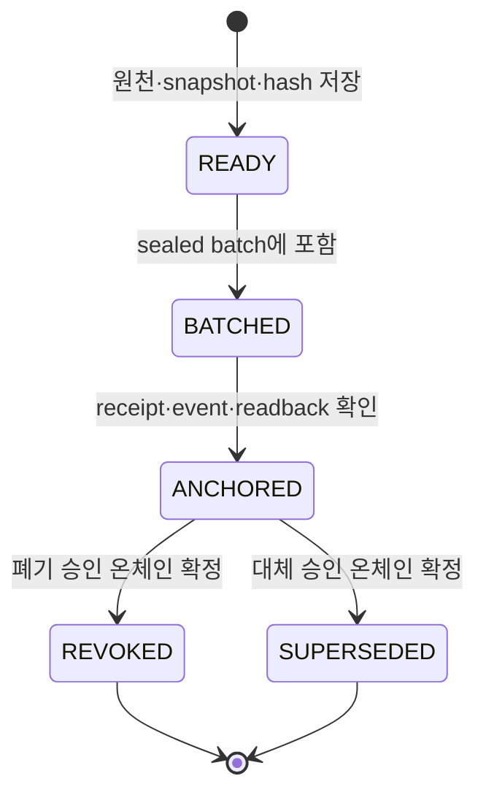

READY 이후 payload, canonical bytes, source, subjects는 수정하지 않는다. 잘못된 내용은 기존 row를 덮어쓰지 않고 새 Credential 발급과 상태 변경으로 처리한다.

### 폐기와 대체

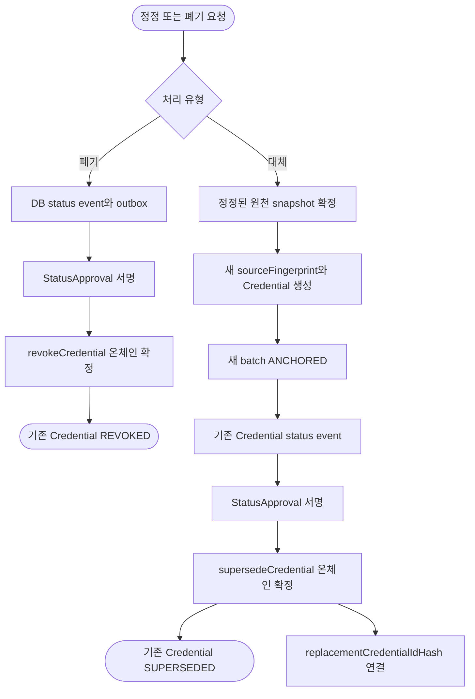

- V1은 개별 REVOKED와 SUPERSEDED만 지원한다.
- 대체 발급은 새 Credential이 먼저 ANCHORED된 다음 기존 Credential을 SUPERSEDED 처리한다.
- replacementCredentialIdHash는 0일 수 없다.
- 이미 종료 상태인 Credential에 다른 종료 상태를 덮어쓰지 않는다.

## 11. Outbox와 장애 복구

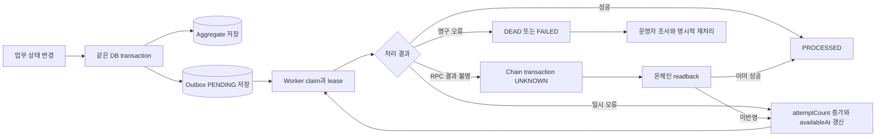

- 업무 확정과 domain outbox 저장은 한 transaction이다.
- Credential과 source·subjects 저장도 한 transaction이다.
- batch seal과 anchor outbox 저장도 한 transaction이다.
- RPC timeout은 FAILED가 아니라 UNKNOWN이다.
- UNKNOWN은 재전송 전에 batch ID 또는 Credential status를 온체인 readback한다.
- relayer nonce는 단일 sequencer 또는 DB lease로 관리한다.
- tx 성공 후 DB 반영이 실패해도 readback으로 복구한다.

### Chain transaction 상태

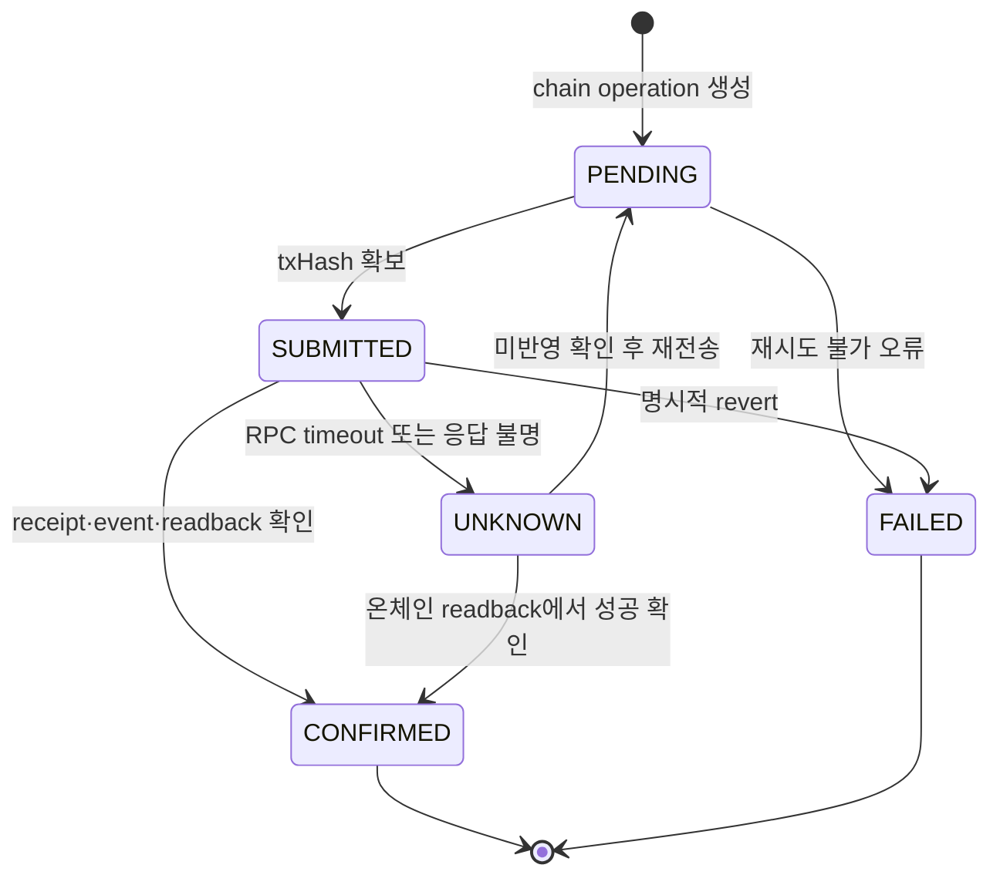

## 12. 보안과 장기 보존

- Issuer·relayer private key는 소스, DB, 일반 환경변수에 저장하지 않는다.
- 학교별 KMS/HSM namespace와 접근 정책을 분리한다.
- 운영 admin은 개인 EOA가 아니라 multisig와 timelock을 사용한다.
- contract allowlist, function selector, value zero, gas cap, 전송 전 eth_call을 검사한다.
- 운영 RPC는 두 provider 이상을 사용하고 receipt, event, block hash를 교차 확인할 수 있게 한다.
- SQL 백업 복구 훈련과 객체 저장소 versioning을 운영한다.
- 학생이 소유할 Portable Credential Package를 제공한다.

### Portable Credential Package

```
credential.json
file-manifest.json
merkle-proof.json
anchor.json
issuer-approval.json
status.json
rendered-certificate.pdf
```

PDF는 사람이 읽는 표시물이고 cryptographic source of truth가 아니다. canonical bytes, proof, chain ID, contract address, schema profile을 함께 보존해야 한다.

## 13. API 경계

```
GET /api/v1/credentials/{publicId}
GET /api/v1/credentials/{publicId}/verify
GET /api/v1/credentials/{publicId}/package

GET /api/v1/organizations/{organizationId}/students/{studentId}/credentials
GET /api/v1/contests/{contestPublicId}/credentials
GET /api/v1/teams/{teamPublicId}/credentials

POST /internal/v1/credentials/issue
POST /internal/v1/batches/{batchPublicId}/seal
POST /internal/v1/batches/{batchPublicId}/submit
POST /internal/v1/credentials/{publicId}/revoke
POST /internal/v1/credentials/{publicId}/supersede
```

공개 검증 API와 관리자 검색 API를 분리한다. 학번 기반 전체 이력 조회는 본인 또는 학교 관리자 인증과 organization scope가 필요하다.

## 14. 중앙형 MVP와 학교별 확장

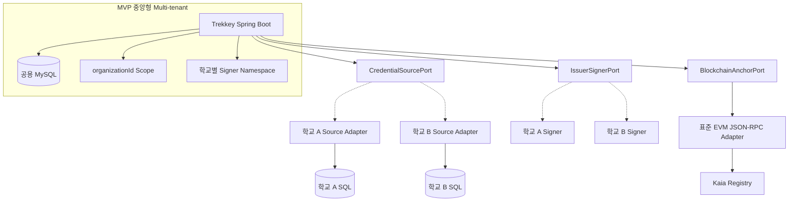

MVP는 하나의 Spring Boot와 MySQL을 organizationId로 격리한다. 이후 학교가 자기 SQL과 signer를 운영해도 Credential schema, Merkle 규칙, 컨트랙트는 유지하고 Source·Signer Adapter만 교체한다.

## 15. 구현 순서

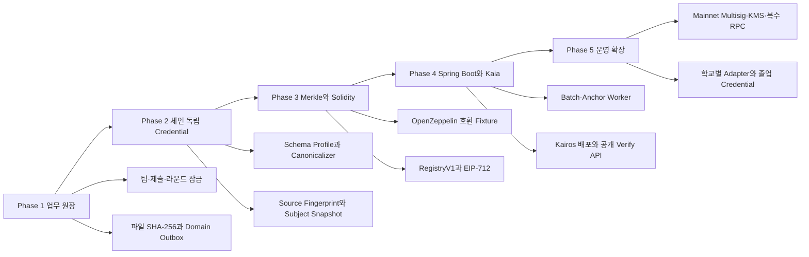

### 완료 기준

- Java canonicalizer와 OpenZeppelin fixture의 leaf, root, proof가 byte-for-byte 일치
- 같은 sourceFingerprint 재처리가 중복 Credential을 만들지 않음
- 동시 재제출에서 오래된 worker가 최신 hash를 덮어쓰지 못함
- 라운드 확정 후 심사와 공식 결과 수정이 실패
- 만료·재사용된 EIP-712 approval이 실패
- 같은 batch ID를 두 번 anchor할 수 없음
- RPC timeout 후 readback으로 성공 여부 복구
- REVOKED와 SUPERSEDED가 VALID로 표시되지 않음
- SQL 백업과 Portable Package로 proof 재검증 가능

## 16. 최종 합의

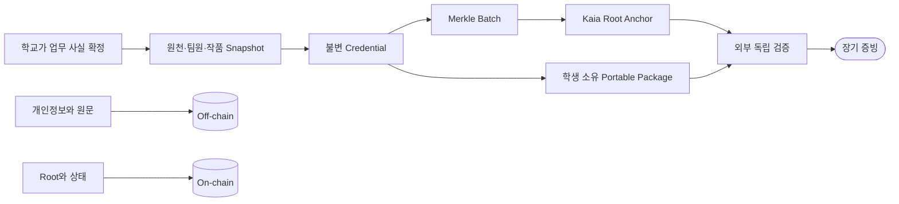

<aside>

**포트폴리오 설명**

Trekkey는 개인정보와 인증서 원문을 퍼블릭 체인에 저장하지 않는다. 발급 시점의 Credential을 canonical JSON으로 고정하고, 여러 hash를 OpenZeppelin 호환 Merkle Tree로 묶어 root만 Kaia에 앵커링한다. 학교는 EIP-712 approval에 서명하고 Trekkey relayer가 수수료를 부담한다. Transactional Outbox와 멱등 키로 DB와 체인 사이 장애를 복구하며, revoke·supersede와 Portable Package로 정정 및 장기 검증을 지원한다.

</aside>

## 17. 문서와 참고

### GitHub 구현 기준

- 통합 ERD
- Mermaid 다이어그램 보드
- 상세 앵커링 설계
- PR 비교 화면

### 이전 의사결정 이력

- ‣
- ‣

### 기술 기준

- Kaia Foundation Setup
- Kaia execution model
- Kaia fee delegation
- RFC 8785 JSON Canonicalization Scheme
- EIP-712 typed structured data
- OpenZeppelin cryptography
- OpenZeppelin Standard Merkle Tree
