# Trekkey MVP ERD

> **주의:** 이 문서의 리뷰 영역은 이전 `CONTEST_STAGE` 기반 설계다.
> 현재 리뷰 구현 기준과 DB 이전 규칙은
> [review-domain-final-erd-alignment.md](review-domain-final-erd-alignment.md)를
> 따른다.

현재 프론트에서 실제로 사용하는 대회 운영 기능과 SQL·Kaia 분리형 Credential 앵커링 구조를 반영한 ERD입니다.
업무 SQL과 인증·블록체인 앵커 SQL의 연결 관계를 한눈에 볼 수 있도록 하나의 Mermaid ERD로 통합합니다.

## 통합 업무·인증·블록체인 앵커 SQL ERD

```mermaid
erDiagram
    %% 업무 도메인 관계
    ORGANIZATION ||--o{ USER : has
    ORGANIZATION ||--o{ CONTEST : hosts
    USER ||--o{ CONTEST : owns
    CONTEST ||--o{ CONTEST_LIKE : receives
    USER ||--o{ CONTEST_LIKE : likes
    CONTEST ||--|{ CONTEST_STAGE : has_rounds
    CONTEST ||--o{ TEAM : receives_applications
    USER ||--o{ TEAM : leads
    CONTEST_STAGE ||--|{ REVIEW_CRITERION : defines
    CONTEST_STAGE ||--o{ CONTEST_JUDGE : assigns
    TEAM ||--o| SUBMISSION : submits
    SUBMISSION ||--|{ SUBMISSION_FILE : contains
    CONTEST_JUDGE ||--o{ REVIEW_TASK : reviews
    SUBMISSION ||--o{ REVIEW_TASK : is_reviewed_by
    CONTEST_STAGE ||--o{ AWARD : produces
    TEAM ||--o| AWARD : receives

    %% 인증·블록체인 앵커 관계
    ORGANIZATION ||--o{ ANC_ISSUER_KEY : owns
    ORGANIZATION ||--o{ ANC_CREDENTIAL : issues
    ORGANIZATION ||--o{ ANC_BATCH : creates
    ANC_ISSUER_KEY ||--o{ ANC_BATCH : signs

    ANC_CREDENTIAL ||--|| ANC_CREDENTIAL_SOURCE : derives_from
    TEAM o|--o{ ANC_CREDENTIAL_SOURCE : sources
    SUBMISSION o|--o{ ANC_CREDENTIAL_SOURCE : sources
    AWARD o|--o{ ANC_CREDENTIAL_SOURCE : sources

    ANC_CREDENTIAL ||--|{ ANC_CREDENTIAL_SUBJECT : snapshots
    USER o|--o{ ANC_CREDENTIAL_SUBJECT : identifies
    TEAM o|--o{ ANC_CREDENTIAL_SUBJECT : represents

    ANC_CREDENTIAL ||--o{ ANC_CREDENTIAL_STATUS_EVENT : changes
    ANC_CREDENTIAL o|--o{ ANC_CREDENTIAL_STATUS_EVENT : succeeds_with
    USER o|--o{ ANC_CREDENTIAL_STATUS_EVENT : acts

    ANC_BATCH ||--|{ ANC_BATCH_ITEM : contains
    ANC_CREDENTIAL ||--o| ANC_BATCH_ITEM : included_in

    ANC_BATCH o|--o{ ANC_CHAIN_TRANSACTION : targets
    ANC_CREDENTIAL_STATUS_EVENT o|--o{ ANC_CHAIN_TRANSACTION : targets
    ANC_ISSUER_KEY o|--o{ ANC_CHAIN_TRANSACTION : targets

    %% 업무 도메인 테이블
    ORGANIZATION {
        bigint id PK "학교/기관 PK"
        string publicId UK "공개 issuer ID"
        string name "학교/기관명"
        string domain UK "학교 이메일 도메인"
        string status "ACTIVE/INACTIVE"
        datetime createdAt "생성 시각"
        datetime updatedAt "수정 시각"
    }

    USER {
        bigint id PK "사용자 PK"
        bigint organizationId FK "현재 소속 학교"
        string role "ADMIN/PARTICIPANT"
        string memberType "STUDENT/STAFF/FACULTY"
        string memberStatus "소속 상태"
        string name "사용자 이름"
        string email UK "로그인 이메일"
        string passwordHash "비밀번호 해시"
        string studentId "학번"
        string major "학과/소속"
        string department "교직원 부서"
        string position "교직원 직책"
        datetime createdAt "생성 시각"
        datetime updatedAt "수정 시각"
    }

    CONTEST {
        bigint id PK "대회 PK"
        string publicId UK "대회 공개 ID"
        bigint organizationId FK "운영 학교"
        bigint ownerUserId FK "담당 관리자"
        string title "대회명"
        string department "주관 부서"
        string status "PREPARING/APPLICATION_OPEN/REVIEWING/AWARDED"
        string participationType "TEAM/INDIVIDUAL/BOTH"
        int awardCount "예정 시상 수"
        string posterUrl "대표 포스터 URL"
        string summary "공개 한 줄 소개"
        string target "참가 대상"
        string applicationMethod "접수 방법"
        string benefits "시상 및 혜택"
        string tags "검색 태그"
        text detailHtml "공고 상세 HTML"
        bigint viewCount "공개 상세 조회 수"
        datetime createdAt "생성 시각"
        datetime updatedAt "수정 시각"
    }

    CONTEST_LIKE {
        bigint id PK "좋아요 PK"
        bigint contestId FK "대회 FK"
        bigint userId FK "사용자 FK"
        datetime createdAt "좋아요 시각"
    }

    CONTEST_STAGE {
        bigint id PK "평가 라운드 PK"
        bigint contestId FK "소속 대회"
        string name "라운드명"
        string stageType "APPLICATION/SUBMISSION/REVIEW/PRESENTATION/AWARD"
        int sequenceNo "라운드 순서"
        string status "PREPARING/OPEN/COMPLETED"
        datetime startsAt "단계 시작 시각"
        datetime endsAt "단계 종료/마감 시각"
        string targetType "ALL_SUBMISSIONS/PREVIOUS_PASSED/MANUAL"
        string passRule "TOP_N/MIN_SCORE/MANUAL/FINAL"
        int passCount "통과 팀 수"
        decimal minScore "최소 통과 점수"
        datetime createdAt "생성 시각"
        datetime updatedAt "수정 시각"
    }

    REVIEW_CRITERION {
        bigint id PK "평가 기준 PK"
        bigint contestStageId FK "평가 라운드 FK"
        string label "화면 표시명"
        int maxScore "최대 점수"
        int sortOrder "표시 순서"
        datetime createdAt "생성 시각"
        datetime updatedAt "수정 시각"
    }

    TEAM {
        bigint id PK "팀 겸 참가 신청 PK"
        string publicId UK "팀 공개 ID"
        bigint contestId FK "신청 대회"
        bigint leaderUserId FK "대표 참가자"
        string name "팀명 또는 참가자명"
        string leaderName "대표자 이름 스냅샷"
        string major "대표 소속 스냅샷"
        int memberCount "참가 인원 수"
        string status "PENDING/APPROVED/REVISION_REQUESTED"
        string contactEmail "신청 연락 이메일"
        string phone "신청 연락처"
        text motivation "지원 동기"
        bigint sourceVersion "Credential source 버전"
        datetime participationFinalizedAt "참여 확정 시각"
        datetime createdAt "신청 생성 시각"
        datetime updatedAt "신청 수정 시각"
    }

    SUBMISSION {
        bigint id PK "제출물 PK"
        string publicId UK "제출물 공개 ID"
        bigint teamId FK "제출 팀, 팀당 한 건"
        string title "제출물명"
        bigint sourceVersion "Credential source 버전"
        string integrityStatus "NOT_REQUESTED/QUEUED/PROCESSING/READY/STALE/FAILED"
        datetime finalizedAt "제출 잠금 시각"
        datetime submittedAt "최근 제출 시각"
        datetime createdAt "최초 제출 시각"
        datetime updatedAt "수정 시각"
    }

    SUBMISSION_FILE {
        bigint id PK "제출 파일 PK"
        bigint submissionId FK "소속 제출물"
        string originalName "원본 파일명"
        string contentType "MIME 타입"
        bigint sizeBytes "파일 크기"
        string storageKey UK "객체 저장소 키"
        binary sha256 "파일 SHA-256"
        datetime createdAt "생성 시각"
        datetime updatedAt "수정 시각"
    }

    CONTEST_JUDGE {
        bigint id PK "라운드 심사위원 PK"
        bigint contestStageId FK "담당 평가 라운드"
        string name "심사위원 이름"
        string roleLabel "심사위원 역할명"
        datetime lastRemindedAt "최근 독촉 시각"
        datetime createdAt "생성 시각"
        datetime updatedAt "수정 시각"
    }

    REVIEW_TASK {
        bigint id PK "심사 작업 PK"
        bigint contestJudgeId FK "배정 심사위원"
        bigint submissionId FK "심사 대상 제출물"
        text scoresJson "기준 ID별 점수 JSON"
        datetime submittedAt "심사 제출 시각"
        datetime createdAt "배정 시각"
        datetime updatedAt "수정 시각"
    }

    AWARD {
        bigint id PK "수상 결과 PK"
        string publicId UK "수상 공개 ID"
        bigint contestStageId FK "수상 산출 라운드"
        bigint teamId FK "수상 팀"
        int rankNo "순위"
        string prize "상격"
        decimal score "확정 점수"
        string status "CANDIDATE/CONFIRMED"
        string certificateNo UK "상장 번호"
        bigint sourceVersion "Credential source 버전"
        datetime confirmedAt "수상 확정 시각"
        datetime createdAt "생성 시각"
        datetime updatedAt "수정 시각"
    }

    %% 인증·블록체인 앵커 테이블
    ANC_ISSUER_KEY {
        bigint id PK "Issuer key PK"
        bigint organizationId FK "발급 기관"
        int keyVersion "기관 내 키 버전"
        binary signerAddress "Kaia 주소 BINARY(20)"
        string signerRef "KMS 또는 서명자 참조"
        string status "ACTIVE/RETIRED/COMPROMISED"
        datetime validFrom "사용 시작"
        datetime validUntil "사용 종료"
        datetime compromisedAt "키 침해 시각"
        datetime createdAt "생성 시각"
    }

    ANC_CREDENTIAL {
        bigint id PK "Credential PK"
        bigint issuerOrganizationId FK "발급 기관"
        string publicId UK "외부 공개 ID"
        string credentialNo "기관별 발급 번호"
        string credentialType "PARTICIPATION/WORK/AWARD"
        int schemaVersion "Credential 스키마 버전"
        string canonicalizationVersion "정규화 규칙 버전"
        text payloadJson "발급 payload"
        blob canonicalBytes "해시에 쓴 정확한 바이트"
        binary contentHash "SHA-256 BINARY(32)"
        binary fileManifestHash "파일 목록 해시 BINARY(32)"
        string status "READY/BATCHED/ANCHORED/REVOKED/SUPERSEDED"
        datetime issuedAt "발급 시각"
        datetime expiresAt "만료 시각"
        datetime createdAt "생성 시각"
    }

    ANC_CREDENTIAL_SOURCE {
        bigint credentialId PK "Credential PK 겸 FK"
        string sourceType "TEAM/SUBMISSION/AWARD"
        bigint teamId FK "참여 원천"
        bigint submissionId FK "작품 원천"
        bigint awardId FK "수상 원천"
        string sourcePublicId "원천 공개 ID 스냅샷"
        bigint sourceVersion "발급에 쓴 원천 버전"
        binary sourceFingerprint UK "중복 발급 방지 해시"
        datetime sourceFinalizedAt "원천 확정 시각"
    }

    ANC_CREDENTIAL_SUBJECT {
        bigint id PK "Credential subject PK"
        bigint credentialId FK "Credential FK"
        bigint userId FK "개인 subject"
        bigint teamId FK "팀 subject"
        string subjectRef "비식별 공개 참조"
        string subjectType "USER/TEAM"
        string displayNameSnapshot "표시명 스냅샷"
        string majorSnapshot "학과 스냅샷"
        string roleCode "PARTICIPANT/TEAM/REPRESENTATIVE/AWARDEE"
        string disclosureClass "PUBLIC/PRIVATE/HASH_ONLY"
        int subjectOrder "Credential 내 표시 순서"
        datetime createdAt "생성 시각"
    }

    ANC_CREDENTIAL_STATUS_EVENT {
        bigint id PK "상태 이력 PK"
        bigint credentialId FK "대상 Credential"
        string previousStatus "변경 전 상태"
        string nextStatus "변경 후 상태"
        string reasonCode "표준 사유 코드"
        text reasonDetail "내부 상세 사유"
        bigint actorUserId FK "처리 관리자"
        bigint supersedingCredentialId FK "대체 Credential"
        string idempotencyKey UK "중복 처리 방지 키"
        datetime effectiveAt "효력 시각"
        datetime createdAt "생성 시각"
    }

    ANC_BATCH {
        bigint id PK "Merkle batch PK"
        bigint issuerOrganizationId FK "발급 기관"
        bigint issuerKeyId FK "서명 키"
        string publicId UK "외부 공개 batch ID"
        binary batchIdHash UK "온체인 batch ID 해시"
        int schemaVersion "Batch 스키마 버전"
        int treeVersion "Merkle leaf/tree 규칙 버전"
        int leafCount "leaf 수"
        binary merkleRoot "Merkle root BINARY(32)"
        bigint issuerNonce "기관별 순번"
        binary issuerSignature "배치 서명 VARBINARY(65)"
        string status "SEALED/SIGNED/ANCHORING/ANCHORED/REVOKED/FAILED"
        datetime sealedAt "배치 고정 시각"
        datetime signedAt "서명 시각"
        datetime createdAt "생성 시각"
    }

    ANC_BATCH_ITEM {
        bigint id PK "Batch item PK"
        bigint batchId FK "Batch FK"
        bigint credentialId FK "Credential FK"
        int leafIndex "Merkle leaf 인덱스"
        binary credentialIdHash "Credential ID 해시"
        binary leafHash "Merkle leaf 해시 BINARY(32)"
        text merkleProofJson "Merkle proof"
        datetime createdAt "생성 시각"
    }

    ANC_CHAIN_TRANSACTION {
        bigint id PK "Kaia 트랜잭션 PK"
        bigint batchId FK "배치 앵커 대상"
        bigint credentialStatusEventId FK "폐기·대체 대상"
        bigint issuerKeyId FK "키 교체 대상"
        string operationType "체인 호출 종류"
        string idempotencyKey UK "재시도 멱등 키"
        bigint chainId "Kaia chain ID"
        binary contractAddress "계약 주소 BINARY(20)"
        string contractVersion "계약 버전"
        binary txHash "트랜잭션 해시 BINARY(32)"
        bigint txNonce "서명 계정 nonce"
        bigint blockNumber "확정 블록 번호"
        binary blockHash "확정 블록 해시 BINARY(32)"
        int eventLogIndex "계약 이벤트 log index"
        string status "PENDING/SUBMITTED/CONFIRMED/UNKNOWN/FAILED"
        string lastErrorCode "마지막 오류 코드"
        datetime submittedAt "전송 시각"
        datetime confirmedAt "확정 시각"
        datetime nextAttemptAt "다음 재시도 시각"
        datetime createdAt "생성 시각"
        datetime updatedAt "수정 시각"
    }

    ANC_OUTBOX_EVENT {
        bigint id PK "Outbox event PK"
        string aggregateType "Credential/Batch/StatusEvent/IssuerKey"
        bigint aggregateId "대상 aggregate PK"
        string eventType "처리할 도메인 이벤트"
        string idempotencyKey UK "중복 발행 방지 키"
        text payloadJson "Worker 메시지"
        string status "PENDING/PROCESSING/PROCESSED/DEAD"
        int attemptCount "처리 시도 횟수"
        datetime availableAt "처리 가능 시각"
        datetime lockedAt "Worker lock 시각"
        string lockedBy "Worker ID"
        datetime processedAt "처리 완료 시각"
        string lastErrorCode "마지막 오류 코드"
        datetime createdAt "생성 시각"
        datetime updatedAt "수정 시각"
    }
```

### 업무 제약

- `CONTEST_LIKE`: `(contest_id, user_id)` unique
- `CONTEST_STAGE`: `(contest_id, sequence_no)` unique
- `REVIEW_CRITERION`: `(contest_stage_id, sort_order)` unique
- `TEAM`: `(contest_id, leader_user_id)` unique
- `SUBMISSION`: `team_id` unique
- `CONTEST_JUDGE`: `(contest_stage_id, name)` unique
- `REVIEW_TASK`: `(contest_judge_id, submission_id)` unique
- `AWARD`: `team_id` unique
- `REVIEW_TASK`의 심사위원 라운드와 제출 팀은 같은 대회에 속해야 합니다.
- `AWARD`의 산출 라운드와 수상 팀은 같은 대회에 속해야 합니다.
- `REVIEW_TASK.scoresJson`의 키와 점수는 해당 라운드의 평가 기준 ID 및 최대 점수와 일치해야 합니다.

### 업무 ERD에서 제외한 구조

- `TEAM_MEMBER`: 현재 프론트는 팀원 신원이 아닌 인원 수만 입력합니다.
- `TEAM_STAGE_RESULT`: 현재 프론트는 단계별 통과·탈락 결과를 저장하지 않습니다.
- `REVIEW_ASSIGNMENT`, `REVIEW`, `REVIEW_SCORE_ITEM`: `REVIEW_TASK`로 통합했습니다.
- `SUBMISSION_VERIFICATION`: 파일 해시는 `SUBMISSION_FILE.sha256`으로 관리합니다.
- 블록체인 Credential·Merkle batch·anchor 테이블은 통합 ERD의 `ANC_*` 영역과 별도 구현 단계로 관리합니다.

`REVIEW_TASK`는 행 생성이 배정, `scoresJson`과 `submittedAt`의 존재가 완료를 뜻합니다. 배정 수, 완료 수, 평균 점수와 제출물 심사 상태는 이 테이블에서 계산합니다.

현재는 `PREVIOUS_PASSED`와 `MANUAL`을 설정값으로만 보존합니다. 실제 다단계 진출 판정 또는 팀원 가입을 구현할 때만 `TEAM_STAGE_RESULT`, `TEAM_MEMBER`를 추가합니다.

### 인증·블록체인 설계 기준

Notion의 [「Trekkey SQL·Kaia 분리형 블록체인 앵커링 설계 v2」](https://app.notion.com/p/39edd41a38708177bcaeeb4cbd745371)를 현재 업무 모델에 맞춰 검토한 결과입니다. SQL에는 Credential 원문·원천 스냅샷·Merkle proof·트랜잭션 영수증을 저장하고, Kaia에는 Merkle root와 공개 상태만 앵커링합니다. 따라서 온체인 상태를 복제하는 `BLOCKCHAIN` SQL 테이블은 두지 않습니다.

`ANC_OUTBOX_EVENT`는 `aggregateType + aggregateId`로 여러 aggregate를 참조하는 폴리모픽 outbox이므로, 잘못된 물리 FK를 표현하지 않기 위해 관계선을 그리지 않았습니다.

### 테이블 검토 결과

| 검토 항목 | 결론 |
| --- | --- |
| 9개 `ANC_*` 테이블 | 역할이 겹치지 않아 모두 유지 |
| `ANC_CREDENTIAL_SOURCE` / `SUBJECT` | 원천 추적과 사용자·팀 조회를 위해 JSON으로 합치지 않음 |
| `ANC_CREDENTIAL_STATUS_EVENT` | 폐기·대체 없는 단순 PoC에서만 이월 가능, v2 검증 의미를 위해서는 필요 |
| `ANC_CHAIN_ANCHOR` | 배치 앵커만 저장하는 한계를 없애고 `ANC_CHAIN_TRANSACTION`으로 일반화 |
| `ANC_OUTBOX_EVENT` | 향후 공용 outbox로 확장해도 되지만, DB·Kaia 원자성 경계 때문에 제거하지 않음 |

### 현재 기능에서 발급 가능한 Credential

| Credential | 원천 | READY 전제 |
| --- | --- | --- |
| 참여 `PARTICIPATION` | `TEAM` | `participationFinalizedAt`이 설정된 확정 참가 |
| 작품 `WORK` | `SUBMISSION` | `finalizedAt` 설정, 모든 파일 SHA-256 생성, `integrityStatus=READY` |
| 수상 `AWARD` | `AWARD` | `status=CONFIRMED` 및 `confirmedAt` 설정 |

- 현재 프론트에 원천 기능이 없는 소속·졸업 Credential은 추가하지 않습니다.
- 팀 대회는 `TEAM`을 subject로 발급합니다. `memberCount`로 실제 팀원 subject를 만들지 않으며, 개인별 증명은 `TEAM_MEMBER` 신원 확정 기능이 생긴 뒤에 발급합니다.
- 개인 대회에서는 `TEAM.leaderUserId`의 `USER`를 subject로 사용할 수 있습니다. 학번·이메일 원문은 `subjectRef`로 노출하지 않습니다.

### 인증·앵커 제약

- `ANC_ISSUER_KEY`: `(organization_id, key_version)` unique
- `ANC_CREDENTIAL`: `(issuer_organization_id, credential_no)` unique, `public_id` unique
- `ANC_CREDENTIAL_SOURCE`: `team_id`, `submission_id`, `award_id` 중 하나만 non-null; `source_fingerprint` unique
- `ANC_CREDENTIAL_SUBJECT`: `user_id`, `team_id` 중 하나만 non-null; `(credential_id, subject_ref)`, `(credential_id, subject_order)` unique
- `ANC_BATCH`: `(issuer_organization_id, issuer_nonce)`, `batch_id_hash`, `public_id` unique
- `ANC_BATCH_ITEM`: `credential_id`, `(batch_id, leaf_index)` unique
- `ANC_CHAIN_TRANSACTION`: `batch_id`, `credential_status_event_id`, `issuer_key_id` 중 하나만 non-null; `idempotency_key` unique
- `ANC_CHAIN_TRANSACTION.operation_type`: `REGISTER_ISSUER_KEY`, `ROTATE_ISSUER_KEY`, `RETIRE_ISSUER_KEY`, `ANCHOR_BATCH`, `REVOKE_BATCH`, `REVOKE_CREDENTIAL`, `SUPERSEDE_CREDENTIAL`
- 확정 영수증은 `(chain_id, tx_hash)` unique, 계약 이벤트는 `(chain_id, contract_address, block_number, event_log_index)` unique로 중복 수집을 막습니다.
- `ANC_OUTBOX_EVENT`: `idempotency_key` unique, Worker 조회용 `(status, available_at)` index
- `READY` 이후 Credential payload·canonical bytes·hash와 `SEALED` 이후 batch item·Merkle root는 불변입니다. 원천이 바뀌면 기존 Credential를 수정하지 말고 새 버전을 발급해 `SUPERSEDED`로 연결합니다.
- 파일 SHA-256와 canonical hash는 클라이언트 플래그가 아니라 서버가 실제 바이트로 계산합니다.
