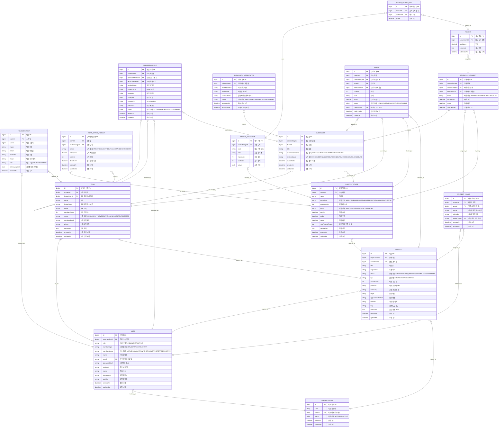

# Trekkey ERD Draft

> **주의:** 이 문서는 초기 초안이다. 리뷰 영역의 현재 기준은
> [review-domain-final-erd-alignment.md](review-domain-final-erd-alignment.md)이며,
> `REVIEW_ROUND`를 공식 심사 라운드 원장으로 사용한다.

프론트의 현재 기능과 대회별 단계 구성이 달라질 수 있다는 요구사항을 반영한 백엔드 ERD 초안입니다.

핵심 방향은 다음과 같습니다.

- 학교/기관은 `ORGANIZATION`으로 관리하고, `USER`는 현재 소속 학교를 `organizationId`로 직접 참조합니다.
- 한 사용자는 현재 하나의 학교에 소속된다는 전제로 설계합니다.
- 사용자 역할은 서비스 권한인 `role`과 학교 구성원 유형인 `memberType`으로 분리합니다.
- 심사위원은 정식 사용자 역할이 아니라 대회별 초대 대상이므로 `CONTEST_JUDGE`에서 관리합니다.
- 대회 단계는 `CONTEST_STAGE` 테이블로 관리합니다.
- `CONTEST_STAGE.stageType`은 enum으로 두고, 실제 단계명/순서/기간은 테이블 데이터로 관리합니다.
- 단일 단계 대회도 `CONTEST_STAGE`를 1개 이상 생성해서 같은 구조로 처리합니다.
- JPA 매핑은 기본적으로 자식 엔티티의 단방향 `ManyToOne(fetch = FetchType.LAZY)`를 우선합니다.
- `@ManyToMany`는 사용하지 않고, 필요한 경우 연결 엔티티를 둡니다.

## 테이블 역할

| 테이블 | 역할 |
| --- | --- |
| `ORGANIZATION` | 서비스를 사용하는 학교/기관 |
| `USER` | 특정 학교에 소속된 관리자 또는 참가자 계정 |
| `CONTEST` | 특정 학교가 운영하는 대회 기본 정보와 공개 공고 정보 |
| `CONTEST_STAGE` | 대회별 진행 단계. 예: 참가 신청, 1차 제출, 예선 심사, 최종 PT, 수상 확정 |
| `TEAM` | 대회 참가 신청 단위. 개인전도 1인 팀으로 처리 |
| `TEAM_MEMBER` | 팀 구성원 정보와 팀 내 역할. 팀원 개인의 수상내역 조회 기준 |
| `TEAM_STAGE_RESULT` | 특정 팀이 특정 단계에서 제출/통과/탈락했는지 기록 |
| `SUBMISSION` | 특정 단계에 제출된 작품 접수 건 |
| `SUBMISSION_FILE` | 제출물에 첨부된 실제 파일 메타데이터 |
| `SUBMISSION_VERIFICATION` | 제출물 해시, 무결성 검증, 온체인 등록 기록 |
| `REVIEW_CRITERION` | 특정 단계의 평가 기준과 배점 |
| `CONTEST_JUDGE` | 특정 대회에 배정된 심사위원 |
| `REVIEW_ASSIGNMENT` | 특정 심사위원에게 특정 제출물을 배정한 기록 |
| `REVIEW` | 심사위원이 제출한 평가 결과 1건 |
| `REVIEW_SCORE_ITEM` | 평가 결과의 기준별 점수 |
| `AWARD` | 팀 단위 수상 후보와 수상 확정 결과 |

## 필드 설명

### ORGANIZATION

| 필드 | 의미 |
| --- | --- |
| `id` | 학교/기관 PK |
| `name` | 학교/기관명 |
| `domain` | 학교 이메일 도메인. 예: `example.ac.kr` |
| `status` | 기관 사용 상태. 활성/비활성 |
| `createdAt` | 생성 시각 |
| `updatedAt` | 수정 시각 |

### USER

| 필드 | 의미 |
| --- | --- |
| `id` | 사용자 PK |
| `organizationId` | 현재 소속 학교/기관 FK |
| `role` | 서비스 권한. 관리자 또는 참가자 |
| `memberType` | 학교 구성원 유형. 학생, 직원, 교원 |
| `memberStatus` | 현재 소속 상태. 재학/재직, 졸업, 자퇴, 편입, 비활성 등 |
| `name` | 사용자 이름 |
| `email` | 로그인/연락용 이메일. 중복 불가 |
| `passwordHash` | 비밀번호 해시 |
| `studentId` | 참가자 학번. 해당 없으면 nullable. `organizationId + studentId` 복합 유니크 권장 |
| `major` | 학생 학과/전공. 해당 없으면 nullable |
| `department` | 교직원 부서. 해당 없으면 nullable |
| `position` | 교직원 직책. 해당 없으면 nullable |
| `createdAt` | 생성 시각 |
| `updatedAt` | 수정 시각 |

### CONTEST

| 필드 | 의미 |
| --- | --- |
| `id` | 대회 PK |
| `organizationId` | 대회를 운영하는 학교/기관 FK |
| `ownerUserId` | 대회 담당 관리자 FK. 같은 `organizationId` 소속 관리자여야 함 |
| `title` | 대회명 |
| `department` | 주관 부서 |
| `status` | 대회 전체 상태. 목록 필터와 운영 상태 표시용 |
| `type` | 참가 방식. 팀전, 개인전, 개인/팀 |
| `awardCount` | 예정 시상 수 |
| `posterUrl` | 공개 페이지 대표 포스터 URL |
| `summary` | 공개 페이지 한 줄 소개 |
| `target` | 참가 대상 |
| `applicationMethod` | 접수 방법 안내 |
| `benefits` | 시상 및 혜택 |
| `tags` | 검색/노출용 태그. 초기에는 콤마 문자열로 시작 가능 |
| `detailHtml` | 공개 공고 상세 본문 HTML |
| `createdAt` | 생성 시각 |
| `updatedAt` | 수정 시각 |

### CONTEST_STAGE

| 필드 | 의미 |
| --- | --- |
| `id` | 대회 단계 PK |
| `contestId` | 소속 대회 FK |
| `name` | 단계명. 예: 참가 신청, 1차 제출, 최종 PT |
| `stageType` | 단계 유형 enum. 화면/정책 분기용 |
| `sequenceNo` | 대회 내 단계 순서 |
| `status` | 단계 상태. 대기, 진행중, 종료, 완료 |
| `startAt` | 단계 시작 시각 |
| `endAt` | 단계 종료 시각 |
| `dueAt` | 단계 마감 시각. 단계 유형에 따라 신청 마감, 제출 마감, 심사 마감, 결과 확정 예정일로 해석 |
| `maxPassedTeams` | 다음 단계 진출 가능 팀 수. 제한 없으면 nullable |
| `description` | 단계 설명 또는 내부 메모 |
| `createdAt` | 생성 시각 |
| `updatedAt` | 수정 시각 |

### TEAM

| 필드 | 의미 |
| --- | --- |
| `id` | 팀/참가 신청 PK |
| `contestId` | 신청한 대회 FK |
| `leaderUserId` | 대표 참가자 사용자 FK |
| `name` | 팀명. 개인전이면 참가자명과 동일하게 둘 수 있음 |
| `leaderName` | 신청 당시 대표자 이름 스냅샷 |
| `major` | 대표 소속 또는 팀 대표 소속 |
| `memberCount` | 신청 인원 수 |
| `status` | 참가 신청 검토 상태 |
| `applicantEmail` | 신청자 이메일 스냅샷 |
| `phone` | 신청자 연락처 |
| `motivation` | 지원 동기 |
| `createdAt` | 신청 생성 시각 |
| `updatedAt` | 신청 수정 시각 |

### TEAM_MEMBER

| 필드 | 의미 |
| --- | --- |
| `id` | 팀원 PK |
| `teamId` | 소속 팀 FK |
| `userId` | 팀원 사용자 FK. 팀원 본인의 수상내역 조회 기준 |
| `name` | 팀원 이름 |
| `email` | 팀원 이메일 |
| `studentId` | 팀원 학번 |
| `major` | 팀원 학과/소속 |
| `role` | 팀 내 역할. 대표 또는 일반 팀원 |
| `privacyAgreed` | 개인정보 제공 동의 여부 |
| `createdAt` | 생성 시각 |

### TEAM_STAGE_RESULT

| 필드 | 의미 |
| --- | --- |
| `id` | 단계별 팀 결과 PK |
| `teamId` | 대상 팀 FK |
| `contestStageId` | 대상 단계 FK |
| `status` | 해당 단계에서의 상태. 대기, 제출, 통과, 탈락, 철회 |
| `totalScore` | 해당 단계 최종 점수 |
| `rankNo` | 해당 단계 순위 |
| `decidedAt` | 통과/탈락/순위 확정 시각 |
| `createdAt` | 생성 시각 |
| `updatedAt` | 수정 시각 |

### SUBMISSION

| 필드 | 의미 |
| --- | --- |
| `id` | 제출물 PK |
| `contestStageId` | 어느 단계 제출물인지 나타내는 FK |
| `teamId` | 제출한 팀 FK |
| `title` | 제출물명 |
| `submissionStatus` | 제출 상태. 임시저장, 제출완료, 수정됨, 철회 |
| `reviewStatus` | 심사 상태. 접수, 미배정, 배정, 심사완료, 수상후보 |
| `submittedAt` | 제출 접수 시각 |
| `createdAt` | 생성 시각 |
| `updatedAt` | 수정 시각 |

### SUBMISSION_FILE

| 필드 | 의미 |
| --- | --- |
| `id` | 제출 파일 PK |
| `submissionId` | 소속 제출물 FK |
| `uploadedByUserId` | 파일을 업로드한 사용자 FK |
| `replacedByFileId` | 이 파일을 교체한 새 파일 FK. 교체되지 않았으면 nullable |
| `originalName` | 업로드 당시 원본 파일명 |
| `contentType` | MIME 타입 |
| `extension` | 파일 확장자 |
| `sizeBytes` | 파일 크기 |
| `storageKey` | S3 object key |
| `checksum` | 파일 단위 체크섬 |
| `status` | 파일 상태. 활성, 삭제, 교체됨, 실패 |
| `deletedAt` | 파일 삭제 시각 |
| `createdAt` | 생성 시각 |

### SUBMISSION_VERIFICATION

| 필드 | 의미 |
| --- | --- |
| `id` | 검증 기록 PK |
| `submissionId` | 검증 대상 제출물 FK |
| `hashAlgorithm` | 해시 알고리즘. 예: SHA-256 |
| `hashValue` | 제출물 또는 파일 묶음의 해시값 |
| `chainTxHash` | 블록체인 등록 트랜잭션 해시. 미등록이면 nullable |
| `status` | 검증 상태. 대기, 해시 생성, 온체인 등록, 실패 |
| `generatedAt` | 해시 생성 시각 |
| `registeredAt` | 온체인 등록 시각 |

### REVIEW_CRITERION

| 필드 | 의미 |
| --- | --- |
| `id` | 평가 기준 PK |
| `contestStageId` | 평가 기준이 적용되는 단계 FK |
| `code` | 내부 코드. 예: creativity, marketability |
| `label` | 화면 표시명. 예: 창의성, 시장성 |
| `maxScore` | 최대 점수 |
| `sortOrder` | 평가 화면 표시 순서 |
| `active` | 사용 여부 |

### CONTEST_JUDGE

| 필드 | 의미 |
| --- | --- |
| `id` | 대회 심사위원 PK |
| `contestId` | 배정된 대회 FK |
| `userId` | 심사위원이 사용자 계정과 연결된 경우의 FK. 외부 링크 심사만 쓰면 nullable |
| `name` | 심사위원 이름 스냅샷 |
| `roleLabel` | 심사위원 역할명. 예: 외부 심사위원, 전임교원 |
| `reviewToken` | 심사 링크/QR 접근 토큰 |
| `createdAt` | 생성 시각 |
| `updatedAt` | 수정 시각 |

### REVIEW_ASSIGNMENT

| 필드 | 의미 |
| --- | --- |
| `id` | 심사 배정 PK |
| `contestStageId` | 어느 단계 심사인지 나타내는 FK. `submissionId`가 가리키는 제출물의 단계와 일치해야 함 |
| `contestJudgeId` | 배정받은 심사위원 FK |
| `submissionId` | 심사 대상 제출물 FK |
| `status` | 배정 상태. 배정, 완료, 취소 |
| `assignedAt` | 배정 시각 |
| `dueAt` | 심사 마감 시각 |
| `completedAt` | 심사 완료 시각 |

### REVIEW

| 필드 | 의미 |
| --- | --- |
| `id` | 심사 결과 PK |
| `assignmentId` | 어떤 배정에 대한 결과인지 나타내는 FK |
| `totalScore` | 항목별 점수 합계 |
| `comment` | 심사 의견 |
| `submittedAt` | 심사 제출 시각 |

### REVIEW_SCORE_ITEM

| 필드 | 의미 |
| --- | --- |
| `id` | 항목별 점수 PK |
| `reviewId` | 소속 심사 결과 FK |
| `criterionId` | 평가 기준 FK |
| `score` | 해당 기준에 부여한 점수 |

### AWARD

| 필드 | 의미 |
| --- | --- |
| `id` | 수상 결과 PK |
| `contestId` | 소속 대회 FK |
| `contestStageId` | 수상 산출 기준 단계 FK. 보통 최종 심사 단계 |
| `teamId` | 수상 팀 FK |
| `submissionId` | 수상 기준 제출물 FK. 제출물 없이 수상 처리하면 nullable 가능 |
| `rankNo` | 순위 |
| `prize` | 상격. 예: 대상, 최우수상 |
| `score` | 수상 산출 점수 |
| `status` | 수상 상태. 후보, 검토중, 확정, 보류 |
| `certificateNo` | 팀 단위 상장 번호. 팀원들은 같은 상장 정보를 공유 |
| `confirmedAt` | 수상 확정 시각 |
| `createdAt` | 생성 시각 |

## JPA 매핑 기준

- 기본 원칙은 자식 엔티티의 단방향 `ManyToOne(fetch = FetchType.LAZY)`입니다.
- 예를 들어 `Submission`은 `ContestStage`, `Team`을 참조하지만, 초기에는 `ContestStage.submissions` 컬렉션을 만들지 않습니다.
- 부모에서 자식 목록이 필요하면 엔티티 그래프를 타지 말고 Repository 쿼리로 조회합니다. 예: `submissionRepository.findByContestStageId(stageId)`.
- 컬렉션 양방향 매핑은 도메인 규칙을 엔티티 메서드로 강하게 묶어야 할 때만 추가합니다.
- 리스트 화면은 DTO projection, fetch join, `@EntityGraph`, batch size 중 하나를 조회 목적에 맞게 명시합니다.
- `LAZY`여도 반복 접근하면 N+1이 납니다. 목록 API는 필요한 부모 필드를 join해서 DTO로 바로 내려주는 쿼리를 우선합니다.
- 조회 성능을 위해 FK 컬럼에는 인덱스를 둡니다. 우선 대상은 `organization_id`, `owner_user_id`, `contest_id`, `contest_stage_id`, `team_id`, `submission_id`, `contest_judge_id`, `review_id`, `criterion_id`입니다.

## 현재 결정 사항

- `TEAM_MEMBER`는 유지합니다. 팀원도 서비스에 가입하고, 개인 수상내역은 `USER -> TEAM_MEMBER -> TEAM -> AWARD` 경로로 조회합니다.
- `TEAM_STAGE_RESULT`는 유지합니다. 다단계 대회에서 단계별 제출, 통과, 탈락, 순위 확정은 기본 기능으로 봅니다.
- `SUBMISSION_VERIFICATION`은 유지합니다. 다만 해시/블록체인 검증 API 구현은 파일 제출과 심사 기능 이후로 미룰 수 있습니다.
- `AWARD_RECIPIENT`는 만들지 않습니다. 상장은 팀 단위로 발급하고, 팀원들은 같은 `AWARD.certificateNo`를 공유합니다.
- `USER_ORGANIZATION_HISTORY`는 MVP에서 만들지 않습니다. 현재 소속/상태는 `USER.memberStatus`로 관리하고, 과거 대회 참여 정보는 `TEAM_MEMBER` 스냅샷으로 보존합니다.
- 화면용 집계/캐시 필드는 초기 ERD에서 제외합니다. 예: `CONTEST.progress`, `CONTEST_JUDGE.assignedCount`, `CONTEST_JUDGE.completedCount`, `CONTEST_JUDGE.avgScore`.
- `CONTEST_STAGE` 날짜 필드는 `startAt`, `endAt`, `dueAt` 3개만 사용합니다.
- 제출물은 해당 단계의 `dueAt` 전까지만 수정할 수 있습니다.
- 제출 파일은 S3에 저장하고, DB에는 S3 object key와 파일 메타데이터만 저장합니다. 다운로드 URL은 저장하지 않고 API에서 presigned URL로 발급합니다.
- 제출 파일 삭제/교체 이력은 `SUBMISSION_FILE.status`, `replacedByFileId`, `deletedAt`으로 추적합니다.
- 심사위원은 `CONTEST_JUDGE.reviewToken` 기반 QR/링크로 대회 단위 초대합니다.
- 같은 심사위원이 여러 단계의 제출물을 심사할 수 있도록 허용합니다.
- 제출물별 심사위원 배정 방식은 주최측 운영 정책으로 열어두고, `REVIEW_ASSIGNMENT` row 생성 방식으로 제어합니다.
- 심사 결과는 제출 후 수정할 수 없습니다.
- 평가 기준은 단계별로 관리하고, 점수는 `0 <= score <= REVIEW_CRITERION.maxScore`로 검증합니다. 별도 `minScore`는 두지 않습니다.
- 동점 처리는 시스템 룰로 자동화하지 않고, 심사위원/운영자 토의 후 `TEAM_STAGE_RESULT`와 `AWARD`에 최종 결과를 반영합니다.

## 권장 제약 조건

- `TEAM_STAGE_RESULT`: `teamId + contestStageId` unique.
- `REVIEW_ASSIGNMENT`: `contestJudgeId + submissionId` unique.
- `REVIEW`: `assignmentId` unique.
- `REVIEW_SCORE_ITEM`: `reviewId + criterionId` unique.
- `REVIEW_SCORE_ITEM.score`: 0 이상, 연결된 `REVIEW_CRITERION.maxScore` 이하.

## 정책 검토 필요

- `TEAM`을 계속 팀/참가 신청 단위로 볼지, 이름을 `APPLICATION`으로 바꿀지 결정해야 합니다.
- 팀원이 참가 신청 시점에 반드시 가입을 완료해야 하는지, 초대 후 가입 완료 방식도 허용할지 결정해야 합니다. 현재 ERD는 가입 완료 후 `TEAM_MEMBER.userId`가 필수인 구조입니다.
- 모든 심사위원이 모든 제출물을 심사할지, 일부 제출물만 배정할지는 주최측 운영 정책으로 결정해야 합니다.
- 심사위원이 추후 사용자 계정과 연결될 필요가 있는지는 후순위로 결정합니다. 현재는 `CONTEST_JUDGE.userId`를 nullable로 둡니다.
- 졸업/자퇴/편입 이력을 감사 수준으로 보관해야 하면 `USER_ORGANIZATION_HISTORY`를 후순위로 추가합니다. MVP에서는 `USER.memberStatus`로 현재 상태만 관리합니다.
