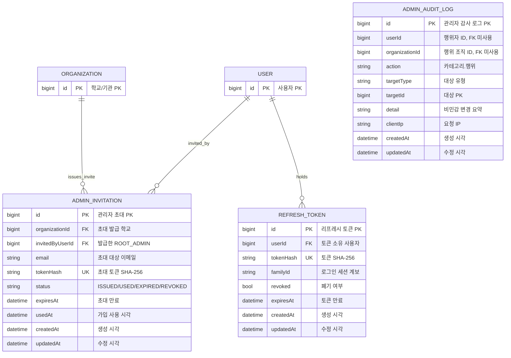
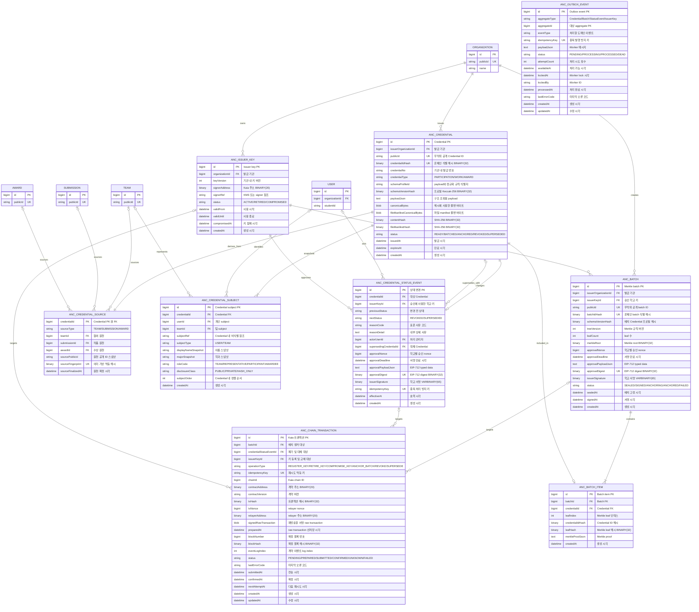

# Trekkey 공모전·Credential 최종 ERD

- 기준일: 2026-07-27
- 상태: 목표 ERD 확정. 리뷰 도메인은 `REVIEW_ROUND`를 공식 심사 라운드 원장으로 사용한다.
- 통합 보기: [업무·블록체인 전체 ERD](./unified-erd.md)
- 시각 보드: [팀 회의용 Mermaid 다이어그램](./architecture-diagrams.md)
- 상세 설계: [블록체인 앵커링 설계](./blockchain-anchoring-architecture.md)

> 기존 `CONTEST_STAGE` 기반 리뷰 데이터가 있는 DB는 배포 전에
> [Review Round DB 이전 안내](./review-domain-final-erd-alignment.md)에 따라
> 명시적으로 이전해야 한다. Hibernate `ddl-auto=update`만으로는 기존 FK와
> 데이터를 안전하게 전환할 수 없다.

## 1. 범위

현재 ERD는 다음 기능을 구현 범위로 고정한다.

- 학교/기관별 사용자와 대회 관리
- 관리자 초대, 로그인 세션, 관리자 감사 로그
- 팀 및 확정 팀원 명단 관리
- 팀당 최종 제출물 한 건 관리
- 0..N개의 Review Round와 라운드별 공식 결과 관리
- 팀 단위 수상 확정
- 참여, 작품, 수상 Credential 발급
- Credential Merkle 배치와 Kaia 앵커링
- Credential 폐기 및 대체 발급

아래 기능은 현재 ERD에 넣지 않는다.

- 학적 이력과 졸업요건 판정
- 공모전과 무관한 독립 작품 관리
- 제출물 버전 이력
- 라운드별 블록체인 앵커링
- 라운드 상태 변경 전체 감사 이벤트

졸업 Credential은 졸업요건 업무 원장이 확정된 뒤 같은 `ANC_*` 파이프라인에 source type만 확장한다.

## 2. 업무 SQL ERD

```mermaid
erDiagram
    ORGANIZATION ||--o{ USER : has
    ORGANIZATION ||--o{ CONTEST : hosts
    USER ||--o{ CONTEST : owns
    CONTEST ||--o{ CONTEST_LIKE : receives
    USER ||--o{ CONTEST_LIKE : likes
    CONTEST ||--o{ REVIEW_ROUND : has_rounds
    CONTEST ||--o{ TEAM : accepts
    USER ||--o{ TEAM : leads
    TEAM ||--|{ TEAM_MEMBER : has_members
    USER ||--o{ TEAM_MEMBER : joins
    TEAM ||--o| SUBMISSION : submits
    SUBMISSION ||--o{ SUBMISSION_FILE : contains
    USER ||--o{ SUBMISSION_FILE : uploads
    REVIEW_ROUND ||--o{ REVIEW_ROUND_ENTRY : records
    SUBMISSION ||--o{ REVIEW_ROUND_ENTRY : enters
    USER o|--o{ REVIEW_ROUND_ENTRY : decides
    REVIEW_ROUND ||--o{ REVIEW_CRITERION : defines
    CONTEST ||--o{ CONTEST_JUDGE : assigns
    USER o|--o{ CONTEST_JUDGE : links
    CONTEST_JUDGE ||--o{ REVIEW_ASSIGNMENT : receives
    REVIEW_ROUND_ENTRY ||--o{ REVIEW_ASSIGNMENT : is_reviewed
    REVIEW_ASSIGNMENT ||--o| REVIEW : completes
    REVIEW ||--|{ REVIEW_SCORE_ITEM : contains
    REVIEW_CRITERION ||--o{ REVIEW_SCORE_ITEM : scores
    REVIEW_ROUND_ENTRY ||--o| AWARD : supports
    TEAM ||--o| AWARD : receives

    ORGANIZATION {
        bigint id PK "학교/기관 PK"
        string publicId UK "외부 issuer ID"
        string name "학교/기관명"
        string domain UK "학교 이메일 도메인"
        string status "ACTIVE/INACTIVE"
        datetime createdAt "생성 시각"
        datetime updatedAt "수정 시각"
    }

    USER {
        bigint id PK "사용자 PK"
        bigint organizationId FK "현재 소속 학교"
        string role "ROOT_ADMIN/ADMIN/PARTICIPANT"
        string memberType "STUDENT/STAFF/FACULTY"
        string memberStatus "PENDING_APPROVAL/ACTIVE/GRADUATED/WITHDRAWN/TRANSFERRED/INACTIVE"
        string name "사용자 이름"
        string email UK "로그인 이메일"
        string passwordHash "비밀번호 해시"
        string studentId "학교 내 학번, 조직 내 유일"
        string major "학과/전공"
        string department "교직원 부서"
        string position "교직원 직책"
        int failedLoginCount "로그인 연속 실패 횟수"
        datetime lockedUntil "로그인 잠금 해제 시각"
        datetime createdAt "생성 시각"
        datetime updatedAt "수정 시각"
    }

    CONTEST {
        bigint id PK "대회 PK"
        string publicId UK "대회 공개 ID"
        bigint organizationId FK "운영 학교"
        bigint ownerUserId FK "담당 관리자"
        string title "대회명"
        string department "주관 부서 스냅샷"
        string status "PREPARING/APPLICATION_OPEN/REVIEWING/AWARDED"
        string participationType "TEAM/INDIVIDUAL/MIXED"
        int awardCount "예정 시상 수"
        datetime applicationStartsAt "신청 시작"
        datetime applicationEndsAt "신청 마감"
        datetime submissionDueAt "제출 마감"
        string posterUrl "대표 포스터 URL"
        string summary "공개 한 줄 소개"
        string target "참가 대상"
        string applicationMethod "접수 방법"
        string benefits "시상 및 혜택"
        string tags "검색 태그"
        text detailHtml "공고 상세 HTML"
        datetime createdAt "생성 시각"
        datetime updatedAt "수정 시각"
    }

    CONTEST_LIKE {
        bigint id PK "좋아요 PK"
        bigint contestId FK "대회 FK"
        bigint userId FK "사용자 FK"
        datetime createdAt "좋아요 시각"
    }

    REVIEW_ROUND {
        bigint id PK "심사 라운드 PK"
        bigint contestId FK "소속 대회"
        int roundNo "대회 내 심사 순서"
        string name "심사 라운드명"
        string status "PREPARING/OPEN/FINALIZED"
        datetime startsAt "심사 시작 시각"
        datetime endsAt "심사 종료 시각"
        string targetType "ALL_SUBMISSIONS/PREVIOUS_SELECTED/MANUAL"
        string decisionRule "TOP_N/MIN_SCORE/MANUAL"
        int selectCount "선정 팀 수"
        decimal minScore "최소 선정 점수"
        datetime finalizedAt "라운드 확정 시각"
        datetime createdAt "생성 시각"
        datetime updatedAt "수정 시각"
    }

    TEAM {
        bigint id PK "팀 겸 참가 신청 PK"
        string publicId UK "팀 공개 ID"
        bigint contestId FK "신청 대회"
        bigint leaderUserId FK "대표 참가자"
        string name "팀명 또는 개인 참가자명"
        string leaderName "대표자 이름 스냅샷"
        string major "대표 소속 스냅샷"
        int memberCount "현재 팀원 수 캐시"
        string status "PENDING/APPROVED/REVISION_REQUESTED/REJECTED"
        string contactEmail "신청 연락 이메일"
        string phone "신청 연락처"
        text motivation "지원 동기"
        datetime participationFinalizedAt "명단 확정 및 잠금 시각"
        datetime createdAt "신청 생성 시각"
        datetime updatedAt "수정 시각"
    }

    TEAM_MEMBER {
        bigint id PK "팀 구성원 PK"
        bigint teamId FK "소속 팀"
        bigint userId FK "구성 사용자, 가입 후 삭제 금지"
        string roleCode "LEADER/MEMBER"
        datetime createdAt "생성 시각"
        datetime updatedAt "수정 시각"
    }

    SUBMISSION {
        bigint id PK "최종 제출물 PK"
        string publicId UK "제출물 공개 ID"
        bigint teamId FK "제출 팀, 팀당 한 건"
        string title "작품명"
        string status "DRAFT/SUBMITTED/WITHDRAWN"
        datetime finalizedAt "제출 수정 마감 시각"
        datetime submittedAt "최근 제출 시각"
        datetime createdAt "최초 제출 시각"
        datetime updatedAt "수정 시각"
    }

    SUBMISSION_FILE {
        bigint id PK "제출 파일 PK"
        bigint submissionId FK "소속 제출물"
        bigint uploadedByUserId FK "업로드 사용자"
        string originalName "원본 파일명"
        string contentType "MIME 타입"
        bigint sizeBytes "파일 크기"
        string storageKey UK "객체 저장소 키"
        binary sha256 "서버 계산 SHA-256"
        datetime createdAt "생성 시각"
        datetime updatedAt "수정 시각"
    }

    REVIEW_ROUND_ENTRY {
        bigint id PK "라운드 참가 및 공식 판정 PK"
        bigint reviewRoundId FK "평가 라운드"
        bigint submissionId FK "대상 제출물"
        string status "ELIGIBLE/IN_REVIEW/SELECTED/NOT_SELECTED/WITHDRAWN/DISQUALIFIED"
        decimal finalScore "확정 평균 점수, 무채점 수동은 null"
        int rankNo "라운드 확정 순위"
        string decisionType "RULE/MANUAL"
        bigint decidedByUserId FK "수동 판정 관리자"
        text decisionReason "수동 판정 및 정정 사유"
        datetime finalizedAt "판정 확정 시각"
        datetime createdAt "라운드 진입 시각"
        datetime updatedAt "수정 시각"
    }

    REVIEW_CRITERION {
        bigint id PK "평가 기준 PK"
        bigint reviewRoundId FK "적용 라운드"
        string code "라운드 내 기준 코드"
        string label "화면 표시명"
        int maxScore "최대 점수"
        int sortOrder "표시 순서"
        bool active "사용 여부"
        datetime createdAt "생성 시각"
        datetime updatedAt "수정 시각"
    }

    CONTEST_JUDGE {
        bigint id PK "대회 심사위원 PK"
        bigint contestId FK "배정 대회"
        bigint userId FK "연결 사용자, 외부 심사위원은 null"
        string name "심사위원 이름 스냅샷"
        string roleLabel "심사위원 역할명"
        string reviewTokenHash UK "심사 링크 토큰 해시"
        datetime tokenExpiresAt "심사 링크 만료"
        datetime createdAt "생성 시각"
        datetime updatedAt "수정 시각"
    }

    REVIEW_ASSIGNMENT {
        bigint id PK "심사 배정 PK"
        bigint contestJudgeId FK "배정 심사위원"
        bigint reviewRoundEntryId FK "라운드별 심사 대상"
        string status "ASSIGNED/COMPLETED/CANCELED"
        datetime assignedAt "배정 시각"
        datetime dueAt "심사 마감"
        datetime completedAt "완료 시각"
        datetime createdAt "생성 시각"
        datetime updatedAt "수정 시각"
    }

    REVIEW {
        bigint id PK "심사 결과 PK"
        bigint assignmentId FK "심사 배정"
        decimal totalScore "총점"
        text comment "심사 의견"
        datetime submittedAt "심사 제출 시각"
        datetime createdAt "생성 시각"
    }

    REVIEW_SCORE_ITEM {
        bigint id PK "항목별 점수 PK"
        bigint reviewId FK "소속 심사 결과"
        bigint criterionId FK "평가 기준"
        decimal score "부여 점수"
    }

    AWARD {
        bigint id PK "수상 결과 PK"
        string publicId UK "수상 공개 ID"
        bigint reviewRoundEntryId FK "수상 근거 공식 결과"
        bigint teamId FK "수상 팀 및 조회용 FK"
        int awardRankNo "수상 순위"
        string prize "상격"
        string status "CANDIDATE/CONFIRMED/HELD"
        string certificateNo UK "팀 단위 상장 번호"
        datetime confirmedAt "수상 확정 시각"
        datetime createdAt "생성 시각"
        datetime updatedAt "수정 시각"
    }
```

## 3. 인증 및 관리 SQL ERD

`ADMIN_INVITATION`과 `REFRESH_TOKEN`은 실제 인증 흐름에 참여하는 원장이다. `ADMIN_AUDIT_LOG`는 사용자나 조직이 삭제돼도 감사 증거를 남기기 위해 의도적으로 FK를 사용하지 않는다.

상세 인증·관리 정책은 [`ADMIN_SECURITY.md`](./ADMIN_SECURITY.md)를 따른다.

## 4. Credential 및 앵커링 SQL ERD

온체인 mapping은 SQL 테이블이 아니다. 아래 `ANC_*` 테이블은 Credential 스냅샷, Merkle proof, 학교 승인 서명, Kaia 트랜잭션 영수증을 저장하는 off-chain 원장이다.

## 5. 업무 원장 규칙

### 사용자 조회

- 학번은 학교 안에서만 유일하다: `UNIQUE (organizationId, studentId)`.
- 학교별 서버에서는 학번만 받을 수 있지만, 중앙형 배포에서는 로그인 tenant가 `organizationId`를 함께 제공한다.
- 학번 검색 API는 본인 또는 학교 관리자에게만 허용하고 공개 검증 API와 분리한다.

### 대회 일정과 상태

- `CONTEST.status`는
  `PREPARING/APPLICATION_OPEN/REVIEWING/AWARDED` 운영 상태를 저장한다.
- 일반 대회 생성·수정 API는 `AWARDED`로 직접 진입하거나
  `AWARDED`에서 다른 상태로 되돌릴 수 없다. 최신 수상 후보 검증을
  통과한 수상 확정 트랜잭션만 `AWARDED`로 전환한다.
- `applicationStartsAt < applicationEndsAt <= submissionDueAt`을 검사한다.
- 승인된 팀은 `submissionDueAt`까지 같은 제출물을 등록하고 수정할 수 있다.
- 신청, 제출, 시상을 표현하는 별도 Stage row는 만들지 않는다.

### 팀과 팀원

- `UNIQUE TEAM_MEMBER (teamId, userId)`.
- `TEAM.leaderUserId`는 현재 팀원이며 `roleCode = LEADER`여야 한다.
- 팀에 가입한 `TEAM_MEMBER`는 이탈하거나 삭제하지 않는다.
- 팀원 추가는 `participationFinalizedAt` 전까지만 허용하고, 확정 이후에는 추가와 역할 변경도 거부한다.
- 명단 확정 뒤에는 신청 상태도 바꿀 수 없다. 심사 탈락 처리가 필요하면
  TEAM을 다시 반려하지 않고 REVIEW_ROUND_ENTRY의
  `DISQUALIFIED` 판정과 Credential 상태 변경 흐름을 사용한다.
- 구성원을 잘못 등록한 신청은 팀 자체를 반려하고 다시 신청한다.
- `TEAM.memberCount`는 조회용 캐시이고 원장은 `TEAM_MEMBER`다.
- 상장은 팀 단위 `AWARD` 및 Credential 한 건으로 발급하고, 모든 구성원은 같은 수상을 참조한다.
- 발급 당시 팀과 구성원 정보는 `ANC_CREDENTIAL_SUBJECT`에 다시 스냅샷한다.

### 제출물

- `UNIQUE SUBMISSION (teamId)`. 제출 버전 테이블은 만들지 않는다.
- 마감 전 수정은 같은 `SUBMISSION` 행과 현재 `SUBMISSION_FILE` 목록을 덮어쓴다.
- 새 파일은 고유 `storageKey`로 업로드하면서 서버가 SHA-256을 계산한다.
- 업로드가 끝나면 트랜잭션에서 `SUBMISSION` 최신 상태를 `FOR UPDATE`로 조회한다. 이미 제출이 확정됐거나 심사가 시작됐으면 거부하고, 아니면 제목과 파일 목록을 교체한다.
- 제출물 수정 이력용 컬럼, 별도 무결성 상태, 비동기 hash worker는 두지 않는다.
- DB 교체 성공 후 이전 객체를 비동기로 정리하고, 실패하면 새 객체를 정리해 기존 제출물을 유지한다.
- `finalizedAt` 이후 또는 첫 심사 시작 이후 제목과 파일을 수정할 수 없다.

### 라운드와 심사

- `UNIQUE REVIEW_ROUND (contestId, roundNo)`이고 `roundNo >= 1`이어야 한다.
- `roundNo`는 1부터 빈 번호 없이 이어지도록 대회 설정 트랜잭션에서 검사한다.
- 라운드를 열 때 낮은 번호의 모든 라운드가 `FINALIZED`인지 확인하고,
  같은 대회의 다른 `OPEN` 라운드가 있으면 거부한다.
- `UNIQUE REVIEW_ROUND_ENTRY (reviewRoundId, submissionId)`.
- `startsAt < endsAt`이어야 한다.
- 첫 Review Round의 `startsAt`은 `CONTEST.submissionDueAt`보다 빠를 수 없다.
- `decisionRule = TOP_N`이면 `selectCount > 0`만, `MIN_SCORE`이면 `minScore >= 0`만 사용하고 `MANUAL`이면 둘 다 null이어야 한다.
- `PREVIOUS_SELECTED`는 2라운드부터 가능하며 직전 `roundNo`가 `FINALIZED`이고 동일 제출물이 `SELECTED`인지 검사한다.
- 심사위원 배정에 ENTRY 식별자가 필요하므로 `PREPARING`에서 `ELIGIBLE` ENTRY를 초안으로 준비할 수 있다. `OPEN` 트랜잭션은 현재 대상 집합을 다시 검증하고 대상 `SUBMISSION.finalizedAt`을 확정한 뒤 ENTRY를 `IN_REVIEW`로 전환한다.
- `OPEN` 전에 모든 대상 TEAM의 `participationFinalizedAt`이 있어야
  한다.
- 종료 시각이 지난 `OPEN` 라운드는 일반 설정 수정이 아니라 전용
  연장 API로만 현재와 기존 종료 시각보다 뒤의 시각까지 연장한다.
- `ALL_SUBMISSIONS` 초안과 현재 승인·제출 완료 작품 집합이 다르면 `OPEN`을 거부한다. 관리자는 대상을 다시 동기화하거나, 채점 이력이 없는 준비 단계에서 미완료 배정과 ENTRY를 초기화한 뒤 다시 준비한다.
- `SELECTED`, `NOT_SELECTED`, `WITHDRAWN`, `DISQUALIFIED`는 `finalizedAt`이 필수다.
- `decisionType = MANUAL`이면 `decidedByUserId`와 `decisionReason`이 필수다.
- 무채점 수동 라운드의 `finalScore`는 null이며 모든 ENTRY에 중복 없는
  연속 순위 `1..N`이 필요하다.
- `FINALIZED` 라운드의 ENTRY, 평가 기준, 심사 배정, 제출된 심사 결과는 수정 및 삭제할 수 없다.
- `UNIQUE REVIEW_ASSIGNMENT (contestJudgeId, reviewRoundEntryId)`.
- 심사 배정 생성 시 judge의 대회와 ENTRY 라운드의 대회가 같은지 트랜잭션 안에서 검사한다.
- `UNIQUE REVIEW (assignmentId)`.
- `UNIQUE REVIEW_SCORE_ITEM (reviewId, criterionId)`.
- 점수는 `0 <= score <= criterion.maxScore`이고 criterion의 라운드는 ENTRY의 라운드와 같아야 한다.
- 제출 완료된 `REVIEW`는 수정하지 않는다.

### 수상

- `UNIQUE AWARD (reviewRoundEntryId)`.
- 대회에 설정된 가장 높은 `roundNo`의 Review Round가 `FINALIZED`일 때, 그 라운드의 `SELECTED REVIEW_ROUND_ENTRY`만 수상의 공식 원천이 된다.
- 심사 없이 수동 선정하는 대회도 `targetType = MANUAL`, `decisionRule = MANUAL`인 Review Round 한 건을 생성한다. 이 조합은 평가 기준과 심사 배정을 만들지 않으며, 관리자는 모든 ENTRY의 판정 사유와 중복 없는 1..N 수동 순위를 함께 확정한다.
- `AWARD.teamId`는 조회용 비정규화 FK이며 `ENTRY -> SUBMISSION -> TEAM`과 항상 같아야 한다.
- `AWARD.awardRankNo`는 라운드 순위가 아니라 상장에 표시할 수상 순위다.
- 후보 산출 후 `awardCount` 또는 마지막 라운드의 선정 결과가 바뀌면
  확정을 거부하고 후보 재산출을 요구한다.
- AWARD가 하나라도 `CONFIRMED`된 뒤에는 Review Round를 추가, 삭제, 재정렬할 수 없다.
- `NOT_SELECTED`, `WITHDRAWN`, `DISQUALIFIED` ENTRY에는 수상을 확정할 수 없다.

## 6. Credential 및 앵커 원장 규칙

### 다형성 FK

- `ANC_CREDENTIAL_SOURCE`는 `sourceType`에 맞는 FK 하나만 non-null이어야 한다.
- `ANC_CREDENTIAL_SUBJECT`는 `subjectType`에 맞춰 `userId`, `teamId` 중 하나만 non-null이어야 한다.
- `ANC_CHAIN_TRANSACTION`은 `operationType`에 맞는 target FK 하나만 non-null이어야 한다.
- 위 규칙은 application validation만이 아니라 DB `CHECK` 제약으로도 적용한다.

### 필수 UNIQUE

- `UNIQUE ANC_ISSUER_KEY (organizationId, keyVersion)`.
- `UNIQUE ANC_CREDENTIAL (issuerOrganizationId, credentialNo)`.
- `UNIQUE ANC_CREDENTIAL_SOURCE (sourceFingerprint)`.
- `UNIQUE ANC_CREDENTIAL_SUBJECT (credentialId, subjectOrder)`.
- `UNIQUE ANC_CREDENTIAL_SUBJECT (credentialId, subjectRef, roleCode)`.
- `UNIQUE ANC_CREDENTIAL_STATUS_EVENT (credentialId)`. V1 상태 변경은 Credential당 한 번만 허용한다.
- `UNIQUE ANC_BATCH_ITEM (credentialId)`. 한 Credential은 하나의 sealed batch에만 들어간다.
- `UNIQUE ANC_BATCH_ITEM (batchId, leafIndex)`.
- `UNIQUE ANC_CHAIN_TRANSACTION (chainId, txHash)`는 `txHash IS NOT NULL`일 때 적용한다.
- `UNIQUE ANC_CHAIN_TRANSACTION (chainId, relayerAddress, txNonce)`는 nonce가 준비된 경우 적용한다.
- `UNIQUE ANC_CHAIN_TRANSACTION (chainId, txHash, eventLogIndex)`는 event가 확인된 경우 적용한다.

### 중복 발급 방지

- 업무 테이블에 숫자 원천 revision 컬럼을 두지 않는다.
- `sourceFingerprint`는 발급 기관, Credential 종류, 원천 공개 ID, 확정 원천 snapshot hash, 정렬된 subject 집합 hash, schema profile로 계산한다.
- 같은 확정 내용을 다시 처리하면 같은 fingerprint로 기존 Credential을 반환한다.
- 실제 정정으로 확정 원천 또는 subject가 바뀌면 fingerprint가 달라져 새 Credential을 발급할 수 있다.
- WORK 원천 snapshot에는 현재 파일의 SHA-256 목록을 포함하고 `storageKey`, URL, `updatedAt` 같은 운영 값은 제외한다.

### 상태와 불변성

- Credential 발급 트랜잭션은 source, subject, canonical bytes를 모두 저장한 뒤 바로 `READY`로 생성한다. 별도 `DRAFT` 상태는 사용하지 않는다.
- `READY` 이후 payload, canonical bytes, hash, source, subject는 수정하지 않는다.
- sealed batch의 item, 순서, root는 수정하지 않는다. 만료·실패 승인만 전용 갱신 API에서 nonce, deadline, typed data, digest, signature를 교체한다.
- raw transaction, relayer 주소, nonce, tx hash는 broadcast 전에 `PREPARED`로 선저장한다.
- broadcast 응답 유실과 receipt timeout은 `FAILED`가 아니라 `UNKNOWN`이다. 새 nonce를 만들지 않고 저장된 tx hash를 조회하며, 미확정 상태가 지속되면 저장된 동일 raw transaction만 간격을 두고 재방송한다.
- receipt revert 또는 readback 불일치는 transaction `FAILED`, outbox `DEAD`로 남긴다.
- 온체인에는 성공했지만 로컬 처리가 실패한 경우, 별도 reconciliation API가 온체인 값 전체 일치를 확인한 뒤 업무 상태만 수렴시킨다. 실패 transaction/outbox 원장은 보존한다.
- V1은 batch 전체 revoke를 지원하지 않고 개별 Credential `REVOKED`와 `SUPERSEDED`만 지원한다.
- 대체 발급은 새 Credential 앵커 확인 후 기존 Credential을 `SUPERSEDED` 처리한다.

## 7. JPA 및 구현 기준

- 업무 도메인은 단방향 `ManyToOne(fetch = FetchType.LAZY)`를 우선한다. 앵커링 모듈은 장기 증거의 불변성과 모듈 경계를 위해 FK ID를 scalar로 보관한다.
- 초기 구현에서는 `@ManyToMany`와 부모 컬렉션 양방향 매핑을 사용하지 않는다.
- 목록 조회는 DTO projection, fetch join, `@EntityGraph`, batch size를 목적에 맞게 사용한다.
- FK와 위 UNIQUE 선두 컬럼에는 인덱스를 둔다.
- 업무 원천 확정과 내부 `CredentialIssuanceService.issue()` 호출은 같은 DB 트랜잭션에 참여시킨다.
- 학교 승인 서명 저장과 chain transaction·anchor outbox 생성은 한 DB 트랜잭션으로 처리한다.
- 학교 issuer private key는 백엔드에 저장하지 않는다. Kairos 개발용 relayer만 환경변수를 사용하고 운영 relayer는 KMS/HSM adapter로 교체한다.

## 8. 후속 확장

| 요구사항 | 확장 시 추가할 모델 |
| --- | --- |
| 졸업요건 증빙 | `GRADUATION_RULE`, `GRADUATION_ACHIEVEMENT`, Credential source type |
| 복수 학교 및 학적 이력 | `AFFILIATION`, `ORG_UNIT` |
| 공모전 외 독립 작품 | `WORK`와 `SUBMISSION` 관계 |
| 라운드별 별도 제출물 | `REVIEW_ROUND_SUBMISSION`과 Round Entry FK |
| 분기형 심사 | `sourceReviewRoundEntryId` 또는 별도 진출 관계 |
| 배치 전체 폐기 | 서명된 `BATCH_STATUS_EVENT`와 온체인 batch revoke |

이 확장은 실제 업무 요구가 생길 때 migration으로 추가한다. 현재 MVP ERD에 미리 넣지 않는다.
