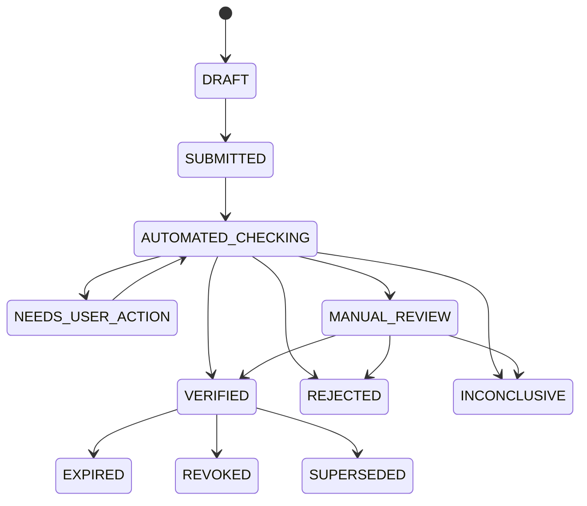

# 외부 증빙 검증 기능 설계

## 1. 목적과 신뢰 경계

자격증, 공모전 상장, 수료증, 어학성적표처럼 Trekkey 밖에서 발급된 자료를 학생이 제출하고, 그 자료를 졸업요건 및 Credential 발급에 안전하게 사용할 수 있게 한다.

이 기능에서 반드시 구분할 사실은 다음과 같다.

- 파일 업로드 성공은 발급 사실 검증이 아니다.
- 파일 해시와 블록체인은 업로드 이후의 변조 여부를 증명할 뿐, 원본 주장이 참이었음을 증명하지 않는다.
- OCR은 필드 추출과 위조 의심 탐지 보조 수단이다. OCR 결과만으로 `VERIFIED`를 만들지 않는다.
- 최종 검증에는 발급기관 신뢰, 제출자와 증명 대상의 동일인 확인, 유효기간·취소 상태 확인이 모두 필요하다.
- 졸업요건 엔진은 검증 상세를 직접 추측하지 않고, 확정된 `VERIFICATION_DECISION`만 소비한다.

Trekkey가 외부 증빙을 근거로 자체 Credential을 발급할 때의 의미는 “원 발급기관이 이 자격을 발급했다”가 아니라 “Trekkey/학교가 아래 방법으로 특정 시점에 확인했다”이다. 원 발급기관, 검증 방법, 검증일, 유효기한을 payload에 포함한다.

## 2. 검증 강도

검증 상태와 검증 강도는 별도 값이다. `VERIFIED`라도 어떤 방법으로 확인했는지에 따라 졸업요건에서 허용할 수 있는 범위가 다르다.

| level | 이름 | 의미 | 단독 졸업요건 인정 |
| --- | --- | --- | --- |
| `L0` | `SELF_REPORTED` | 사용자 주장과 파일만 존재 | 불가 |
| `L1` | `FILE_INTEGRITY` | 파일 형식·해시·악성코드·OCR 일관성 확인 | 불가 |
| `L2` | `HUMAN_CORROBORATED` | 검수자가 공식 공고·기관 화면·원본을 대조 | 정책별 허용 |
| `L3` | `ISSUER_CONFIRMED` | 계약 API, 공식 검증번호/QR, 기관 도메인 확인 메일로 발급기관이 확인 | 허용 |
| `L4` | `CRYPTOGRAPHICALLY_VERIFIED` | 신뢰 목록에 있는 발급자 서명과 상태·취소 여부까지 검증 | 허용 |

우선순위는 `L4 전자서명/VC/Open Badges` → `L3 계약 API` → `L3 공식 검증번호·QR` → `L3 기관 challenge` → `L2 2인 수동검수`다. 방법을 찾을 수 없거나 공식 채널이 일시 장애인 경우는 `INCONCLUSIVE`이지 `VERIFIED`가 아니다.

W3C Verifiable Credentials 2.0은 issuer, subject, 유효기간, 상태와 securing mechanism을 분리해 표현한다. Open Badges 3.0도 발급기관이 서명한 Verifiable Credential 형식을 사용한다. 지원 가능한 발급기관에는 이 형식을 최우선으로 받는다.

## 3. 증빙 유형별 절차

### 3.1 자격증·어학성적

1. 사용자가 자격 종류, 발급기관, 자격번호, 발급일·만료일을 입력하고 파일 또는 디지털 증명서를 제출한다.
2. 서버가 파일 해시를 고정하고 OCR 결과와 입력값의 불일치를 표시한다.
3. 발급기관 adapter가 있으면 서명 검증, 계약 API 또는 공식 진위확인 채널을 사용한다.
4. 이름만 비교하지 않고 로그인 사용자에게 귀속된 학번/생년월일 일부 등 정책상 허용된 식별자를 발급기관 응답과 대조한다.
5. 자격번호, 등급, 발급일, 유효기간, 취소·정지 상태가 모두 맞을 때만 확정한다.

Q-Net처럼 공식 진위확인 화면이 있어도 공개 계약 API가 확인되지 않은 경우에는 브라우저 화면을 비공식 scraping하지 않는다. 사용자가 검증번호를 제출하고, 허용된 공식 URL에서 관리자가 대조하는 `L2` 흐름부터 운영한 뒤 공식 연계 계약이 생기면 `L3` adapter를 추가한다.

### 3.2 공모전 상장

1. 주최기관, 대회명, 회차, 상명, 수상자/팀, 상장번호, 수상일을 구조화한다.
2. 주최기관이 서명 증명서나 수상자 API/feed를 제공하면 이를 사용한다.
3. 공식 수상 공고 URL과 상장번호를 대조하되, 공고가 이름을 마스킹했으면 이것만으로 동일인을 확정하지 않는다.
4. 공식 채널이 없으면 `@기관도메인` 수신자에게 일회성 nonce가 포함된 확인 링크를 보내거나, 기관 직인이 있는 원본을 2인이 수동 검수한다.
5. 팀 수상은 팀 수상 사실과 개인의 당시 팀 소속을 각각 검증한다.

동일 상장번호·발급기관 조합이 다른 사용자에게 재사용되면 자동 확정하지 않고 중복 위험 건으로 격리한다. 같은 상장이 팀원별로 유효한 경우에는 하나의 award claim 아래 여러 subject binding을 명시한다.

### 3.3 재학·수료·경력 서류

전자문서 서명, 공식 QR/문서확인번호, 기관 challenge 순으로 검증한다. 단순 캡처와 이메일 전달본은 `L1`을 넘지 못하며, 송신자 주소 표시만 믿지 않고 실제 확인 challenge와 서명된 callback을 사용한다.

## 4. 처리 흐름과 상태 머신

- 제출 이후 원본 claim과 파일은 수정하지 않는다. 정정은 새 submission으로 만든다.
- 각 외부 호출은 append-only `VERIFICATION_ATTEMPT`로 남긴다.
- 최종 판단도 덮어쓰지 않고 새 `VERIFICATION_DECISION`으로 이전 판단을 대체한다.
- provider 장애·timeout은 `INCONCLUSIVE` 또는 재시도 상태이며 허위 제출을 뜻하는 `REJECTED`와 구분한다.
- `VERIFIED` 이후에도 만료일 도래, 발급기관 취소 정보 또는 관리자 철회로 졸업 판정을 재평가한다.

## 5. 판정 규칙

다음 조건을 모두 만족해야 `VERIFIED`다.

1. 파일/디지털 증명서 처리와 악성코드 검사가 통과했다.
2. 신뢰 목록에 등록된 발급기관과 증명서 issuer가 일치한다.
3. 증명 대상이 로그인 사용자 또는 명시된 팀과 결합된다.
4. 자격번호·대회·등급·수상명 등 정책에 필요한 claim이 기관 확인 결과와 일치한다.
5. 유효기간 내이며 취소·정지 상태가 아니다.
6. 적용 정책의 최소 assurance level을 만족한다.

| 상황 | 결과 |
| --- | --- |
| 파일은 정상이나 기관 확인 수단이 없음 | `INCONCLUSIVE`, 최대 `L1` |
| 공식 공고와 상장을 2인이 확인 | `VERIFIED/L2` 또는 정책상 `INCONCLUSIVE` |
| 공식 기관 응답은 참이나 제출자와 subject 불일치 | `REJECTED` |
| 서명은 유효하나 신뢰 목록에 없는 issuer | `INCONCLUSIVE` |
| 서명·issuer·subject가 맞지만 credential status가 revoked | `REJECTED` 또는 기존 결정을 `REVOKED` |
| API timeout/429/5xx | 재시도 후 `INCONCLUSIVE`, 허위로 기록하지 않음 |
| OCR과 입력값이 다름 | 사용자 정정 또는 수동검수, 자동 확정 금지 |

## 6. 졸업요건 및 Credential 연결

- `STUDENT_NON_COURSE_RECORD.verification_status`를 클라이언트 요청값으로 직접 변경하지 않는다.
- 유효한 decision과 `EVIDENCE_BINDING`이 생성된 뒤 서버가 기존 enum의 `DOCUMENT_VERIFIED`, `verified_by`, `verified_at`을 갱신한다. 학교가 직접 원장을 확인한 별도 절차만 `UNIVERSITY_VERIFIED`다.
- 비교과 기록에 `verification_assurance_level`을 추가하고 각 졸업 규칙의 `parameters_json.minimumAssuranceLevel`과 비교한다. 예: TOPIK/공인자격은 기본 `L3`, 학과 졸업작품은 학교 정책에 따라 `L2` 허용.
- 외부 검증이 만료·철회되면 연결된 비교과 기록을 재평가 queue에 넣고 기존 졸업평가 snapshot은 보존한다.
- Trekkey Credential 발급이 필요하면 `CredentialSourceType.EXTERNAL_EVIDENCE`와 `external_evidence_decision_id`를 추가한다. source fingerprint는 `submission public id + decision bundle hash + finalized_at`의 canonical bytes로 만든다.
- 기존 `ANC_CREDENTIAL_SOURCE`에는 타입과 일치하는 FK가 정확히 하나만 있어야 한다. 기존 TEAM/SUBMISSION/AWARD 제약을 약화시키지 않는다.
- raw 파일, 주민번호, 발급기관 응답 전문은 체인에 기록하지 않는다. 비식별 claim과 검증 bundle hash만 앵커링한다.

## 7. 보안·개인정보·운영 규칙

### 파일

- magic byte와 MIME을 함께 확인하고 확장자만 신뢰하지 않는다.
- 크기·페이지 제한, 악성코드 sandbox, PDF active content 차단을 적용한다.
- object storage는 비공개·암호화하고 짧은 만료의 서명 URL로만 접근한다.
- 원본 파일명과 object key를 외부 응답에 그대로 노출하지 않는다.
- SHA-256은 무결성 식별자이지 개인정보 보호 수단이 아니므로 원본과 함께 접근 통제한다.

### URL·QR

- QR은 신뢰된 증거가 아니라 사용자 입력이다.
- 서버만 allowlist의 HTTPS host에 접근한다. private/link-local IP, DNS rebinding, 임의 redirect를 차단한다.
- 응답 크기, timeout, redirect 횟수와 content type을 제한해 SSRF를 방지한다.
- 프론트가 QR URL을 직접 열어 검증 결과를 서버에 전달하는 방식은 금지한다.

### 기관 연계와 감사

- provider secret은 설정 파일/DB가 아니라 secret manager에 둔다.
- webhook은 서명, timestamp 허용 오차, nonce, idempotency key를 확인한다.
- 외부 요청·응답 전문 대신 hash, result code, provider reference를 일반 DB에 저장하고 필요한 원문은 별도 암호화 보관한다.
- 관리자 열람·다운로드·판정·철회는 `ADMIN_AUDIT_LOG`에 남긴다. 감사 detail에는 주민번호·원문 응답을 넣지 않는다.
- 고위험 `L2` 수동 승인은 제출자와 무관한 두 검수자의 승인을 요구한다. 자기 제출물 승인 금지.
- 목적 달성 후 원본 삭제/보존 기한을 증빙 유형별로 설정하고, decision과 hash 감사기록은 별도 보존 정책을 둔다.

## 8. 비동기 처리

외부 provider 호출은 사용자 HTTP transaction 안에서 완료하려 하지 않는다.

1. submit transaction에서 case와 outbox event를 함께 기록한다.
2. worker가 provider별 adapter를 실행한다.
3. timeout·429·5xx는 지수 backoff와 jitter로 재시도한다.
4. provider별 circuit breaker와 rate limit을 적용한다.
5. 동일 `case + provider + claim hash + attempt generation`은 idempotency key로 중복 호출을 막는다.
6. 최종 decision과 졸업요건 binding은 한 transaction에서 확정하고 후속 재평가 event를 발행한다.

attempt는 실행 중 `PENDING`에서 종료 결과로 한 번 완성할 수 있지만 `completed_at` 이후에는 불변이다. 재시도는 같은 row를 덮어쓰지 않고 다음 `attempt_no`로 생성한다.

## 9. 단계별 도입

### 1단계: 한성대 운영 MVP

- PDF/JPG/PNG 업로드, 해시·악성코드·OCR 보조
- 기관·증빙 유형 registry
- Q-Net 등 공식 확인 화면을 이용하는 2인 수동검수
- 공모전 주최기관 email challenge
- 졸업 비교과 기록 연결과 관리자 queue

### 2단계: 기관 adapter

- 계약된 공식 API/검증번호 adapter
- provider webhook과 만료·취소 재확인
- 서명 PDF와 국내 전자문서 검증 모듈

### 3단계: 상호운용 증명서

- W3C VC 2.0과 Open Badges 3.0 입력
- issuer trust registry와 key/status cache
- 선택적 Trekkey 검증 Credential 발급 및 블록체인 앵커링

## 10. 참고 표준·공식 채널

- [W3C Verifiable Credentials Data Model 2.0](https://www.w3.org/TR/vc-data-model/)
- [W3C Verifiable Credential Data Integrity 1.0](https://www.w3.org/TR/vc-data-integrity/)
- [1EdTech Open Badges 3.0 구현 가이드](https://standards.1edtech.org/open-badges/guides/standards/v3p0/impl)
- [Q-Net 자격증 진위확인](https://c.q-net.or.kr/authentic/lcsAuthen.do)

공식 화면의 존재는 자동화 가능한 API 계약을 의미하지 않는다. 실제 adapter 구현 전에는 해당 기관 약관, 호출 권한, 개인정보 처리 근거와 응답 schema를 별도로 승인받는다.
