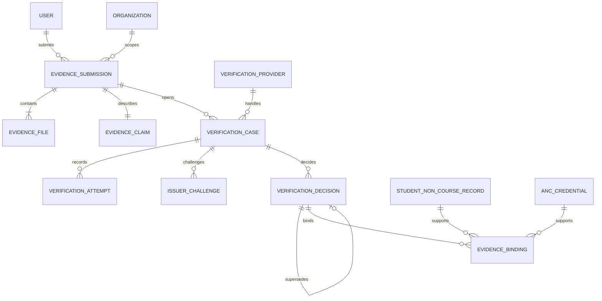

# 외부 증빙 검증 ERD 및 테이블 명세

## 1. ERD

`EVIDENCE_SUBMISSION`은 사용자 제출물, `VERIFICATION_CASE`는 검증 작업, `VERIFICATION_DECISION`은 다른 도메인이 신뢰할 수 있는 불변 결과다. 이 셋을 한 테이블로 합치면 재검증·철회·provider 장애 이력을 표현할 수 없으므로 분리한다.

## 2. 공통 규칙

- 외부 API에는 `public_id`만 노출한다.
- enum은 문자열로 저장한다.
- claim, attempt, decision은 제출 후 물리 수정하지 않는다.
- 민감한 기관 응답과 원본 파일은 암호화 object storage에 두고 DB에는 key와 hash만 저장한다.
- organization 범위 객체 조회는 항상 `(organization_id, public_id)` 조건을 사용한다.
- 아래 시간은 모두 UTC `DATETIME(6)`로 저장하고 API에서 ISO-8601로 표현한다.

## 3. `EVIDENCE_SUBMISSION`

| 컬럼 | 타입 | Null | 설명 |
| --- | --- | --- | --- |
| `id` | BIGINT | N | PK |
| `public_id` | VARCHAR(36) | N | UUID, unique |
| `organization_id` | BIGINT | N | 학교/조직 FK |
| `submitted_by` | BIGINT | N | 로그인 USER FK |
| `evidence_type` | VARCHAR(40) | N | `QUALIFICATION`, `LANGUAGE_SCORE`, `CONTEST_AWARD`, `COMPLETION`, `ENROLLMENT`, `EMPLOYMENT`, `OTHER` |
| `status` | VARCHAR(30) | N | 상태 머신 값 |
| `title` | VARCHAR(200) | N | 사용자 표시 제목 |
| `issuer_name` | VARCHAR(200) | N | 제출 snapshot |
| `issuer_code` | VARCHAR(100) | Y | registry와 매핑된 코드 |
| `credential_number_hash` | BINARY(32) | Y | 정규화 번호의 keyed hash |
| `issued_at` | DATE | Y | 발급일 |
| `expires_at` | DATE | Y | 만료일 |
| `submitted_at` | DATETIME(6) | Y | 제출 완료 시각 |
| `supersedes_id` | BIGINT | Y | 사용자 정정 전 submission FK |
| `version` | BIGINT | N | optimistic lock |

제약:

- `status=DRAFT`일 때만 파일 추가와 claim 수정 허용
- `submitted_by`는 `organization_id`에 속한 사용자여야 함
- credential number 원문은 필요할 때 암호화 claim에만 저장하며 로그에 남기지 않음
- 사용자별 동일 issuer/번호 중복은 확정 전 risk flag로 처리한다. 팀 상장 등 합법적 중복이 있어 전역 unique로 막지 않는다.

## 4. `EVIDENCE_FILE`

| 컬럼 | 타입 | Null | 설명 |
| --- | --- | --- | --- |
| `id` | BIGINT | N | PK |
| `public_id` | VARCHAR(36) | N | unique |
| `submission_id` | BIGINT | N | 제출 FK |
| `file_role` | VARCHAR(30) | N | `ORIGINAL`, `SUPPORTING`, `DIGITAL_CREDENTIAL` |
| `object_key` | VARCHAR(500) | N | private storage key, unique |
| `original_filename` | VARCHAR(255) | N | 표시 전 escape 필요 |
| `media_type` | VARCHAR(100) | N | magic byte 확인 결과 |
| `byte_size` | BIGINT | N | 제한 검증 |
| `sha256` | BINARY(32) | N | 업로드 원본 hash |
| `malware_status` | VARCHAR(20) | N | `PENDING`, `CLEAN`, `INFECTED`, `ERROR` |
| `ocr_status` | VARCHAR(20) | N | `NOT_RUN`, `PENDING`, `DONE`, `ERROR` |
| `ocr_result_key` | VARCHAR(500) | Y | 암호화 OCR 결과 경로 |
| `encryption_key_version` | VARCHAR(100) | N | KMS key version 참조 |
| `retained_until` | DATETIME(6) | Y | 원본 보존 기한 |
| `deleted_at` | DATETIME(6) | Y | 원본 파기 시각 |

제약: `(submission_id, sha256)` unique, `byte_size > 0`. `deleted_at` 이후에도 hash와 감사 메타데이터는 정책에 따라 남긴다.

## 5. `EVIDENCE_CLAIM`

| 컬럼 | 타입 | Null | 설명 |
| --- | --- | --- | --- |
| `submission_id` | BIGINT | N | PK/FK, 1:1 |
| `schema_type` | VARCHAR(80) | N | 허용된 증빙 schema |
| `schema_version` | INT | N | 해석 버전 |
| `normalized_json` | JSON | N | 구조화 claim; 민감값은 암호화/최소화 |
| `claim_hash` | BINARY(32) | N | canonical JSON SHA-256 |
| `subject_binding_type` | VARCHAR(30) | N | `USER`, `STUDENT_NUMBER`, `TEAM` |
| `subject_binding_hash` | BINARY(32) | N | 정규화된 대상 식별자의 keyed hash |

허용 schema별 JSON Schema를 서버에 버전 관리한다. 임의 key를 졸업요건 판정에 사용하지 않는다.

## 6. `VERIFICATION_PROVIDER`

| 컬럼 | 타입 | Null | 설명 |
| --- | --- | --- | --- |
| `id` | BIGINT | N | PK |
| `provider_code` | VARCHAR(100) | N | 안정 코드, unique |
| `issuer_code` | VARCHAR(100) | N | 발급기관 registry 코드 |
| `method` | VARCHAR(40) | N | `VC_SIGNATURE`, `OPEN_BADGE`, `OFFICIAL_API`, `VERIFY_URL`, `EMAIL_CHALLENGE`, `MANUAL` |
| `display_name` | VARCHAR(200) | N | 관리자 표시명 |
| `allowed_hosts_json` | JSON | Y | URL/메일 도메인 allowlist |
| `config_secret_ref` | VARCHAR(300) | Y | secret manager 참조 |
| `maximum_assurance_level` | VARCHAR(5) | N | provider가 달성 가능한 최대 level |
| `status` | VARCHAR(20) | N | `ACTIVE`, `SUSPENDED`, `RETIRED` |
| `config_version` | INT | N | adapter 설정 버전 |

provider를 코드에 하드코딩하지 않고 registry에 두되, 실제 adapter 구현체 이름과 config schema는 서버 allowlist로 제한한다.

## 7. `VERIFICATION_CASE`

| 컬럼 | 타입 | Null | 설명 |
| --- | --- | --- | --- |
| `id` | BIGINT | N | PK |
| `public_id` | VARCHAR(36) | N | unique |
| `submission_id` | BIGINT | N | 제출 FK |
| `provider_id` | BIGINT | Y | 수동 queue면 null 가능 |
| `status` | VARCHAR(30) | N | 처리 상태 |
| `required_assurance_level` | VARCHAR(5) | N | 적용 목적의 최소값 |
| `achieved_assurance_level` | VARCHAR(5) | Y | 결정 시 실제값 |
| `risk_score` | DECIMAL(5,2) | N | queue 우선순위; 자동 진실 판정값 아님 |
| `risk_flags_json` | JSON | N | `DUPLICATE_NUMBER`, `OCR_MISMATCH` 등 |
| `opened_at` | DATETIME(6) | N | 시작 |
| `next_attempt_at` | DATETIME(6) | Y | 재시도 시각 |
| `closed_at` | DATETIME(6) | Y | 종료 |
| `version` | BIGINT | N | optimistic lock |

동일 submission에 provider fallback case가 여러 개 있을 수 있다. active case 중복 방지는 MySQL에서 generated column 또는 service transaction lock으로 구현한다.

## 8. `VERIFICATION_ATTEMPT`

| 컬럼 | 타입 | Null | 설명 |
| --- | --- | --- | --- |
| `id` | BIGINT | N | PK |
| `case_id` | BIGINT | N | case FK |
| `attempt_no` | INT | N | case 내 순번 |
| `method` | VARCHAR(40) | N | 실제 사용 방법 |
| `idempotency_key` | VARCHAR(100) | N | 외부 중복 호출 방지 |
| `result` | VARCHAR(30) | N | `PENDING`, `MATCH`, `MISMATCH`, `UNAVAILABLE`, `ERROR` |
| `result_code` | VARCHAR(100) | Y | 정규화 provider code |
| `request_hash` | BINARY(32) | N | 민감값 제외 canonical request hash |
| `response_hash` | BINARY(32) | Y | response hash |
| `response_object_key` | VARCHAR(500) | Y | 필요 시 암호화 원문 |
| `external_reference` | VARCHAR(200) | Y | 마스킹 가능한 기관 참조번호 |
| `started_at` | DATETIME(6) | N | 시작 |
| `completed_at` | DATETIME(6) | Y | 완료 |

제약: `(case_id, attempt_no)` unique, `idempotency_key` unique. 기존 attempt를 재사용하거나 결과를 덮어쓰지 않는다.

## 9. `ISSUER_CHALLENGE`

| 컬럼 | 타입 | Null | 설명 |
| --- | --- | --- | --- |
| `id` | BIGINT | N | PK |
| `case_id` | BIGINT | N | case FK |
| `recipient_hash` | BINARY(32) | N | 기관 담당 주소 keyed hash |
| `recipient_domain` | VARCHAR(255) | N | allowlist 대조용 |
| `nonce_hash` | BINARY(32) | N | 원문 nonce 미저장 |
| `status` | VARCHAR(20) | N | `SENT`, `CONFIRMED`, `EXPIRED`, `CANCELLED` |
| `expires_at` | DATETIME(6) | N | 짧은 만료 |
| `consumed_at` | DATETIME(6) | Y | 1회 사용 시각 |

challenge 확인 화면에는 최소 claim만 표시한다. 사용자에게 confirmation 링크를 전달하도록 맡기지 않고 서버가 등록된 기관 주소로 직접 전송한다.

## 10. `VERIFICATION_DECISION`

| 컬럼 | 타입 | Null | 설명 |
| --- | --- | --- | --- |
| `id` | BIGINT | N | PK |
| `public_id` | VARCHAR(36) | N | unique |
| `case_id` | BIGINT | N | case FK |
| `decision` | VARCHAR(30) | N | `VERIFIED`, `REJECTED`, `INCONCLUSIVE`, `EXPIRED`, `REVOKED` |
| `assurance_level` | VARCHAR(5) | N | `L0`~`L4` |
| `reason_code` | VARCHAR(100) | N | 표준 사유 |
| `decision_detail` | VARCHAR(1000) | Y | PII 없는 설명 |
| `reviewer_primary_id` | BIGINT | Y | USER FK |
| `reviewer_secondary_id` | BIGINT | Y | L2 고위험 2차 검수자 |
| `decided_at` | DATETIME(6) | N | 판단 시각 |
| `valid_until` | DATETIME(6) | Y | 재확인 또는 자격 만료 |
| `bundle_hash` | BINARY(32) | N | claim/file/attempt/decision canonical bundle hash |
| `supersedes_id` | BIGINT | Y | 이전 decision self FK |

한 case의 최신 decision은 query로 계산하거나 별도 pointer를 transaction 안에서 갱신한다. 과거 row의 값을 바꾸지 않는다. `L2`에서 정책상 2인 검수가 필요하면 두 reviewer가 서로 달라야 하며 제출자와도 달라야 한다.

## 11. `EVIDENCE_BINDING`

| 컬럼 | 타입 | Null | 설명 |
| --- | --- | --- | --- |
| `id` | BIGINT | N | PK |
| `decision_id` | BIGINT | N | 유효 decision FK |
| `target_type` | VARCHAR(40) | N | `GRADUATION_NON_COURSE`, `ANC_CREDENTIAL` |
| `student_non_course_record_id` | BIGINT | Y | 비교과 기록 FK |
| `anc_credential_id` | BIGINT | Y | Credential FK |
| `bound_at` | DATETIME(6) | N | 연결 시각 |
| `unbound_at` | DATETIME(6) | Y | 철회 시각 |

target type과 일치하는 FK가 정확히 하나여야 한다. `(decision_id, target_type, target FK)` 중복을 막는다. decision이 취소되어도 binding을 삭제하지 않고 `unbound_at`으로 감사 이력을 남긴다.

## 12. 기존 테이블 변경

### `STUDENT_NON_COURSE_RECORD`

- `verification_status`는 외부 요청으로 갱신하지 않고 binding service만 갱신한다.
- `verification_assurance_level VARCHAR(5) NULL`과 `active_evidence_binding_id BIGINT NULL`을 추가한다.
- 외부 decision이 유효하면 현재 enum의 `DOCUMENT_VERIFIED`, 학교 원장 직접 확인은 `UNIVERSITY_VERIFIED`로 매핑한다.
- `EXPIRED`, `REVOKED` decision이면 허위라는 뜻의 `REJECTED`로 덮지 않는다. 1차 구현에서는 binding을 해제하고 `SELF_REPORTED`로 낮추며 만료/철회 사유는 decision에 보존한다. 이후 enum을 확장하면 `EXPIRED`, `REVOKED`를 직접 노출할 수 있다.

### `GRADUATION_REQUIREMENT`

- 비교과 `rule_type`의 `parameters_json`에 `minimumAssuranceLevel`을 추가한다.
- 값은 `L0`~`L4`만 허용하며, 발행 시 JSON Schema 검증을 통과해야 한다.
- 평가기는 현재처럼 `DOCUMENT_VERIFIED`/`UNIVERSITY_VERIFIED` 여부만 보지 않고 비교과 기록의 assurance가 최소값 이상인지도 확인한다.

### `ANC_CREDENTIAL_SOURCE`

- `CredentialSourceType`에 `EXTERNAL_EVIDENCE` 추가
- nullable `external_evidence_decision_id`와 index/FK 추가
- TEAM/SUBMISSION/AWARD/EXTERNAL_EVIDENCE 중 source type에 맞는 FK가 정확히 하나라는 CHECK를 migration에 명시
- 기존 `source_fingerprint` unique와 불변 정책 유지

## 13. 인덱스와 정합성 핵심

- queue: `VERIFICATION_CASE(status, next_attempt_at, risk_score)`
- 사용자 목록: `EVIDENCE_SUBMISSION(submitted_by, created_at)`
- 조직 관리자 목록: `EVIDENCE_SUBMISSION(organization_id, status, created_at)`
- 만료 scan: `VERIFICATION_DECISION(decision, valid_until)`
- 중복 위험 탐지: `EVIDENCE_SUBMISSION(issuer_code, credential_number_hash)`
- provider 이력: `VERIFICATION_CASE(provider_id, status, opened_at)`
- decision 확정, binding, 비교과 상태 변경, outbox 생성은 단일 transaction
