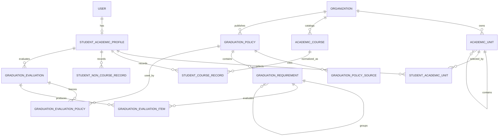

# 한성대학교 졸업요건 ERD 및 테이블 명세

## 1. 범위

한성대학교 전용 MVP를 구현하되 테이블명과 관계는 다른 학교로 확장 가능한 형태로 둔다. 초기 데이터는 한성대학교 `ORGANIZATION` 한 건에만 발행한다.

기존 테이블은 `ORGANIZATION`, `USER`, `ADMIN_AUDIT_LOG`를 재사용한다. 단, 한성대를 이름 문자열로 찾지 않도록 `ORGANIZATION.code`를 추가한다. 모든 신규 entity 테이블은 별도 언급이 없어도 `BaseEntity`의 `created_at`, `updated_at`을 가진다. 순수 연결 테이블은 예외로 명시한다.

학교 학사시스템에서 제공하는 외부 API는 없다고 전제한다. 따라서 학생 데이터의 원천은 `MANUAL`, `CSV`, `ADMIN`뿐이며, 공식 URL은 런타임 데이터 연동 주소가 아니라 정책 근거 메타데이터다.

## 2. 전체 ERD



### 기존 `ORGANIZATION` 변경

| 컬럼 | 타입 | Null | 설명 |
| --- | --- | --- | --- |
| `code` | VARCHAR(50) | N | 변경되지 않는 조직 코드, unique. 한성대 seed는 `HANSUNG_UNIVERSITY` |

- 기존 행은 migration에서 임시 code를 채운 뒤 `NOT NULL`, unique를 적용한다.
- `name='한성대학교'`, 임의 PK, 환경마다 달라지는 `public_id`로 기능 대상을 판별하지 않는다.

## 3. 설계 규칙

- API 응답과 URL path에는 auto increment ID 대신 `public_id`를 사용한다.
- enum은 `EnumType.STRING`으로 저장한다.
- 공개된 정책은 수정하지 않고 새 버전을 발행한다.
- 판정은 사용한 정책 ID를 N:M 스냅샷으로 고정한다.
- 과목명과 정책 설명은 판정 당시 snapshot을 함께 저장한다.
- `parameters_json`은 허용된 rule type별 JSON schema를 서버가 검증한다.
- 학생 자가 입력과 학교 확인값을 구분한다.
- 입력 완전성이 확인되지 않은 규칙은 값이 부족해 보여도 `UNSATISFIED`로 단정하지 않고 `UNKNOWN`으로 판정한다.
- 삭제보다 `status`, `valid_to`, `retired_at`을 사용한다.
- 운영 스키마 변경은 명시적 MySQL migration으로 수행한다. `ddl-auto=update`에 FK, CHECK, partial unique 구현을 맡기지 않는다.

## 4. `ACADEMIC_UNIT`

한성대학교의 학과·전공·트랙·Micro Degree를 저장한다.

| 컬럼 | 타입 | Null | 설명 |
| --- | --- | --- | --- |
| `id` | BIGINT | N | PK |
| `public_id` | VARCHAR(36) | N | 외부 식별자, unique |
| `organization_id` | BIGINT | N | `ORGANIZATION` FK |
| `parent_id` | BIGINT | Y | 상위 학사조직 self FK |
| `external_code` | VARCHAR(50) | Y | 학교 공식 코드 |
| `name` | VARCHAR(150) | N | 표시명 |
| `unit_type` | VARCHAR(30) | N | `COLLEGE`, `DIVISION`, `DEPARTMENT`, `MAJOR`, `TRACK`, `MICRO_DEGREE` |
| `valid_from_year` | SMALLINT | N | 적용 시작 학년도 |
| `valid_to_year` | SMALLINT | Y | 종료 학년도 |
| `status` | VARCHAR(20) | N | `ACTIVE`, `INACTIVE` |

### 제약

- `(organization_id, external_code)` unique, `external_code`가 null이면 이름+기간 중복을 서비스에서 검사
- `parent_id`는 같은 organization이어야 함
- self cycle 금지
- 학생 프로필에서 사용 중인 unit은 물리 삭제 금지

## 5. `ACADEMIC_COURSE`

학년도별 한성대학교 교과목 카탈로그다.

| 컬럼 | 타입 | Null | 설명 |
| --- | --- | --- | --- |
| `id` | BIGINT | N | PK |
| `public_id` | VARCHAR(36) | N | API·CSV 매핑용 UUID, unique |
| `organization_id` | BIGINT | N | 학교 FK |
| `academic_year` | SMALLINT | N | 교육과정 학년도 |
| `course_code` | VARCHAR(30) | N | 공식 교과목 코드 |
| `name` | VARCHAR(200) | N | 과목명 |
| `credits` | DECIMAL(4,1) | N | 학점 |
| `category` | VARCHAR(40) | N | 교양/전공 이수구분 |
| `academic_unit_id` | BIGINT | Y | 전공·트랙 과목이면 FK |
| `distribution_area` | VARCHAR(40) | Y | 선택필수교양 배분영역 |
| `valid_from_term` | VARCHAR(6) | N | 예: `2024-1` |
| `valid_to_term` | VARCHAR(6) | Y | 종료 학기 |

### `category`

```text
GENERAL_REQUIRED
GENERAL_DISTRIBUTION
GENERAL_ELECTIVE
MAJOR_FOUNDATION
MAJOR_REQUIRED
MAJOR_ELECTIVE
FREE_ELECTIVE
GRADUATE_COURSE
```

### 제약·인덱스

- `(organization_id, academic_year, course_code)` unique
- `(organization_id, name)` 조회 index
- `credits > 0`

## 6. `GRADUATION_POLICY`

적용조건을 가진 불변 정책 버전이다. 학교 공통·교양·전공·편입 정책을 각각 발행하고 평가 시 합성한다.

| 컬럼 | 타입 | Null | 설명 |
| --- | --- | --- | --- |
| `id` | BIGINT | N | PK |
| `public_id` | VARCHAR(36) | N | 외부 식별자, unique |
| `organization_id` | BIGINT | N | 한성대학교 FK |
| `academic_unit_id` | BIGINT | Y | 학교 공통이면 null |
| `policy_code` | VARCHAR(100) | N | 사람이 읽는 안정 코드 |
| `version_no` | INT | N | 정책 코드별 버전 |
| `policy_type` | VARCHAR(30) | N | `COMMON`, `GENERAL_EDUCATION`, `MAJOR_PLAN`, `UNIT_GRADUATION`, `TRANSFER`, `EARLY_GRADUATION` |
| `title` | VARCHAR(200) | N | 관리자 표시명 |
| `admission_year_from` | SMALLINT | Y | 적용 학번 시작 |
| `admission_year_to` | SMALLINT | Y | 적용 학번 종료 |
| `admission_type` | VARCHAR(30) | Y | null이면 전체 |
| `graduation_path` | VARCHAR(30) | Y | null이면 전체 |
| `major_plan_type` | VARCHAR(30) | Y | 전공 이수유형 조건 |
| `effective_from` | DATE | N | 정책 시행일 |
| `effective_to` | DATE | Y | 종료일 |
| `status` | VARCHAR(20) | N | `DRAFT`, `IN_REVIEW`, `PUBLISHED`, `RETIRED` |
| `source_set_hash` | CHAR(64) | N | 출처 묶음 SHA-256 |
| `created_by` | BIGINT | N | 초안 작성 관리자 USER FK |
| `reviewed_by` | BIGINT | Y | 검수 관리자 USER FK |
| `reviewed_at` | DATETIME | Y | 검수 시각 |
| `published_at` | DATETIME | Y | 발행 시각 |
| `supersedes_id` | BIGINT | Y | 이전 버전 self FK |

### enum

```text
AdmissionType
- FRESHMAN
- GENERAL_TRANSFER
- BACHELOR_TRANSFER
- INTERNATIONAL_TRANSFER_2
- INTERNATIONAL_TRANSFER_3
- INTERNATIONAL_TRANSFER_4

GraduationPath
- REGULAR
- EARLY
- BACHELOR_MASTER_LINKED_7
- BACHELOR_MASTER_LINKED_8

MajorPlanType
- CONVERGENCE_I
- CONVERGENCE_II
- INTENSIVE
- CREATIVE_CONVERGENCE_COLLEGE
- CONVERGENCE_I_WITH_MINOR
- CONVERGENCE_I_WITH_MICRO_DEGREE
```

### 제약

- `(organization_id, policy_code, version_no)` unique
- 발행 상태에서 `reviewed_by`, `reviewed_at`, `published_at` 필수
- 발행 시 `created_by != reviewed_by`를 기본 원칙으로 하며, 인력상 예외는 ROOT_ADMIN 사유와 감사 로그가 필요하다.
- 발행 후 규칙과 출처 수정 금지
- 같은 조건·기간의 `PUBLISHED` 정책 중복 금지

## 7. `GRADUATION_POLICY_SOURCE`

| 컬럼 | 타입 | Null | 설명 |
| --- | --- | --- | --- |
| `id` | BIGINT | N | PK |
| `policy_id` | BIGINT | N | 정책 FK |
| `source_type` | VARCHAR(30) | N | `ACADEMIC_RULE`, `GUIDE`, `CURRICULUM`, `NOTICE`, `FORM` |
| `official_url` | VARCHAR(1000) | N | 공식 URL |
| `title` | VARCHAR(300) | N | 원문 제목 |
| `published_at` | DATE | Y | 원문 게시일 |
| `retrieved_at` | DATETIME | N | 수집시각 |
| `content_hash` | CHAR(64) | N | 원문 SHA-256 |
| `source_locator` | VARCHAR(300) | Y | HTML 절/표 또는 PDF 페이지 |
| `stored_object_key` | VARCHAR(500) | Y | 허용된 원문 보관 경로 |

- `(policy_id, content_hash, source_locator)` unique
- 공식 한성대 도메인이 아니면 관리자 경고

## 8. `GRADUATION_REQUIREMENT`

정책의 실행 가능한 규칙 트리다.

| 컬럼 | 타입 | Null | 설명 |
| --- | --- | --- | --- |
| `id` | BIGINT | N | PK |
| `policy_id` | BIGINT | N | 정책 FK |
| `parent_id` | BIGINT | Y | 그룹 규칙 self FK |
| `requirement_code` | VARCHAR(100) | N | 정책 안의 안정 코드 |
| `title` | VARCHAR(200) | N | 학생 표시명 |
| `description` | VARCHAR(1000) | Y | 안내문 |
| `node_type` | VARCHAR(20) | N | `GROUP`, `RULE` |
| `operator_type` | VARCHAR(20) | Y | 그룹이면 `ALL`, `ANY`, `N_OF` |
| `rule_type` | VARCHAR(50) | Y | leaf 규칙 타입 |
| `parameters_json` | JSON | N | 타입별 파라미터 |
| `sequence_no` | INT | N | 표시·평가 순서 |
| `required` | BOOLEAN | N | 전체 판정 필수 여부 |
| `source_id` | BIGINT | Y | 직접 근거 source FK |

### `rule_type`

```text
TOTAL_CREDITS_MIN
HANSUNG_CREDITS_MIN
TRANSFER_RECOGNIZED_CREDITS_MIN
CATEGORY_CREDITS_MIN
ACADEMIC_UNIT_CREDITS_MIN
COURSE_ALL
COURSE_ANY
DISTRIBUTION_AREAS_MIN
GPA_MIN
REGISTERED_SEMESTERS_MIN
NO_FAIL_GRADE
ACTIVITY_POINTS_MIN
GRADUATE_COURSE_CREDITS_MIN
TOPIK_LEVEL_MIN
EVIDENCE_VERIFIED
MANUAL_REVIEW
```

### 제약

- `(policy_id, requirement_code)` unique
- 그룹에는 `operator_type`, leaf에는 `rule_type` 필수
- `parent_id`와 자식은 같은 policy
- cycle 금지
- `sequence_no >= 1`
- `parameters_json`은 발행 전에 rule별 validator 통과

## 9. `STUDENT_ACADEMIC_PROFILE`

| 컬럼 | 타입 | Null | 설명 |
| --- | --- | --- | --- |
| `id` | BIGINT | N | PK |
| `public_id` | VARCHAR(36) | N | 외부 식별자, unique |
| `user_id` | BIGINT | N | USER FK, unique |
| `admission_year` | SMALLINT | N | 입학연도/학번 기준연도 |
| `curriculum_year` | SMALLINT | N | 적용 교육과정 연도 |
| `admission_type` | VARCHAR(30) | N | 입학유형 |
| `graduation_path` | VARCHAR(30) | N | 일반/조기/학석사연계 |
| `major_plan_type` | VARCHAR(40) | N | 전공 이수유형 |
| `registered_semesters` | SMALLINT | N | 본교 등록학기 |
| `total_credits` | DECIMAL(5,1) | N | 인정 포함 총학점 |
| `hansung_credits` | DECIMAL(5,1) | N | 본교 취득학점 |
| `transfer_recognized_credits` | DECIMAL(5,1) | N | 전적대 인정학점 |
| `cumulative_gpa` | DECIMAL(3,2) | N | 누적 GPA |
| `gpa_scale` | DECIMAL(2,1) | N | 기본 4.5 |
| `activity_points` | INT | N | 비교과점수 |
| `international_student` | BOOLEAN | N | 순수외국인 여부 |
| `teaching_program` | BOOLEAN | N | 교직 여부 |
| `input_mode` | VARCHAR(30) | N | `SUMMARY_ONLY`, `COURSE_DETAIL` |
| `record_completeness` | VARCHAR(20) | N | `UNKNOWN`, `PARTIAL`, `COMPLETE` |
| `summary_as_of_term` | VARCHAR(6) | Y | 누계 기준 학기 |
| `fail_history_status` | VARCHAR(20) | N | `UNKNOWN`, `NONE`, `EXISTS` |
| `version` | BIGINT | N | optimistic lock |

### 제약

- `user_id` unique
- 학교와 학번은 `USER.organization`, `USER.studentId`에서 읽어 중복 저장하지 않는다.
- USER의 organization code가 `HANSUNG_UNIVERSITY`인 경우만 허용한다.
- 모든 학점·포인트·학기는 0 이상
- `cumulative_gpa <= gpa_scale`
- `record_completeness=COMPLETE`는 사용자가 해당 기준 학기까지 전체 성적을 입력했다고 명시적으로 확인한 경우만 허용한다.
- `SUMMARY_ONLY`이면 총학점·GPA·비교과처럼 프로필 값으로 판정 가능한 규칙만 계산하고 과목·영역별 규칙은 `UNKNOWN`이다.

## 10. `STUDENT_ACADEMIC_UNIT`

학생이 이수하는 제1·제2트랙, 주전공, 부전공, 복수전공, MD를 연결한다.

| 컬럼 | 타입 | Null | 설명 |
| --- | --- | --- | --- |
| `id` | BIGINT | N | PK |
| `profile_id` | BIGINT | N | 프로필 FK |
| `academic_unit_id` | BIGINT | N | 학사조직 FK |
| `role_type` | VARCHAR(30) | N | `PRIMARY`, `SECONDARY`, `MINOR`, `DOUBLE_MAJOR`, `MICRO_DEGREE` |
| `sequence_no` | INT | N | 같은 역할 내 순서 |
| `graduation_evidence_status` | VARCHAR(30) | N | 트랙 졸업요건 확인 상태 |
| `verified_by` | BIGINT | Y | 관리자 USER FK |
| `verified_at` | DATETIME | Y | 확인 시각 |

### 제약

- `(profile_id, academic_unit_id, role_type)` unique
- 같은 profile에서 `PRIMARY`는 정확히 하나
- `CONVERGENCE_I`은 `PRIMARY`와 `SECONDARY`가 각각 하나
- `verified_by`가 없으면 `UNIVERSITY_VERIFIED` 금지
- profile의 USER organization과 academic unit organization이 같아야 한다.

## 11. `STUDENT_COURSE_RECORD`

| 컬럼 | 타입 | Null | 설명 |
| --- | --- | --- | --- |
| `id` | BIGINT | N | PK |
| `public_id` | VARCHAR(36) | N | 외부 식별자, unique |
| `profile_id` | BIGINT | N | 프로필 FK |
| `academic_course_id` | BIGINT | Y | 매핑된 카탈로그 FK |
| `term` | VARCHAR(6) | N | `YYYY-1`, `YYYY-2`, `YYYY-S`, `YYYY-W` |
| `course_code` | VARCHAR(30) | Y | 원본 코드 snapshot |
| `course_name` | VARCHAR(200) | N | 원본 과목명 snapshot |
| `credits` | DECIMAL(4,1) | N | 인정학점 |
| `grade` | VARCHAR(5) | Y | A+, P, F 등. 수강 중이면 null 허용 |
| `completion_status` | VARCHAR(20) | N | `COMPLETED`, `FAILED`, `IN_PROGRESS`, `WITHDRAWN` |
| `category` | VARCHAR(40) | N | 학생/학교 확정 이수구분 |
| `academic_unit_id` | BIGINT | Y | 전공/트랙 귀속 |
| `mapping_status` | VARCHAR(30) | N | `MATCHED`, `SELF_REPORTED`, `NEEDS_REVIEW`, `UNIVERSITY_VERIFIED` |
| `retake_group_key` | VARCHAR(100) | Y | 재수강 중복 제거 키 |
| `source_type` | VARCHAR(20) | N | `MANUAL`, `CSV`, `ADMIN` |

### 제약·인덱스

- `(profile_id, term, course_code)` unique when course code exists
- `(profile_id, course_name, term)` index
- `credits > 0`
- `FAILED`, `WITHDRAWN`은 취득학점 합산 제외
- 같은 `retake_group_key`는 학교 규칙에 따라 한 번만 합산
- `academic_course_id`, `academic_unit_id`가 있으면 둘 다 profile의 USER organization과 같아야 한다.
- 프로필 누계값과 검산값이 다르면 자동으로 한쪽을 덮어쓰지 않고 `INPUT_TOTAL_MISMATCH`를 발생시킨다. 신입학은 `total_credits`와 완료 과목 인정학점 합계, 편입은 `hansung_credits`와 본교 완료 과목 합계를 비교한다. 편입의 `total_credits`는 별도로 `hansung_credits + transfer_recognized_credits`와 비교한다. 카테고리 판정은 과목 합계를, 총학점 판정은 프로필 누계값을 사용하되 불일치 영향 규칙을 `UNKNOWN`으로 낮춘다.

## 12. `STUDENT_NON_COURSE_RECORD`

| 컬럼 | 타입 | Null | 설명 |
| --- | --- | --- | --- |
| `id` | BIGINT | N | PK |
| `public_id` | VARCHAR(36) | N | 외부 식별자, unique |
| `profile_id` | BIGINT | N | 프로필 FK |
| `record_type` | VARCHAR(40) | N | `TOPIK`, `THESIS`, `GRADUATION_WORK`, `GRADUATION_EXAM`, `RESEARCH_PLAN`, `GRADUATE_ENROLLMENT`, `TEACHING_COMPLETION`, `OTHER` |
| `title` | VARCHAR(200) | N | 표시명 |
| `numeric_value` | DECIMAL(10,2) | Y | TOPIK 급수 등 |
| `issued_at` | DATE | Y | 발급/합격일 |
| `expires_at` | DATE | Y | 유효기간 |
| `verification_status` | VARCHAR(30) | N | `SELF_REPORTED`, `DOCUMENT_VERIFIED`, `UNIVERSITY_VERIFIED`, `REJECTED` |
| `verified_by` | BIGINT | Y | 관리자 USER FK |
| `verified_at` | DATETIME | Y | 확인 시각 |
| `note` | VARCHAR(1000) | Y | 관리자 메모 |

- 원본 파일 저장은 MVP 제외
- `UNIVERSITY_VERIFIED`이면 `verified_by`, `verified_at` 필수

## 13. `GRADUATION_EVALUATION`

| 컬럼 | 타입 | Null | 설명 |
| --- | --- | --- | --- |
| `id` | BIGINT | N | PK |
| `public_id` | VARCHAR(36) | N | API 식별자, unique |
| `profile_id` | BIGINT | N | 평가 대상 프로필 FK |
| `status` | VARCHAR(30) | N | `ELIGIBLE`, `NOT_ELIGIBLE`, `INDETERMINATE` |
| `policy_as_of` | DATE | N | 정책 기준일 |
| `input_hash` | CHAR(64) | N | 프로필·과목·증빙 canonical hash |
| `input_snapshot_json` | JSON | N | 판정에 사용한 정규화 입력 snapshot |
| `profile_version` | BIGINT | N | 판정 시 profile optimistic version |
| `evaluator_version` | VARCHAR(30) | N | 평가기 버전 |
| `satisfied_count` | INT | N | 충족 수 |
| `unsatisfied_count` | INT | N | 미충족 수 |
| `unknown_count` | INT | N | 확인필요 수 |
| `evaluated_at` | DATETIME | N | 실행 시각 |

### 제약·인덱스

- `(profile_id, evaluated_at)` index
- count는 모두 0 이상
- 필수 미충족이 1개 이상이면 `NOT_ELIGIBLE`
- 미충족 0, UNKNOWN 1개 이상이면 `INDETERMINATE`
- snapshot에는 비밀번호·이메일·관리자 메모를 넣지 않고 학번도 마스킹한다.
- 입력 snapshot 보존기간과 계정 탈퇴 시 삭제 정책을 개인정보 처리방침에 명시한다.

## 14. `GRADUATION_EVALUATION_POLICY`

평가에 사용한 여러 정책 버전을 고정한다.

| 컬럼 | 타입 | Null | 설명 |
| --- | --- | --- | --- |
| `id` | BIGINT | N | PK |
| `evaluation_id` | BIGINT | N | 평가 FK |
| `policy_id` | BIGINT | N | 정책 FK |
| `policy_code_snapshot` | VARCHAR(100) | N | 코드 snapshot |
| `version_no_snapshot` | INT | N | 버전 snapshot |

- `(evaluation_id, policy_id)` unique
- 이 연결 entity도 `BaseEntity`를 적용한다.

## 15. `GRADUATION_EVALUATION_ITEM`

| 컬럼 | 타입 | Null | 설명 |
| --- | --- | --- | --- |
| `id` | BIGINT | N | PK |
| `evaluation_id` | BIGINT | N | 평가 FK |
| `requirement_id` | BIGINT | N | 규칙 FK |
| `requirement_code` | VARCHAR(100) | N | 코드 snapshot |
| `title` | VARCHAR(200) | N | 제목 snapshot |
| `rule_type_snapshot` | VARCHAR(50) | Y | leaf rule type snapshot |
| `parameters_snapshot_json` | JSON | N | 당시 기준값과 연산자 snapshot |
| `required_snapshot` | BOOLEAN | N | 당시 필수 여부 |
| `status` | VARCHAR(30) | N | `SATISFIED`, `UNSATISFIED`, `UNKNOWN`, `NOT_APPLICABLE` |
| `current_value` | VARCHAR(100) | Y | 현재값 표시용 |
| `required_value` | VARCHAR(100) | Y | 기준값 표시용 |
| `remaining_value` | VARCHAR(100) | Y | 부족값 표시용 |
| `message` | VARCHAR(1000) | N | 학생 안내 |
| `source_url` | VARCHAR(1000) | Y | 판정 근거 snapshot |
| `source_locator` | VARCHAR(300) | Y | 표/절 위치 snapshot |
| `sequence_no` | INT | N | 표시 순서 |

- `(evaluation_id, requirement_code)` unique
- 과거 결과는 정책 폐기 후에도 조회 가능

## 16. 주요 불변조건

1. 학생 USER와 profile의 organization은 같아야 한다.
2. 프로필, 학사조직, 과목, 정책은 모두 같은 organization이어야 한다.
3. 발행 정책은 수정·삭제할 수 없다.
4. 평가에는 최소 1개 정책이 연결되어야 한다.
5. 필수 `UNKNOWN`이 있으면 `ELIGIBLE`이 될 수 없다.
6. 한 과목 학점은 하나의 전공 role에만 합산한다.
7. 제1·제2트랙 졸업요건은 각각 별도 result item을 가진다.
8. 학생 자가신고 증빙은 학교 확인 요건을 자동 충족시키지 않는다.
9. 학교 API가 없으므로 `record_completeness != COMPLETE`인 상세데이터 기반 규칙은 `UNSATISFIED` 대신 `UNKNOWN`이다.
10. profile 누계값과 상세 과목 합계가 불일치하면 전체 결과는 `ELIGIBLE`이 될 수 없다.
11. USER, 학사조직, 과목, 정책의 organization 경계는 모든 쓰기와 평가에서 다시 검증한다.

## 17. 권장 인덱스

```text
ACADEMIC_UNIT(organization_id, status, name)
ACADEMIC_COURSE(organization_id, academic_year, course_code)
GRADUATION_POLICY(organization_id, status, admission_year_from, admission_year_to)
GRADUATION_REQUIREMENT(policy_id, parent_id, sequence_no)
STUDENT_COURSE_RECORD(profile_id, category, academic_unit_id)
STUDENT_NON_COURSE_RECORD(profile_id, record_type, verification_status)
GRADUATION_EVALUATION(profile_id, evaluated_at DESC)
GRADUATION_EVALUATION_ITEM(evaluation_id, status, sequence_no)
```

## 18. JPA 구현 주의사항

- 자식에서 부모로의 `ManyToOne(fetch = LAZY)` 단방향을 기본으로 한다.
- 규칙 트리는 한 번의 repository 조회 후 service에서 parent ID로 조립한다.
- `parameters_json`은 entity에서 raw `String` 또는 JSON column으로 저장하고 domain parameter DTO로 변환한다.
- profile 수정에는 `@Version`을 사용해 여러 탭의 덮어쓰기를 막는다.
- evaluation 생성은 policy 선택, item 저장까지 한 transaction으로 처리한다.
- 정책 발행은 organization 단위 비관적 잠금으로 중복 버전을 방지한다.
- 모든 FK의 삭제 동작은 migration에 명시한다: 발행 정책·평가 이력은 `RESTRICT`, 프로필의 편집 데이터는 계정 삭제 정책에 따라 명시적 service 삭제 후 제거한다.
- MySQL의 nullable column unique와 CHECK 동작에 의존하는 조건부 제약은 발행 transaction의 잠금 조회와 통합 테스트로 보완한다.
