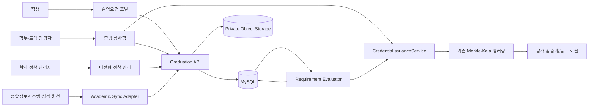
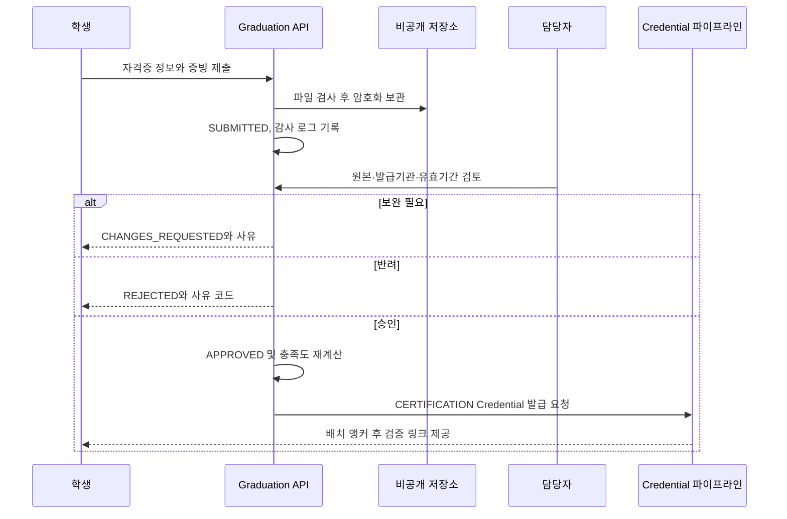
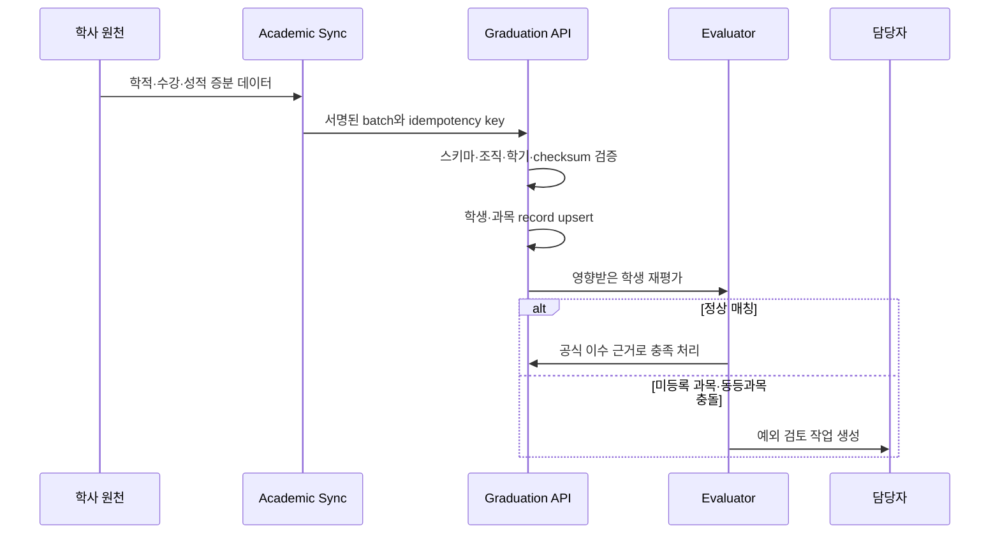

# 한성대학교 졸업요건 관리 및 증빙 Credential 도입 기획

- 기준일: 2026-08-11
- 상태: 구현 전 기획안
- 대상: 한성대학교 학생, 학부·트랙 담당자, 학사운영 담당자
- 연계 문서: [Credential 및 Kaia 앵커링 설계](./blockchain-anchoring-architecture.md), [외부 온체인 활동 프로필](./public-activity-profile.md)

## 1. 결론

Trekkey에 다음 세 기능을 하나의 `Graduation Requirement` 도메인으로 추가한다.

1. 입학연도, 학적, 트랙·전공에 맞는 졸업요건과 현재 충족도를 계산한다.
2. 학생이 자격증·프로젝트 등 증빙을 신청하고 담당자가 승인한다.
3. 학사시스템에서 확인한 과목 이수 내역을 자동 반영하며, 연동 전에는 담당자 승인으로 대체한다.

블록체인에는 학생의 신청이나 학사 원문을 올리지 않는다. 학교가 최종 승인한 사실만 기존 Credential 파이프라인으로 발급하고 Merkle root를 Kaia에 앵커링한다. 졸업 가능 여부 계산은 언제든 규정과 성적이 바뀔 수 있는 업무 상태이므로 SQL에서 수행하고, 최종 확정 스냅샷만 선택적으로 Credential화한다.

핵심 원칙은 다음과 같다.

- `수강신청`과 `이수 완료`를 구분한다. 수강 중인 과목은 예상 충족도에만 반영하고 졸업 충족으로 확정하지 않는다.
- 학생이 올린 증빙은 `주장(claim)`일 뿐이다. 담당자 승인 또는 신뢰할 수 있는 학교 데이터 수신 전에는 충족 처리하지 않는다.
- 졸업요건 숫자를 애플리케이션 코드에 하드코딩하지 않는다. 규정 원문, 적용 대상, 유효 기간을 포함한 버전형 정책으로 관리한다.
- 자동화 결과에도 출처와 실행 이력을 남기며 담당자가 예외를 처리할 수 있어야 한다.
- 자격증 번호, 성적, 학번, 증빙 파일 같은 개인정보는 온체인과 공개 API에 포함하지 않는다.

## 2. 한성대학교 규정에서 확인한 설계 조건

한성대학교 공식 안내에 따르면 졸업 판단은 단순 총학점 계산이 아니다.

- 학교 공통 안내는 교과 이수학점, 비교과 포인트, 학부·트랙 졸업요건을 함께 고려한다. 16학번 이후의 일반 기준으로 130학점과 비교과 800포인트를 제시하고, 편입·조기졸업에는 별도 조건을 둔다.
- 트랙제 융합전공자는 제1·제2트랙 요건을 각각 충족해야 하고, 복수전공자는 제2전공 졸업요건도 충족해야 한다.
- 컴퓨터공학부 안내는 학번 구간별로 캡스톤디자인, 논문, 전공 관련 자격증·공모전 입상, 트랙 수, 산학협력 프로젝트 같은 별도 조건을 둔다.
- 학생의 최종 공식 요건은 종합정보시스템의 `졸업 > 졸업요건` 메뉴에서 확인하도록 안내된다.

따라서 위 숫자와 항목은 초기 정책 입력의 참고값일 뿐, 운영 기준을 코드 상수로 사용하지 않는다. 실제 정책 활성화 전 학사운영팀과 해당 학부·트랙 담당자가 입학연도별 원문을 검수하고 승인해야 한다.

공식 참고 자료:

- [한성대학교 졸업 및 학위](https://www.hansung.ac.kr/hansung/6234/subview.do)
- [한성대학교 컴퓨터공학부 졸업 요건](https://hansung.ac.kr/CSE/1564/subview.do)
- [한성대학교 전공트랙제 안내](https://www.hansung.ac.kr/hansung/6023/subview.do)

## 3. 목표와 비목표

### 목표

- 학생이 자신에게 적용되는 졸업요건, 충족·부족·확인 필요 상태를 한 화면에서 확인한다.
- 자격증과 수동 증빙의 신청, 보완, 승인, 반려 이력을 보존한다.
- 과목 이수는 학교 원천 데이터와 동기화하여 가능한 범위에서 자동 승인한다.
- 정책이 변경돼도 과거 판정 근거와 당시 적용 버전을 재현한다.
- 승인된 자격증·과목·졸업요건 스냅샷을 위변조 검증 가능한 Credential로 발급한다.
- 학생이 허용한 Credential만 기존 외부 활동 프로필에서 공개한다.

### 비목표

- Trekkey가 학교의 공식 졸업사정을 대체하지 않는다.
- 학생이 입력한 수강·성적을 자동으로 사실로 인정하지 않는다.
- 외부 자격증 발급기관의 검증 API가 없는데 화면 스크래핑으로 자동 승인하지 않는다.
- 성적표, 자격증 원본, 자격번호, 학번을 블록체인에 저장하지 않는다.
- 모든 과목 이력을 개별 온체인 트랜잭션으로 발급하지 않는다.
- 정책 변경 시 기존 확정 Credential 내용을 수정하지 않는다. 오류가 있으면 폐기 또는 대체한다.

## 4. 사용자와 권한

| 역할 | 주요 권한 | 제한 |
| --- | --- | --- |
| 학생 `PARTICIPANT` | 내 요건 조회, 증빙 신청·보완·철회, 공개 범위 설정 | 승인, 정책 변경, 타인 조회 불가 |
| 학부·트랙 담당자 `REQUIREMENT_REVIEWER` | 소관 요건 신청 심사, 보완 요청, 승인·반려 | 다른 조직·트랙 심사와 정책 배포 불가 |
| 학사 정책 관리자 `ACADEMIC_POLICY_ADMIN` | 정책 초안 작성, 원문 등록, 테스트 | 자기 초안을 단독 배포할 수 없음 |
| 학사 승인자 `ACADEMIC_POLICY_APPROVER` | 정책 diff 검토·활성화·종료 | 증빙 원문 임의 수정 불가 |
| 연동 서비스 `ACADEMIC_SYNC` | 정해진 스키마의 학적·성적 데이터 적재 | 사용자 UI 로그인과 정책 변경 불가 |
| 감사자 `AUDITOR` | 정책·판정·승인·동기화 로그 읽기 | 변경 권한 없음 |

현재 `UserRole`의 `ADMIN` 하나에 위 권한을 모두 합치지 않는다. 초기 구현은 별도 `academic_permission` 또는 조직 내 역할 테이블로 세분화하고 Spring Security에서 조직과 담당 범위를 함께 검사한다.

정책 작성자와 배포 승인자는 분리하는 2인 승인 방식을 권장한다. 증빙 승인자가 자기 자신의 신청을 처리하는 것도 금지한다.

## 5. 전체 구조



### 신뢰 경계

| 데이터 | 신뢰 수준 | 사용 방식 |
| --- | --- | --- |
| 학생 직접 입력 | 미검증 | 신청 화면과 심사 자료로만 사용 |
| 학생 첨부 파일 | 미검증 | 악성 파일 검사 후 비공개 보관, 담당자 검토 필요 |
| 담당자 승인 | 학교 검증 | 요건 충족 근거 및 Credential 발급 가능 |
| 학사시스템 성적 원천 | 학교 검증 | 정규 과목 이수 자동 승인 가능 |
| 외부 발급기관 검증 응답 | 기관 검증 | 검증기관·응답시각·원문 hash 보존 후 자동 또는 반자동 승인 |
| Kaia 앵커 | 무결성 증거 | 승인 이후 Credential이 변경되지 않았는지 검증 |

## 6. 핵심 업무 모델

### 6.1 정책과 요건

`GRADUATION_POLICY_VERSION`

- 조직, 정책 코드, 버전, 상태(`DRAFT`, `IN_REVIEW`, `ACTIVE`, `RETIRED`)
- 적용 입학연도 범위, 입학 유형, 학적 유형
- 적용 학부·학과·제1트랙·제2트랙·복수전공 조건
- 유효 시작일·종료일
- 규정 원문 URL, 문서 hash, 작성자·승인자·승인시각

`GRADUATION_REQUIREMENT`

- 정책 버전에 속한 개별 요건
- 유형: `TOTAL_CREDITS`, `CATEGORY_CREDITS`, `GPA`, `COURSE`, `COURSE_GROUP`, `CERTIFICATE`, `NONCURRICULAR_POINT`, `PROJECT`, `THESIS`, `CONTEST_AWARD`, `TRACK_COUNT`, `CUSTOM_EVIDENCE`
- 충족량, 단위, 최소성적, 필수 여부, 표시 순서
- 학생용 설명과 담당자용 판정 지침

`REQUIREMENT_GROUP`

- `ALL_OF`: 하위 요건 전부 필요
- `ANY_OF`: 하위 요건 중 N개 필요
- `MIN_COUNT`: 하위 항목 중 최소 N개 필요
- `MIN_VALUE`: 학점·포인트 합계가 기준 이상

정책 조건은 자유로운 실행 코드나 SQL 문자열로 저장하지 않는다. 제한된 연산자와 JSON Schema로 검증한 선언형 AST를 사용한다. 정책 게시 전에 고정 fixture 학생군으로 회귀 테스트를 실행한다.

### 6.2 학생 적용 프로필

`STUDENT_ACADEMIC_PROFILE`

- 사용자, 조직, 학번
- 최초 입학연도, 현재 학적, 신입·일반편입·학사편입·재입학 구분
- 제1트랙, 제2트랙, 복수·부전공, 변경 이력
- 예상 졸업학기
- 원천 시스템 버전과 마지막 동기화 시각

트랙 변경을 덮어쓰지 않고 기간 이력으로 보존한다. 판정기는 평가 기준일에 유효한 프로필과 정책을 결합한다.

### 6.3 교과목과 이수 내역

`ACADEMIC_COURSE`

- 과목 코드, 과목명, 개설 조직, 학점, 교과 구분
- 유효 학기 범위와 대체·동일 과목 그룹

`STUDENT_COURSE_RECORD`

- 학생, 학기, 과목 코드, 학점, 성적, 상태
- 상태: `ENROLLED`, `COMPLETED`, `FAILED`, `WITHDRAWN`, `TRANSFERRED`, `RECOGNIZED`
- 출처: `SIS`, `STAFF_IMPORT`, `MANUAL_REVIEW`
- 원천 레코드 ID, 원천 수정시각, 수신 batch ID

`COURSE_EQUIVALENCE`

- 구과목·신과목, 대체 인정 범위, 적용 학번·학기, 승인 근거

`ENROLLED`는 화면에서 `예상 충족`으로만 계산한다. `COMPLETED` 또는 학교가 승인한 `RECOGNIZED`만 확정 충족에 포함한다. F, NP, 철회 과목은 충족에서 제외하며 재수강·학점 중복 산정 규칙도 정책으로 관리한다.

### 6.4 증빙 신청과 심사

`EVIDENCE_APPLICATION`

- 신청자, 대상 요건, 증빙 유형, 신청 상태
- 상태: `DRAFT`, `SUBMITTED`, `UNDER_REVIEW`, `CHANGES_REQUESTED`, `APPROVED`, `REJECTED`, `WITHDRAWN`
- 학생 설명, 제출·처리 시각, 담당 조직

`EVIDENCE_DOCUMENT`

- 비공개 storage key, 원본 파일명, MIME type, 크기
- SHA-256, 악성 파일 검사 상태, 보존 기한
- 공개 URL을 저장하지 않고 짧은 만료시간의 다운로드 URL만 발급

`CERTIFICATE_EVIDENCE`

- 자격 종목 코드, 발급기관, 취득일, 만료일
- 자격번호는 암호화 저장하고 API 응답에서 마스킹
- 검증 방법: `ISSUER_API`, `STAFF_REVIEW`, `SIGNED_DOCUMENT`
- 검증 참조값과 검증 응답 hash

`APPROVAL_TASK` / `APPROVAL_DECISION`

- 담당자 배정, 처리 기한, 결정, 사유 코드, 내부 메모
- 모든 결정에 actor, timestamp, 이전·이후 상태를 기록
- 승인 후 원문 수정 금지. 정정은 기존 승인을 취소하고 새 신청으로 대체

## 7. 주요 처리 흐름

### 7.1 자격증 등록과 담당자 승인



자동 검증 API가 있더라도 이름·생년월일 같은 개인정보를 외부로 보낼 법적 근거와 학교 계약을 먼저 확인한다. 검증 불가·불일치·만료·API 장애는 자동 승인하지 않고 담당자 큐로 보낸다.

### 7.2 특정 과목 이수 자동 반영



연동 우선순위는 다음과 같다.

1. 학교가 제공하는 내부 API 또는 데이터웨어하우스의 읽기 전용 연동
2. 학교가 서명한 CSV 배치의 관리자 업로드와 checksum 검증
3. 담당자가 종합정보시스템과 대조한 수동 승인
4. 학생이 올린 성적 화면은 참고자료만 허용하고 자동 승인 금지

동일 batch 재수신은 중복 반영하지 않는다. 원천에서 성적이 정정되면 기존 record를 삭제하지 않고 revision을 남기고 영향받은 판정을 재실행한다.

### 7.3 졸업요건 판정

판정 결과는 단순 boolean 대신 다음 상태를 사용한다.

| 상태 | 의미 |
| --- | --- |
| `SATISFIED` | 공식 데이터 또는 승인 증빙으로 충족 |
| `EXPECTED` | 현재 수강 중인 과목까지 포함하면 충족 예상 |
| `NOT_SATISFIED` | 검증된 데이터 기준 부족량 존재 |
| `PENDING_REVIEW` | 제출 증빙이 심사 중 |
| `UNKNOWN` | 정책 또는 원천 데이터가 불완전하여 판단 불가 |
| `NOT_APPLICABLE` | 학생에게 적용되지 않는 요건 |

판정 결과에는 다음 설명 데이터를 함께 저장한다.

- 적용 정책 ID와 버전
- 사용한 학적 snapshot과 데이터 기준시각
- 충족에 사용한 과목·승인 증빙 ID
- 현재값, 필요값, 부족값
- 예상 충족에만 사용한 수강 중 과목
- 실행기 버전과 실행시각

학생 화면에는 `공식 졸업사정 결과가 아니라 현재 수신 데이터 기준의 안내`임을 명시한다. `UNKNOWN`을 충족이나 미충족으로 숨기지 않는다.

## 8. 블록체인 Credential 확장

현재 `CredentialType`에 다음 유형을 추가한다.

| 유형 | 발급 시점 | source | 공개 기본값 |
| --- | --- | --- | --- |
| `CERTIFICATION` | 자격증 증빙 최종 승인 | `EVIDENCE` | 학생 선택 |
| `COURSE_COMPLETION` | 학교 성적 원천 또는 담당자 승인으로 과목 이수 확정 | `COURSE_RECORD` | 비공개 |
| `REQUIREMENT_ACHIEVEMENT` | 논문·프로젝트·트랙별 별도 요건 최종 승인 | `EVIDENCE` 또는 `REQUIREMENT_RESULT` | 학생 선택 |
| `GRADUATION_ELIGIBILITY` | 학사 담당자가 전체 졸업요건 snapshot을 최종 확정 | `REQUIREMENT_RESULT` | 비공개, 학생 선택 공개 |

권장 schema profile 예시:

```text
trekkey:certification:v1:jcs-rfc8785:unicode-nfc-1
trekkey:course-completion:v1:jcs-rfc8785:unicode-nfc-1
trekkey:requirement-achievement:v1:jcs-rfc8785:unicode-nfc-1
trekkey:graduation-eligibility:v1:jcs-rfc8785:unicode-nfc-1
```

`COURSE_COMPLETION`을 모든 과목에 일괄 발급하면 비용과 노이즈가 커진다. 기본 정책은 졸업요건에서 명시적으로 요구한 특정 과목 또는 학생이 발급 요청한 과목만 Credential화하고, 일반 학점 합계는 `GRADUATION_ELIGIBILITY` snapshot 하나에 요약한다.

### Credential에 포함할 수 있는 값

- 공개 Credential ID와 발급 학교
- 자격 종목 또는 과목의 공개 코드·표시명
- 취득·이수 학기 또는 날짜
- 승인 근거 유형과 정책 버전
- 발급·폐기·대체 상태

### 포함하지 않을 값

- 학번, 이메일, 생년월일
- 자격증 번호 원문
- 성적 원점수와 전체 성적표
- 증빙 파일 URL 또는 storage key
- 담당자 내부 메모
- 학교 내부 DB PK

오승인, 성적 정정, 자격 취소가 발생하면 기존 Credential은 `REVOKED` 또는 `SUPERSEDED`로 처리하고 새 snapshot을 발급한다. 앵커링 전 `READY` 단계에서도 원문을 수정하지 않고 발급 건을 폐기한 뒤 재발급한다.

## 9. 제안 데이터베이스

| 테이블 | 책임 | 핵심 제약 |
| --- | --- | --- |
| `graduation_policy_version` | 버전형 졸업 정책 | 조직+정책코드+버전 UNIQUE, ACTIVE 기간 중복 금지 |
| `graduation_requirement` | 원자 요건 | 정책 버전 삭제 시 운영 이력 보존 |
| `requirement_group` | ALL/ANY/MIN 조합 | 순환 참조 금지 |
| `requirement_applicability` | 학번·학적·트랙 적용 조건 | 허용 연산자만 사용 |
| `student_academic_profile` | 현재 학생 학적 projection | 조직+학번 UNIQUE |
| `student_academic_profile_history` | 학적·트랙 변경 이력 | 유효기간 겹침 검사 |
| `academic_course` | 학기별 과목 catalog | 조직+과목코드+유효시작학기 UNIQUE |
| `course_equivalence` | 대체·동일 과목 | 자기참조·순환 금지 |
| `academic_sync_batch` | 원천 수신 원장 | source+idempotency key UNIQUE |
| `student_course_record` | 수강·이수·성적 record | 학생+학기+과목+attempt UNIQUE |
| `evidence_application` | 학생 증빙 신청 | 상태 전이와 조직 범위 검사 |
| `evidence_document` | 비공개 증빙 파일 metadata | content hash, 공개 URL 금지 |
| `certificate_evidence` | 자격증 상세 | 자격번호 암호화, 마스킹 응답 |
| `approval_task` | 담당자 심사 큐 | 승인자의 담당 범위 검사 |
| `approval_decision` | 불변 승인 이력 | UPDATE/DELETE 금지 |
| `requirement_evaluation_snapshot` | 학생별 판정 결과 | 정책·학적·원천 기준시각 보존 |
| `requirement_evaluation_item` | 요건별 설명 결과 | 근거 목록과 부족량 보존 |

모든 업무 테이블은 `organization_id`를 갖고 tenant 조건을 적용한다. JPA 조회 조건만 믿지 말고 service 계층 인가와 DB 인덱스 설계를 함께 적용한다.

## 10. API 초안

### 학생

| Method | Path | 설명 |
| --- | --- | --- |
| `GET` | `/api/me/graduation/dashboard` | 내 적용 정책, 충족도, 데이터 기준시각 |
| `GET` | `/api/me/graduation/requirements/{requirementId}` | 요건 설명, 근거, 부족량 |
| `GET` | `/api/me/academic/courses` | 공식 수강·이수 내역과 예상 반영 |
| `GET` | `/api/me/evidence-applications` | 내 증빙 신청 목록 |
| `POST` | `/api/me/evidence-applications` | 자격증·프로젝트 등 증빙 초안 생성 |
| `POST` | `/api/me/evidence-applications/{id}/documents` | 비공개 업로드 URL 발급 |
| `POST` | `/api/me/evidence-applications/{id}/submit` | 제출 |
| `POST` | `/api/me/evidence-applications/{id}/withdraw` | 심사 전 철회 |

### 담당자

| Method | Path | 설명 |
| --- | --- | --- |
| `GET` | `/api/admin/graduation/reviews` | 내 담당 범위 심사 큐 |
| `GET` | `/api/admin/graduation/reviews/{id}` | 신청, 증빙, 검증 이력 조회 |
| `POST` | `/api/admin/graduation/reviews/{id}/request-changes` | 보완 요청 |
| `POST` | `/api/admin/graduation/reviews/{id}/approve` | 승인 및 재평가 |
| `POST` | `/api/admin/graduation/reviews/{id}/reject` | 사유 코드 기반 반려 |
| `POST` | `/api/admin/graduation/evaluations/{userId}/finalize` | 전체 판정 snapshot 최종 확정 |

### 정책·연동

| Method | Path | 설명 |
| --- | --- | --- |
| `POST` | `/api/admin/academic-policies` | 정책 초안 생성 |
| `POST` | `/api/admin/academic-policies/{id}/validate` | schema와 fixture 회귀 검증 |
| `POST` | `/api/admin/academic-policies/{id}/request-approval` | 배포 승인 요청 |
| `POST` | `/api/root/academic-policies/{id}/activate` | 승인자 활성화 |
| `POST` | `/api/integrations/academic-sync/batches` | 학사 데이터 batch 수신 |
| `GET` | `/api/admin/academic-sync/batches/{id}` | 수신·실패·재처리 상태 |

모든 변경 API는 request ID 또는 idempotency key를 받고 감사 로그에 기록한다. 승인 API는 낙관적 잠금 버전을 요구해 중복 승인과 경합을 방지한다.

## 11. 화면 기획

### 학생 `졸업 준비` 대시보드

- 상단: `충족`, `예상 충족`, `부족`, `확인 필요` 건수와 데이터 갱신시각
- 정책 안내: 입학연도, 학적 유형, 적용 트랙, 정책 버전과 공식 원문 링크
- 영역별 카드: 총학점, 교양·전공 학점, 비교과, 필수 과목, 트랙별 별도 요건
- 상세 drawer: 충족에 사용한 과목·증빙, 부족량, 현재 수강 중 반영값
- 행동: 증빙 제출, 보완, 담당 부서 문의, 승인 Credential 공개 설정
- 경고: 공식 졸업사정이 아니며 `UNKNOWN` 데이터가 있으면 최종 확정 불가

### 담당자 `졸업 증빙 심사` 화면

- 담당 조직·트랙, 신청 유형, 대기일 기준 필터
- 학생 학적과 적용 정책을 신청 당시 snapshot으로 표시
- 증빙 파일과 발급기관 검증 결과를 나란히 표시
- 승인·보완·반려 사유 템플릿
- 동일 자격번호 hash 또는 파일 hash 중복 경고
- 승인 이후 Credential 발급·앵커링 상태 추적

### 정책 관리 화면

- 기존 활성 정책과 초안 diff
- 적용 학생 표본과 이전·신규 판정 차이
- 규정 원문, 시행일, 승인자
- 오류, 미분류 과목, 순환 규칙, 무요건 학생 탐지
- 미래 시행 정책 예약과 기존 정책 종료

## 12. 보안·개인정보·감사

- 증빙 저장소는 public bucket을 금지하고 서버측 암호화와 짧은 signed URL을 사용한다.
- 파일 업로드 시 확장자와 실제 MIME을 모두 검사하고 악성 파일 검사가 끝나기 전 담당자 다운로드를 막는다.
- 자격번호는 애플리케이션 계층 암호화와 검색용 keyed hash를 분리한다.
- 학생별 학사·성적 조회는 본인 또는 명시적 담당 범위만 허용한다.
- 관리자 목록 API에서 학번·자격번호를 기본 마스킹한다.
- 정책 변경, 자료 열람, 파일 다운로드, 승인, 재평가, Credential 발급·폐기를 감사 로그에 남긴다.
- 감사 로그에는 민감 원문 대신 식별자와 hash를 기록한다.
- 연동 계정은 batch 적재 전용으로 제한하며 사용자 비밀번호나 지속형 개인 접근키를 사용하지 않는다.
- 보존 기간이 지난 반려·철회 증빙은 학교 정책에 따라 삭제하되 승인 결정과 content hash 감사 기록은 보존한다.

## 13. 자동화 실패와 운영

| 상황 | 처리 |
| --- | --- |
| 학사 원천 지연 | 마지막 성공 동기화 시각 표시, 기존 확정값 유지, 신규 판정은 stale 경고 |
| 동일 batch 재수신 | idempotency key로 no-op 처리 |
| 일부 학생 record 실패 | 성공·실패를 분리하고 실패 record만 재처리 |
| 미등록 과목 코드 | 자동 산정 제외, 관리자 매핑 큐 생성 |
| 성적 정정 | revision 저장, 영향 학생 재평가, 필요 시 Credential 대체 |
| 정책 활성 기간 충돌 | 활성화 차단 |
| 담당자 오승인 | 승인 취소 사유 기록, 판정 재실행, Credential 폐기·대체 |
| 앵커링 장애 | 업무 승인은 유지하되 `앵커링 대기` 표시, 기존 outbox 재시도 사용 |

운영 지표:

- 심사 대기 건수와 평균 처리시간
- 보완·반려율과 사유 분포
- 학사 batch 지연, 실패 record, 미매핑 과목 수
- 정책별 `UNKNOWN` 학생 수
- 재평가 queue 지연
- Credential 발급·앵커링 실패 및 폐기율

## 14. 단계별 도입

### Phase 0 — 규정 수집과 정책 검증

- 학사운영팀, 컴퓨터공학부, 대상 트랙의 입학연도별 규정 원문 확보
- 실제 학생 유형 fixture: 신입, 편입, 재입학, 트랙 변경, 복수전공
- 정책 schema, 2인 승인, 회귀 테스트 도구 구현
- 총학점·비교과·트랙 요건은 공식 담당자 확인 전 `DRAFT` 유지

완료 기준: 표본 학생에 대해 종합정보시스템 결과와 Trekkey 계산 결과가 담당자 검수에서 일치한다.

### Phase 1 — 수동 증빙과 대시보드 MVP

- 학생 졸업요건 대시보드
- 자격증·프로젝트·논문·공모전 증빙 신청
- 담당자 심사 큐와 감사 로그
- 수동 입력 또는 관리자 CSV로 과목 이수 반영
- 승인 후 `CERTIFICATION`, `REQUIREMENT_ACHIEVEMENT` Credential 선택 발급

완료 기준: 승인되지 않은 신청은 어떤 판정에도 확정 충족으로 포함되지 않는다.

### Phase 2 — 학사 과목 자동화

- 학교 승인 방식으로 학적·수강·성적 증분 연동
- course catalog와 대체 과목 관리
- 현재 수강 `EXPECTED`와 이수 완료 `SATISFIED` 분리
- 정정·재수강·편입 인정학점 회귀 테스트

완료 기준: 동일 batch 재처리가 결과를 바꾸지 않고, 성적 정정 시 영향 학생만 재평가된다.

### Phase 3 — 최종 판정과 외부 검증

- 담당자의 졸업요건 snapshot 최종 확정
- `GRADUATION_ELIGIBILITY` Credential 발급
- 학생 동의 기반 외부 활동 프로필 노출
- 폐기·대체, QR 또는 portable package 연계

완료 기준: 공개 검증만으로 Credential의 학교 발급, 무결성, 현재 상태를 확인할 수 있지만 학번·성적·자격번호는 노출되지 않는다.

## 15. 테스트 전략

### 정책 단위 테스트

- 15학번 이전과 16학번 이후 경계
- 신입, 일반편입, 학사편입, 재입학
- 제1·제2트랙, 복수·부전공, 트랙 변경
- `ALL_OF`, `ANY_OF`, 최소 N개 조합
- 대체 과목, 재수강, F/NP, 철회, 중복 학점
- 자격증 만료 전·후와 승인 취소

### 통합 테스트

- 증빙 제출 → 보완 → 재제출 → 승인 → Credential 발급
- 중복 승인 요청과 낙관적 잠금
- 성적 batch 중복 수신 no-op
- 원천 정정 → 재평가 → 기존 Credential supersede
- tenant 간 학생·증빙·정책 접근 차단
- 비공개 Credential의 외부 활동 프로필 제외

### 운영 전 대조 테스트

- 익명화한 실제 학생 표본으로 학교 공식 결과와 병행 대조
- 정책별 판정 차이를 담당자가 전수 검토
- 한 학기 동안 안내용 shadow mode로 운영
- 불일치율과 `UNKNOWN`이 합의한 기준 이하일 때만 학생용 `확정 데이터 기준` 표시 활성화

## 16. 구현 순서와 기존 코드 영향

1. `academic`과 `graduation` 패키지 및 마이그레이션 추가
2. 조직 내 세분화 권한과 담당 범위 추가
3. 정책 schema와 evaluator를 순수 도메인 로직으로 구현
4. 증빙 신청·심사·비공개 파일 저장 구현
5. 학사 batch adapter와 course mapping 구현
6. `CredentialType`, `CredentialSourceType`, issuance validator와 mapper 확장
7. 학생·관리자 화면 및 공개 설정 연계
8. shadow mode 대조 후 운영 활성화

현재 Credential 인프라는 그대로 재사용하되 업무 원천 연결은 별도 adapter로 둔다. 졸업 규칙 평가 트랜잭션과 Credential 발급을 강결합하지 않고 outbox 또는 재시도 가능한 발급 요청을 사용한다. 졸업 판정 성공 여부가 체인 RPC 장애에 좌우되어서는 안 된다.

현재 코드에 적용할 때는 다음 마이그레이션을 함께 처리한다.

- `anc_credential.credential_type`은 현재 길이 20이므로 새 enum을 위해 32 이상으로 확장한다.
- `CredentialSourceType`에 `EVIDENCE`, `COURSE_RECORD`, `REQUIREMENT_RESULT`를 추가하고 `anc_credential_source`에 각 원천 FK를 추가한다.
- `AncCredentialSource.validateSourceReference`는 source type별로 정확히 하나의 FK만 존재하도록 확장한다.
- `CredentialIssueValidator`의 credential-source 조합과 source reference 조회를 새 유형에 맞춰 확장한다.
- schema profile, source fingerprint, canonical payload fixture를 유형별로 추가하고 기존 fixture가 변하지 않는지 회귀 테스트한다.
- 공개 활동 프로필은 학생이 공개를 선택하고 subject visibility가 `PUBLIC`인 새 Credential만 반환한다.

## 17. 구현 전 확정해야 할 항목

- 학교가 제공할 수 있는 학적·수강·성적 연동 방식과 갱신 주기
- 1차 적용 학부·트랙 및 입학연도 범위
- 자격증 인정 목록, 유효기간, 승인 담당 조직
- 비교과 포인트 원천 시스템과 정정 절차
- 편입·재입학·트랙 변경의 공식 판정 우선순위
- 과목 이수 Credential의 발급 범위와 학생 공개 정책
- 증빙 파일 보존 기간과 삭제 승인 절차
- Trekkey 결과의 법적·행정적 지위와 화면 고지 문구
- 정책 작성·승인 담당자와 2인 승인 운영 가능 여부

첫 운영 범위는 `컴퓨터공학부 특정 입학연도 + 자격증/필수 과목 + 수동 승인`으로 제한하는 것이 안전하다. 이 범위에서 학교 공식 판정과 일치율, 담당자 처리량, 예외 유형을 확인한 뒤 학사 자동 연동과 다른 트랙으로 확장한다.
