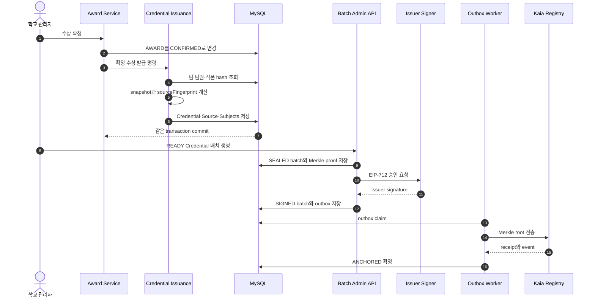

# 2026-07-27 Trekkey 통합 회의 안건

- 회의 목적: 업무 도메인과 Credential·Kaia 앵커링의 연결 계약 확정
- 기준 브랜치: `fix/anchoring-integration-readiness`
- 병합 목표: 백엔드 `develop`, 프론트 `main`
- 심사관리 기능 책임자: **혁모**
- 작성자와 기능 책임자: 반드시 구분

## 1. 회의가 끝날 때 남아야 하는 결과

- [ ] 합의된 `REVIEW_ROUND` 모델의 코드 전환 범위·담당·별도 PR 확정
- [ ] 심사 마감·미제출·동점·수동 판정 규칙 확정
- [ ] 팀원 등록 API와 명단 확정 시점 확정
- [ ] 수상 확정부터 Credential 발급까지의 트랜잭션 계약 승인
- [ ] 프론트·백엔드 `publicId` 응답 계약 승인
- [ ] Kairos 배포 담당자와 필요한 비밀값 보관 위치 지정
- [ ] DB 스키마 반영 방법과 개발 DB 초기화 일정 확정
- [ ] 각 PR의 리뷰어·완료일 지정
- [ ] 기존 비밀값 교체 담당자와 완료 시각 지정

## 2. 이미 합의된 기준

| 주제 | 확정 기준 |
| --- | --- |
| 상장 단위 | 팀당 `AWARD`와 수상 Credential 각 1건 |
| 개인 이력 | 발급 당시 팀원 전원을 `ANC_CREDENTIAL_SUBJECT`에 snapshot으로 저장 |
| 팀원 정책 | 가입한 팀원은 이탈·삭제하지 않음, 현재 API 미구현 |
| 팀원 변경 | 명단 확정 전 추가만 허용, 잘못 만든 팀은 반려 후 재신청, 현재 API 미구현 |
| 제출물 | 팀당 `SUBMISSION` 1행, 마감 전 현재 내용을 덮어씀 |
| 제출 이력 | 별도 제출 버전 테이블과 `sourceVersion`을 만들지 않음 |
| 파일 해시 | 업로드 스트림에서 SHA-256을 동기 계산 |
| 제출 확정 | 첫 심사 시작 시 `finalizedAt` 기록, 이후 수정 금지 |
| row lock | 버전 관리가 아니라 동시 파일 교체 직렬화를 위한 DB 잠금 |
| 심사 결과 | 라운드 마감 후 점수·순위·판정 수정 금지 |
| 심사 모델 | 고정 일정은 `CONTEST`, 가변 심사만 `REVIEW_ROUND`로 관리 |
| Credential 원문 | canonical JSON과 snapshot은 MySQL에 불변 저장 |
| 온체인 데이터 | 개인정보 없이 Merkle root와 상태만 저장 |
| 체인 | MVP는 Kaia Kairos, EVM 추상화는 유지 |
| 정정 | 기존 Credential 수정이 아니라 신규 발급 후 `SUPERSEDED` |
| 보장 범위 | 앵커링 전 입력의 진실성은 학교 책임, 앵커링 후 변경 여부를 검증 |

## 3. 현재 저장소 상태

| 항목 | 상태 | 조치 |
| --- | --- | --- |
| 백엔드 `develop` | 대회·제출·심사·수상 코드가 합쳐짐 | 통합 PR의 base로 사용 |
| [백엔드 통합 PR #9](https://github.com/Tok-Baro/Trekkey_BackEnd/pull/9) | 업무 도메인·Credential, 보안·결정성·CI·문서 통합 | `develop` 대상 Draft, 팀 리뷰 필요 |
| 기존 백엔드 PR #7 | `feat/blockchain-anchoring → main`, Draft | 새 `develop` PR로 대체 후 종료 |
| [보안 PR #8](https://github.com/Tok-Baro/Trekkey_BackEnd/pull/8) | 추적된 로컬 설정 제거와 JWT 키 필수화 | 우선 리뷰·병합 |
| [프론트 통합 PR #1](https://github.com/Tok-Baro/Trekkey/pull/1) | 최신 `main` UI와 참가자 API 연동 통합 | `main` 대상 Draft, 백엔드 PR #9 이후 병합 |
| 백엔드 CI | Java·Solidity·TypeScript 검증 추가 | PR #9 결과 확인 후 병합 |
| 프론트 CI | Node 22 production build 검증 추가 | PR #1 결과 확인 후 병합 |
| 브랜치 보호 | Private Free 플랜에서 서버 강제 제한 | 팀 규칙과 CI로 우선 운영 |

## 4. 커밋 추적과 책임 구분

| 사실 | 작성 이력 | 기능·조치 책임 |
| --- | --- | --- |
| `application-local.properties` 최초 추적 | `3634c21`, `naeunmin` | 보안 담당자가 키 교체, 전원이 기존 값 폐기 |
| JWT 기본키 최초 도입 | `d409039`, `naeunmin` | 보안 PR #8에서 제거 |
| 제출 덮어쓰기·SHA-256 | `cbd88e6`, `ijunsu` | 제출 담당자와 통합 PR 리뷰어 |
| 심사 도메인 구현 | `5ce57cc`, `ijunsu` | **기능 승인·인수 책임자는 혁모** |
| 수상 도메인 구현 | `a4d23c9`, `ijunsu` | 수상 담당자 확정 필요 |
| 업무·앵커링 통합 | `011f36e`, `69d531a`, `e1df66f`, `1ad4f8c`, `ijunsu` | 통합 PR 리뷰어 공동 책임 |
| 블록체인 초안의 `main` 직접 반영 | Codex 작업 후 revert | 새 PR은 `develop` 대상으로 교체 |

책임 원칙:

- 커밋 작성자는 변경 이력을 설명한다.
- 기능 책임자는 상태 전이와 사용자 요구를 승인한다.
- 통합 담당자는 충돌 해결과 전체 회귀 테스트를 책임진다.
- 심사관리 최종 승인자는 혁모다.

## 5. P0 보안 안건

### 현재 조치

- [x] 추적된 `application-local.properties`를 현재 트리에서 제거
- [x] 비밀값 없는 `application-local.properties.example` 추가
- [x] JWT 기본 서명 키 제거
- [x] 누락·잘못된 Base64·64바이트 미만 키의 기동 거부 테스트
- [x] `.DS_Store` 추적 제거 및 ignore 추가

### 팀이 해야 할 외부 조치

- [ ] 실제 실행 환경의 `JWT_SECRET` 교체
- [ ] 저장소 값과 같은 DB 비밀번호를 다른 환경에서 썼다면 DB 비밀번호 교체
- [ ] 기존 access·refresh token 전부 무효화
- [ ] 운영 환경 `JWT_REFRESH_COOKIE_SECURE=true` 확인
- [ ] Git 과거 이력 정리 여부 결정

### 이력 정리 결정

| 선택 | 장점 | 비용 |
| --- | --- | --- |
| 키만 교체하고 이력 유지 | 협업 중단이 없음 | 과거 값은 Git 이력에 계속 보임 |
| `git filter-repo` 후 강제 push | 과거 blob까지 제거 | 모든 브랜치·PR 영향, 전원 재클론 필요 |

권장 순서:

1. 키 교체
2. 보안 PR 병합
3. 팀 작업 브랜치 정리
4. 이력 재작성 필요성 재평가

## 6. P0 업무·Credential 연결 공백

### 6.1 `TEAM_MEMBER` 저장 경로 부재

현재 확인:

- `TEAM_MEMBER` 엔티티와 repository는 존재
- 팀 신청 요청은 `memberCount`만 받음
- 학번으로 사용자를 검색해 팀원 행을 만드는 API는 없음
- 수상 Credential 발급기는 현재 `TEAM_MEMBER`를 조회함

위험:

- 실제 팀원이 DB에 없으면 대표자만 개인 수상 이력에 연결됨
- `memberCount` 숫자만으로는 누가 수상자인지 증명할 수 없음
- 발급 뒤 팀을 다시 조회해 복구할 수 없음

회의 결정:

- [ ] 같은 학교 안에서 `studentId`로 사용자 조회
- [ ] 대표자 포함 전원을 `TEAM_MEMBER`에 저장
- [ ] `(teamId, userId)` 유일 제약 유지
- [ ] 대표자는 `roleCode=LEADER` 한 명만 허용
- [ ] 명단 확정 전 추가만 허용
- [ ] 팀원 이탈·삭제 API는 만들지 않음
- [ ] 개인전도 대표자 1명을 `TEAM_MEMBER`에 저장
- [ ] `TEAM.memberCount`를 실제 행 수로 검증 또는 파생값으로 전환

완료 조건:

- 팀 생성 직후 대표자 `TEAM_MEMBER` 생성
- 학번 검색으로 팀원 추가 가능
- 다른 학교 학번 추가 거부
- 중복 팀원 추가 거부
- 명단 확정 후 추가·역할 변경 거부
- 수상 발급 테스트에 대표자와 일반 팀원 모두 포함

### 6.2 최종 ERD와 심사 코드 불일치

현재 확인:

- 최종 문서: `CONTEST` 고정 신청·제출 일정 + `REVIEW_ROUND` 0..N
- 실제 코드: 범용 `CONTEST_STAGE`와 `stageType`
- 제출 서비스도 `SUBMISSION` stage를 조회
- 심사 서비스도 `REVIEW/PRESENTATION` stage를 분기

논의했던 선택안:

| 안 | 장점 | 단점 |
| --- | --- | --- |
| A. 현재 `CONTEST_STAGE` 유지 | 추가 구현이 적음 | 고정 단계까지 다형화, 문서와 불일치 |
| B. `REVIEW_ROUND`로 전환 | 최종 ERD와 일치, 신청·제출 규칙 단순 | 백엔드·프론트 API 동시 수정 필요 |

기획 결론은 **B안**이다. 이번 회의에서는 모델을 다시 고르는 것이 아니라 실제 코드 전환 범위와 담당을 확정한다. 결론을 바꾸려면 업무·심사·제출·수상·프론트 담당 전원의 명시적 재합의가 필요하다.

공동 아키텍처 결정:

- [ ] `REVIEW_ROUND` 전환 PR 담당자와 마감일
- [ ] 라운드 상태 `PREPARING/OPEN/FINALIZED`
- [ ] 신청 기간과 제출 마감의 `CONTEST` 컬럼 위치
- [ ] 심사 API의 `{stageId}`를 `{roundId}`로 변경
- [ ] 프론트 심사 화면의 용어를 “단계”가 아닌 “라운드”로 통일

혁모는 위 공동 결정 이후 심사 상태 전이와 인수 테스트를 최종 승인한다.

## 7. 심사관리 인수 안건

기능 책임자: **혁모**

### 7.1 라운드 시작

- [ ] 심사위원이 1명 이상이어야 함
- [ ] 대상 제출물이 1건 이상이어야 함
- [ ] 대상 제출물을 이 시점에 `finalizedAt`으로 확정
- [ ] 같은 라운드 시작 API 동시 호출 방지
- [ ] 전 심사위원 × 전 제출물 배정 정책을 MVP에서 유지할지 결정

### 7.2 심사 제출

- [ ] 기준별 점수 합계와 각 기준 최대점 검증
- [ ] 심사 제출 후 수정 금지
- [ ] 만료·재발급된 심사 링크 정책
- [ ] 심사위원 삭제는 배정 전까지만 허용
- [ ] 의견 필수 여부와 최대 길이 확정

### 7.3 라운드 마감

현재 코드상 주의점:

- 심사가 한 건도 없는 제출물도 0점으로 계산 가능
- `MANUAL` 라운드는 개별 판정 전에도 라운드가 완료될 수 있음
- 동점일 때 안정적인 2차 정렬 기준이 없음
- 라운드 시작·마감 row lock이 없음

회의 결정:

- [ ] 모든 배정의 심사 제출을 마감 조건으로 요구할지
- [ ] 미제출 심사위원을 제외할지 0점 처리할지
- [ ] 동점 시 공동 순위 또는 제출 시각·ID 순으로 결정할지
- [ ] 수동 판정 대상이 모두 확정된 뒤에만 라운드를 마칠지
- [ ] 마감 후 정정이 필요하면 append-only 이벤트를 둘지

혁모 인수 테스트:

- [ ] 라운드 시작 중복 호출 실패
- [ ] 제출 확정 뒤 파일 덮어쓰기 실패
- [ ] 심사 제출 뒤 재제출 실패
- [ ] 미완료 배정이 있으면 마감 실패
- [ ] 동점 결과가 재실행해도 동일
- [ ] 마감 뒤 기준·배정·점수·순위·판정 수정 실패
- [ ] 수동 판정 사유와 담당자 저장

## 8. 제출물 인수 안건

현재 통합 PR 반영:

- `SUBMISSION`은 팀당 1행
- 재제출은 현재 제목과 파일 목록 덮어쓰기
- `sourceVersion`과 `integrityStatus` 제거
- 파일 SHA-256은 업로드 시 계산
- `TEAM` 행을 먼저 잠가 최초 제출과 덮어쓰기를 팀 단위로 직렬화
- 기존 파일은 DB 커밋 뒤 삭제
- DB 롤백 시 새 파일 삭제
- row lock은 동시 덮어쓰기 직렬화에만 사용

확인할 예외:

- [ ] 최초 동시 제출 테스트에서 1행만 생성
- [ ] 우회 쓰기의 유일 제약 오류를 도메인 409로 변환
- [ ] 파일 저장 도중 일부만 성공하면 성공한 새 객체 정리
- [ ] 삭제 실패 객체를 추적할 운영 로그·정리 작업
- [ ] 허용 확장자 외 MIME 검증 수준
- [ ] 최대 요청 크기와 프론트 제한 일치

기존 DB 반영:

- `docs/migrations/2026-07-27-remove-submission-version-state.sql`
- 신규 DB는 현재 엔티티로 생성
- 기존 개발 DB는 migration 실행 또는 재생성 필요

## 9. 수상 → Credential 계약

트랜잭션 기준:

- Credential 생성 실패 시 수상 확정도 롤백
- Kaia 전송 실패는 수상·Credential DB 확정을 롤백하지 않음
- 체인 전송은 Outbox worker가 재시도
- 같은 `sourceFingerprint` 재요청은 기존 Credential 반환

결정성 기준:

- DB `LocalDateTime`은 UTC로 해석
- 팀원은 안정적인 사용자 ID 순서로 조회
- subject snapshot 순서는 canonical 규칙으로 재정렬
- 파일 SHA-256은 접두사 없는 DB 값에서 `0x` 형식으로 변환
- 서버 시간대가 달라도 같은 입력은 같은 hash를 생성
- 기존 공유 DB에 KST wall-clock으로 저장된 `confirmed_at`이 있다면 UTC 전환 전에 데이터 기준을 확인하고 migration

프론트·백엔드 수상 계약:

| 필드 | 용도 |
| --- | --- |
| `id` | 수상 공개 ID |
| `contestPublicId` | 대회 상세 이동과 필터 |
| `teamPublicId` | 팀 상세 및 소유권 연결 |
| `teamName` | 화면 표시 전용 |
| `certificateNo` | 팀이 공유하는 상장 번호 |
| `confirmedAt` | 확정 시각 |

금지:

- 팀명으로 대회나 팀을 역매칭하지 않음
- 내부 DB PK를 API에 노출하지 않음
- 현재 팀 명단으로 과거 Credential subject를 다시 계산하지 않음
- 일반 팀원의 `/api/users/me/awards` 조회는 `TEAM_MEMBER` 저장 API가 구현된 뒤 인수 완료

## 10. Kaia 앵커링 운영 안건

### MVP 구조

- Off-chain: Credential 원문, subject snapshot, 파일 manifest, Merkle proof
- On-chain: issuer key, batch ID hash, Merkle root, schema/tree version, 폐기·대체 상태
- 네트워크: Kairos `chainId=1001`
- 쓰기 모드: `LOCAL_RELAYER`
- 기본 모드: `DISABLED`

### 키 역할

| 키 | 역할 | 보관 |
| --- | --- | --- |
| Issuer signer | 학교가 batch·상태 변경을 승인 | 학교 KMS 또는 별도 signer |
| Relayer | 승인된 트랜잭션 전송과 가스 지불 | 서버 secret/KMS |
| Contract admin | issuer key·pause·권한 관리 | 운영 multisig 권장 |

회의 결정:

- [ ] Kairos 배포 계정
- [ ] issuer signer와 relayer를 다른 키로 운영
- [ ] private key 저장 위치
- [ ] 테스트 KAIA 충전 담당자
- [ ] 컨트랙트 주소와 배포 commit 기록 위치
- [ ] worker 단일 인스턴스 운영 여부
- [ ] Mainnet 전환은 MVP 범위에서 제외할지

Kairos 완료 조건:

- 컨트랙트 배포
- issuer key 등록
- 2개 이상 Credential Merkle batch 생성
- 학교 EIP-712 승인
- relayer 전송
- receipt와 contract event 확인
- 공개 검증 API에서 `VALID` 확인
- 원문 1바이트 변경 시 hash 불일치 확인
- 잘못된 proof 거부 확인
- 폐기 또는 대체 1건 검증

## 11. 개인정보와 공개 검증

현재 원칙:

- 학번, 이름, 전공을 온체인에 올리지 않음
- 학번은 학교 내부 사용자 조회 키
- 공개 검증은 무작위 `credentialPublicId` 사용

회의 결정:

- [ ] 공개 검증 응답에서 이름 전체 공개 여부
- [ ] 전공 공개 여부
- [ ] 본인 인증 전·후 응답 범위 분리
- [ ] 공개 API rate limit
- [ ] 반복 조회와 대량 수집 감사 로그
- [ ] 인증서 QR 분실 시 대응

## 12. DB 운영 안건

현재:

- JPA `ddl-auto=update`
- Flyway/Liquibase 없음
- Credential 테이블 수가 많고 유일·체크 제약이 중요

결정:

- [ ] MVP 전 Flyway 도입 여부
- [ ] 운영 `ddl-auto=validate` 전환 시점
- [ ] 기존 개발 DB 재생성 또는 수동 migration
- [ ] MySQL 8 기준 canonical bytes·hash 컬럼 타입 확인
- [ ] `MEDIUMTEXT/MEDIUMBLOB` 실제 schema 확인
- [ ] 조직별 학번 유일 제약 migration 확인

권장:

- 통합 PR 병합 전 최소 manual SQL 검증
- 첫 공유 서버 배포 전 Flyway 도입
- 운영에서 `ddl-auto=update` 사용 금지

## 13. 프론트 통합 안건

현재 실제 백엔드 연동:

- 로그인
- 대회 목록
- 참가 신청
- 내 신청
- 내 수상

현재 미연동 또는 목업:

- 관리자 대회 관리 일부
- 제출 관리 화면
- 심사위원·라운드·점수·마감
- 수상 산출·확정
- Credential 배치·승인·검증 상태

회의 결정:

- [ ] 혁모의 심사 화면 API 인수 순서
- [ ] `stageId` 또는 `roundId` 확정 뒤 프론트 타입 반영
- [ ] 수상 목록은 `contestPublicId/teamPublicId`로 연결
- [ ] Credential 상태 `READY/BATCHED/ANCHORED` 표시 수준
- [ ] 체인 장애가 사용자 수상 이력을 가리지 않도록 UI 분리

## 14. CI와 Git 규칙

백엔드 필수 검사:

- Java 21 `./gradlew clean test --no-daemon`
- Node 22 `npm ci`
- Hardhat `npm test`
- TypeScript `npx tsc --noEmit`

프론트 필수 검사:

- Node LTS `npm ci`
- `npm run build`

팀 규칙:

- 기능 브랜치 → 백엔드 `develop`
- 백엔드 `develop` → `main`은 릴리스 PR
- 프론트 기능 브랜치 → `main`
- `develop/main` 직접 push 금지
- PR 최소 1인 승인
- 본인 작성 PR 본인 단독 병합 금지
- 충돌 해결자는 전체 테스트 재실행
- 비밀값·로컬 설정 파일 커밋 금지

## 15. 90분 회의 진행 순서

| 시간 | 안건 | 결론 |
| --- | --- | --- |
| 0~10분 | 보안 PR #8과 키 교체 | 담당자·완료 시각 |
| 10~20분 | 최종 ERD와 실제 코드 차이 | ReviewRound 전환 담당·범위 |
| 20~35분 | 팀원 원장과 학번 조회 | API·잠금 시점 |
| 35~55분 | 심사관리 인수 | 혁모 승인 규칙 |
| 55~65분 | 제출·수상 API 계약 | publicId·예외 |
| 65~80분 | Credential·Kairos 운영 | 배포·키 담당 |
| 80~90분 | PR·CI·일정 | 담당자·마감일 |

## 16. 담당표

| 업무 | 책임자 | 리뷰어 | 완료 조건 |
| --- | --- | --- | --- |
| 심사 상태 전이·인수 테스트 | **혁모** | 팀 지정 | 7절 체크 통과 |
| 팀원 학번 조회·추가 API | 회의 지정 | 블록체인 담당 | subject 전원 발급 |
| 제출 동시성·파일 정리 | 회의 지정 | 통합 담당 | commit/rollback 테스트 |
| 수상 응답 publicId | 백엔드 통합 담당 | 프론트 담당 | 이름 역매칭 제거 |
| Credential·Merkle·Kaia | 블록체인 담당 | 백엔드 1명 | Kairos E2E |
| 프론트 API 통합 | 프론트 담당 | 혁모 포함 | build·화면 검증 |
| 비밀값 교체 | 저장소 관리자 | 전원 확인 | 기존 token 폐기 |
| DB migration | 백엔드 배포 담당 | 통합 담당 | 공유 DB 기동 |

## 17. 회의 기록 양식

| 안건 | 결정 | 담당 | 기한 | PR/Issue |
| --- | --- | --- | --- | --- |
| ReviewRound 전환 범위 |  |  |  |  |
| 팀원 등록 |  |  |  |  |
| 심사 마감 |  | 혁모 |  |  |
| 동점 규칙 |  | 혁모 |  |  |
| 미제출 심사 |  | 혁모 |  |  |
| DB migration |  |  |  |  |
| Kairos 배포 |  |  |  |  |
| 개인정보 공개 |  |  |  |  |
| PR 승인 규칙 |  |  |  |  |

## 18. 병합 승인 체크리스트

- [ ] 보안 PR #8 병합 및 실제 키 교체
- [ ] 백엔드 통합 PR #9 리뷰어 지정
- [ ] 프론트 통합 PR #1 리뷰어 지정
- [ ] Java 전체 테스트 통과
- [ ] Solidity 12개 테스트 통과
- [ ] TypeScript typecheck 통과
- [ ] 프론트 production build 통과
- [ ] `application-local.properties`와 `.DS_Store` 미추적 확인
- [ ] `sourceVersion`·`integrityStatus` 잔존 참조 없음
- [ ] 수상 응답 publicId 계약 프론트 반영
- [ ] 팀원 저장 경로 구현 또는 별도 차단 Issue 생성
- [ ] 혁모 심사관리 승인
- [ ] ReviewRound 전환 Issue·담당·별도 PR 확정
- [ ] Kairos 환경변수는 Git 밖에서 주입
- [ ] 기존 PR #7 종료 및 대체 PR 연결
